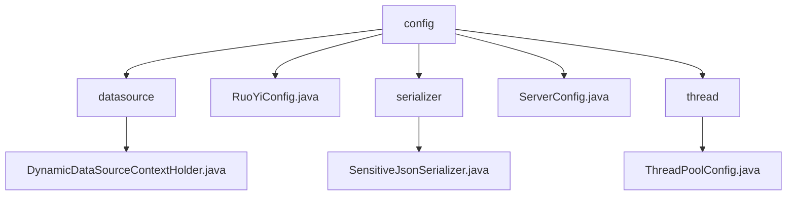

# 基础信息

|      |      |
|------|------|
| 名称 | config |
| 编码语言 | .java |
| 代码路径 | RuoYi-main/ruoyi-common/src/main/java/com/ruoyi/common/config |
| 包名 | RuoYi-main.ruoyi-common.src.main.java.com.ruoyi.common.config |
| 概述说明 | 动态数据源、RuoYi配置、JSON脱敏、服务地址、线程池设置。 |

# 说明

## 概述
该代码模块主要包含了一系列用于配置和管理的类，涵盖了动态数据源管理、项目核心属性配置、JSON序列化、服务地址生成以及线程池配置等功能。这些类通过不同的机制和策略，确保了项目在多线程环境下的稳定运行、敏感信息的安全处理以及服务地址的准确生成。模块的设计注重线程安全、数据安全和配置的灵活性，适用于需要处理多线程、敏感信息保护和复杂服务配置的业务场景。

## 主要业务场景
1. **动态数据源管理**：通过`ThreadLocal`机制管理线程独立的动态数据源变量，确保在多线程环境下每个线程都能独立访问和操作自己的数据源实例，避免线程间数据源的冲突和干扰。适用于需要动态切换数据源的多线程应用场景。

2. **项目核心属性配置**：`RuoYiConfig`类负责配置项目的核心属性，如项目名称、版本、版权年份以及文件上传路径等。该类提供了获取这些配置路径的方法，确保项目在运行过程中能够准确访问和调用这些配置数据，支持项目的正常运作和功能实现。适用于需要集中管理项目配置的场景。

3. **JSON序列化与脱敏**：自定义JSON序列化器具备字符串脱敏功能，能够根据用户角色动态决定是否进行脱敏处理。该功能在处理敏感信息时，依据用户权限或角色判断是否需要隐藏或模糊部分数据，确保信息安全。适用于需要保护隐私的场景，如用户信息展示或数据传输。

4. **服务地址生成**：`ServerConfig`类的主要功能是获取完整的服务地址，整合了域名、端口和上下文路径，确保能够准确生成服务的完整访问地址。适用于需要生成服务地址并进行网络请求或服务调用的场景。

5. **线程池配置**：该配置涉及线程池的设置，包括核心线程数、最大线程数、任务队列容量以及线程回收策略等。当线程池和队列均满时，采用调用者执行策略，确保任务能够被执行。适用于需要处理大量并发任务的业务场景，确保系统资源的合理利用和任务的及时处理。

### 包内部结构视图

该流程图展示了RuoYi项目中`common`模块下`config`目录的层级结构。`config`作为根节点，包含了多个子节点，如`datasource`、`serializer`、`thread`等，每个子节点下又有具体的配置文件。这些配置文件分别用于数据源管理、序列化配置、服务器配置以及线程池配置，体现了模块化设计的清晰结构。

# 文件列表 File List

| 名称   | 类型  | 说明 |
|-------|------|-------------|
| [RuoYiConfig.java](RuoYiConfig.md) | file | RuoYiConfig类配置项目名称、版本、版权年份、上传路径并提供路径获取方法。 |
| [ServerConfig.java](ServerConfig.md) | file | ServerConfig类用于获取包含域名、端口和上下文路径的完整服务地址。 |
| [thread](thread/_module.md) | package | 配置线程池：核心线程50，最大200，队列1000，空闲300秒，拒绝策略调用者执行。 |
| [serializer](serializer/_module.md) | package | 自定义JSON序列化器，支持按用户角色进行字符串脱敏。 |
| [datasource](datasource/_module.md) | package | 动态数据源上下文类通过ThreadLocal管理线程独立数据源变量。 |

