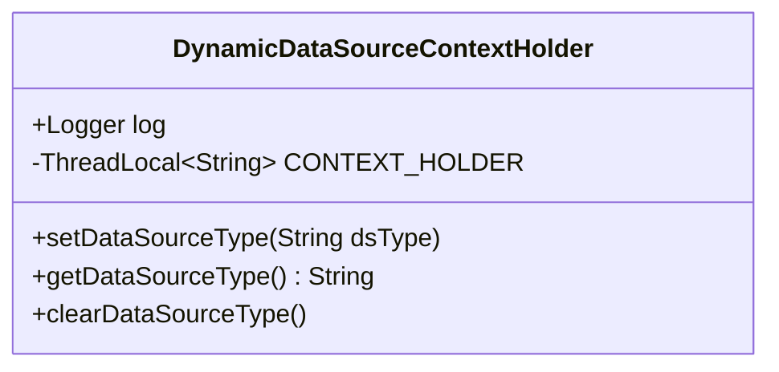
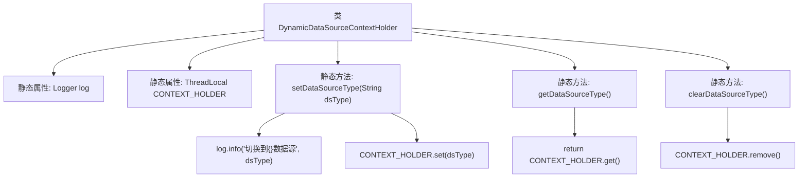

# 基础信息

|      |      |
|------|------|
| 名称 | DynamicDataSourceContextHolder |
| 编码语言 | .java |
| 代码路径 | RuoYi-main/ruoyi-common/src/main/java/com/ruoyi/common/config/datasource/DynamicDataSourceContextHolder.java |
| 包名 | com.ruoyi.common.config.datasource |
| 依赖项 | ['org.slf4j.Logger', 'org.slf4j.LoggerFactory'] |
| 概述说明 | 动态数据源上下文类通过ThreadLocal管理线程独立数据源变量。 |

# 说明

动态数据源上下文持有类通过ThreadLocal机制管理线程独立的动态数据源变量，确保在多线程环境下每个线程都能独立访问和操作自己的数据源实例，避免线程间数据源的冲突和干扰。

# 类列表 Class Summary

| 名称   | 类型  | 说明 |
|-------|------|-------------|
| DynamicDataSourceContextHolder | class | 动态数据源上下文持有类，使用ThreadLocal管理线程独立数据源变量。 |

## 类 DynamicDataSourceContextHolder

|      |      |
|------|------|
| 访问范围 | public |
| 类型 | class |
| 名称 | DynamicDataSourceContextHolder |
| 说明 | 动态数据源上下文持有类，使用ThreadLocal管理线程独立数据源变量。 |

### UML类图

**描述：**  
`DynamicDataSourceContextHolder` 类用于管理动态数据源的上下文信息。通过 `ThreadLocal` 实现线程隔离，确保每个线程可以独立设置、获取和清除数据源类型，而不会影响其他线程。该类提供了三个静态方法：`setDataSourceType` 用于设置当前线程的数据源类型，`getDataSourceType` 用于获取当前线程的数据源类型，`clearDataSourceType` 用于清除当前线程的数据源类型。这种设计在多线程环境下非常有用，尤其是在需要动态切换数据源的场景中。

### 内部方法调用关系图

这段代码定义了一个名为 `DynamicDataSourceContextHolder` 的类，用于管理线程级别的数据源切换。通过 `ThreadLocal` 维护数据源类型，确保每个线程可以独立设置和获取自己的数据源，而不会影响其他线程。类中提供了三个静态方法：`setDataSourceType` 用于设置数据源类型，`getDataSourceType` 用于获取当前数据源类型，`clearDataSourceType` 用于清除当前线程的数据源类型。

### 字段列表 Field List

| 名称  | 类型  | 说明 |
|-------|-------|------|
| CONTEXT_HOLDER = new ThreadLocal<>() | ThreadLocal<String> | 定义线程局部变量CONTEXT_HOLDER，存储字符串类型数据。 |
| log = LoggerFactory.getLogger(DynamicDataSourceContextHolder.class) | Logger | 定义静态常量日志记录器，用于动态数据源上下文类。 |

### 方法列表 Method List

| 名称  | 类型  | 说明 |
|-------|-------|------|
| clearDataSourceType | void | 清除数据源类型的静态方法。 |
| setDataSourceType | void | 静态方法设置数据源类型并记录日志。 |
| getDataSourceType | String | 获取当前数据源类型的静态方法。 |

