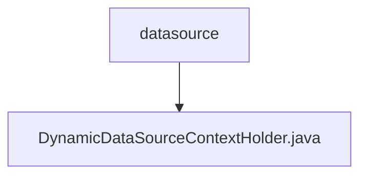

# 基础信息

|      |      |
|------|------|
| 名称 | datasource |
| 编码语言 | .java |
| 代码路径 | RuoYi-main/ruoyi-common/src/main/java/com/ruoyi/common/config/datasource |
| 包名 | RuoYi-main.ruoyi-common.src.main.java.com.ruoyi.common.config.datasource |
| 概述说明 | 动态数据源上下文类通过ThreadLocal管理线程独立数据源变量。 |

# 说明

动态数据源上下文持有类通过ThreadLocal机制管理线程独立的动态数据源变量，确保在多线程环境下每个线程都能独立访问和操作自己的数据源实例，避免线程间数据源的冲突和干扰。

### 包内部结构视图

该流程图展示了路径的层级关系，`datasource`是上级文件夹，`DynamicDataSourceContextHolder.java`是其下的一个文件。通过简洁的图形表示，清晰地呈现了文件夹与文件之间的从属关系，便于理解项目结构。

# 文件列表 File List

| 名称   | 类型  | 说明 |
|-------|------|-------------|
| [DynamicDataSourceContextHolder.java](DynamicDataSourceContextHolder.md) | file | 动态数据源上下文类通过ThreadLocal管理线程独立数据源变量。 |

