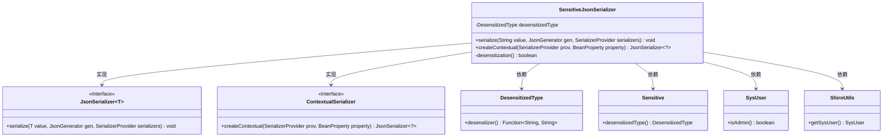
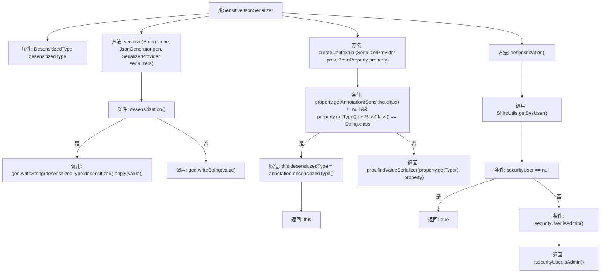

# 基础信息

|      |      |
|------|------|
| 名称 | SensitiveJsonSerializer |
| 编码语言 | .java |
| 代码路径 | RuoYi-main/ruoyi-common/src/main/java/com/ruoyi/common/config/serializer/SensitiveJsonSerializer.java |
| 包名 | com.ruoyi.common.config.serializer |
| 依赖项 | ['java.io.IOException', 'java.util.Objects', 'com.fasterxml.jackson.core.JsonGenerator', 'com.fasterxml.jackson.databind.BeanProperty', 'com.fasterxml.jackson.databind.JsonMappingException', 'com.fasterxml.jackson.databind.JsonSerializer', 'com.fasterxml.jackson.databind.SerializerProvider', 'com.fasterxml.jackson.databind.ser.ContextualSerializer', 'com.ruoyi.common.annotation.Sensitive', 'com.ruoyi.common.core.domain.entity.SysUser', 'com.ruoyi.common.enums.DesensitizedType', 'com.ruoyi.common.utils.ShiroUtils'] |
| 概述说明 | 自定义JSON序列化器，支持按用户角色进行字符串脱敏。 |

# 说明

自定义JSON序列化器具备字符串脱敏功能，能够根据用户角色动态决定是否进行脱敏处理。该序列化器在处理敏感信息时，依据用户权限或角色判断是否需要隐藏或模糊部分数据，确保信息安全。此功能适用于需要保护隐私的场景，如用户信息展示或数据传输，有效防止敏感信息泄露。

# 类列表 Class Summary

| 名称   | 类型  | 说明 |
|-------|------|-------------|
| SensitiveJsonSerializer | class | 自定义JSON序列化器，支持字符串脱敏处理，基于用户角色决定是否脱敏。 |

## 类 SensitiveJsonSerializer

|      |      |
|------|------|
| 访问范围 | public |
| 类型 | class |
| 名称 | SensitiveJsonSerializer |
| 说明 | 自定义JSON序列化器，支持字符串脱敏处理，基于用户角色决定是否脱敏。 |

### UML类图

**描述：**
`SensitiveJsonSerializer` 是一个用于序列化字符串的类，实现了 `JsonSerializer` 和 `ContextualSerializer` 接口。它根据 `Sensitive` 注解和当前用户权限决定是否对字符串进行脱敏处理。`DesensitizedType` 提供了脱敏逻辑，`SysUser` 和 `ShiroUtils` 用于获取当前用户信息并判断是否需要脱敏。

### 内部方法调用关系图

这段代码实现了一个用于JSON序列化的敏感信息脱敏处理器。`SensitiveJsonSerializer`类继承自`JsonSerializer`，并实现了`ContextualSerializer`接口。`serialize`方法根据`desensitization`方法的返回值决定是否对字符串进行脱敏处理。`createContextual`方法根据字段的注解信息初始化脱敏类型。`desensitization`方法通过判断当前用户是否为管理员来决定是否进行脱敏处理。

### 字段列表 Field List

| 名称  | 类型  | 说明 |
|-------|-------|------|
| desensitizedType | DesensitizedType | 私有反序列化类型变量desensitizedType。 |

### 方法列表 Method List

| 名称  | 类型  | 说明 |
|-------|-------|------|
| serialize | void | 序列化方法根据脱敏条件选择输出原始或脱敏字符串。 |
| createContextual | JsonSerializer<?> | 重写方法，根据注解和属性类型返回序列化器。 |
| desensitization | boolean | 检查用户权限，管理员不脱敏，其他用户脱敏。 |

