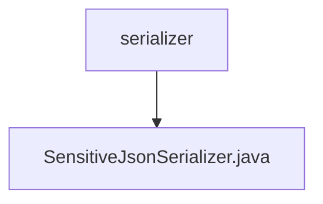

# 基础信息

|      |      |
|------|------|
| 名称 | serializer |
| 编码语言 | .java |
| 代码路径 | RuoYi-main/ruoyi-common/src/main/java/com/ruoyi/common/config/serializer |
| 包名 | RuoYi-main.ruoyi-common.src.main.java.com.ruoyi.common.config.serializer |
| 概述说明 | 自定义JSON序列化器，支持按用户角色进行字符串脱敏。 |

# 说明

自定义JSON序列化器具备字符串脱敏功能，能够根据用户角色动态决定是否进行脱敏处理。该序列化器在处理敏感信息时，依据用户权限或角色判断是否需要隐藏或模糊部分数据，确保信息安全。此功能适用于需要保护隐私的场景，如用户信息展示或数据传输，有效防止敏感信息泄露。

### 包内部结构视图

该流程图展示了路径的层级关系，其中`serializer`文件夹包含一个文件`SensitiveJsonSerializer.java`。这种结构清晰地反映了文件在项目中的位置，便于开发者快速定位和理解文件的组织方式。

# 文件列表 File List

| 名称   | 类型  | 说明 |
|-------|------|-------------|
| [SensitiveJsonSerializer.java](SensitiveJsonSerializer.md) | file | 自定义JSON序列化器，支持按用户角色进行字符串脱敏。 |

