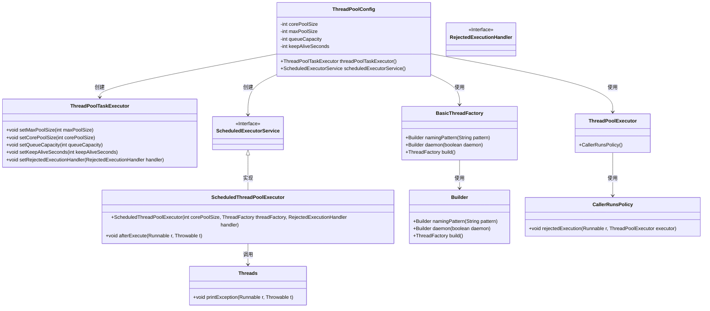
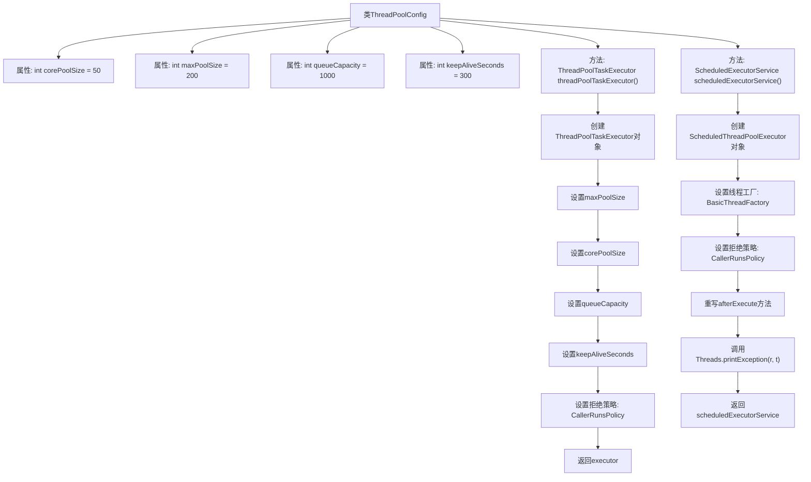

# 基础信息

|      |      |
|------|------|
| 名称 | ThreadPoolConfig |
| 编码语言 | .java |
| 代码路径 | RuoYi-main/ruoyi-common/src/main/java/com/ruoyi/common/config/thread/ThreadPoolConfig.java |
| 包名 | com.ruoyi.common.config.thread |
| 依赖项 | ['java.util.concurrent.ScheduledExecutorService', 'java.util.concurrent.ScheduledThreadPoolExecutor', 'java.util.concurrent.ThreadPoolExecutor', 'org.apache.commons.lang3.concurrent.BasicThreadFactory', 'org.springframework.context.annotation.Bean', 'org.springframework.context.annotation.Configuration', 'org.springframework.scheduling.concurrent.ThreadPoolTaskExecutor', 'com.ruoyi.common.utils.Threads'] |
| 概述说明 | 配置线程池：核心线程50，最大200，队列1000，空闲300秒，拒绝策略调用者执行。 |

# 说明

该配置涉及线程池的设置，核心线程数为50，最大线程数为200，任务队列容量为1000。当线程空闲时间超过300秒时，线程将被回收。当线程池和队列均满时，采用调用者执行策略，即由提交任务的线程直接执行该任务。

# 类列表 Class Summary

| 名称   | 类型  | 说明 |
|-------|------|-------------|
| ThreadPoolConfig | class | 配置线程池，核心线程50，最大200，队列1000，空闲300秒，拒绝策略调用者执行。 |

## 类 ThreadPoolConfig

|      |      |
|------|------|
| 访问范围 | @Configuration;public |
| 类型 | class |
| 名称 | ThreadPoolConfig |
| 说明 | 配置线程池，核心线程50，最大200，队列1000，空闲300秒，拒绝策略调用者执行。 |

### UML类图

这段代码定义了一个线程池配置类 `ThreadPoolConfig`，用于创建和管理线程池。它包含两个主要方法：`threadPoolTaskExecutor()` 用于创建 `ThreadPoolTaskExecutor` 实例，`scheduledExecutorService()` 用于创建 `ScheduledExecutorService` 实例。代码中使用了 `BasicThreadFactory` 来配置线程工厂，并使用 `ThreadPoolExecutor.CallerRunsPolicy` 作为拒绝策略。`ScheduledThreadPoolExecutor` 在任务执行后调用 `Threads.printException` 方法处理异常。整体设计灵活，便于扩展和维护。

### 内部方法调用关系图

该流程图描述了`ThreadPoolConfig`类的结构和内部方法调用关系。`ThreadPoolConfig`类包含两个主要方法：`threadPoolTaskExecutor()`和`scheduledExecutorService()`。`threadPoolTaskExecutor()`方法创建并配置了一个`ThreadPoolTaskExecutor`对象，设置了线程池的核心大小、最大线程数、队列容量和线程空闲时间，并指定了拒绝策略。`scheduledExecutorService()`方法创建了一个`ScheduledThreadPoolExecutor`对象，设置了线程工厂和拒绝策略，并重写了`afterExecute`方法以在任务执行后打印异常信息。

### 字段列表 Field List

| 名称  | 类型  | 说明 |
|-------|-------|------|
| corePoolSize = 50 | int | 核心线程池大小为50。 |
| maxPoolSize = 200 | int | 最大线程池大小为200。 |
| queueCapacity = 1000 | int | 队列容量设置为1000。 |
| keepAliveSeconds = 300 | int | 私有整型变量keepAliveSeconds初始值为300秒。 |

### 方法列表 Method List

| 名称  | 类型  | 说明 |
|-------|-------|------|
| scheduledExecutorService | ScheduledExecutorService | 创建带命名和异常处理的定时线程池。 |
| threadPoolTaskExecutor | ThreadPoolTaskExecutor | 创建线程池，设置最大、核心线程数，队列容量，存活时间及拒绝策略。 |

