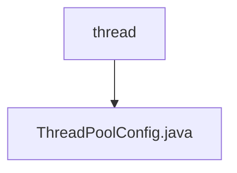

# 基础信息

|      |      |
|------|------|
| 名称 | thread |
| 编码语言 | .java |
| 代码路径 | RuoYi-main/ruoyi-common/src/main/java/com/ruoyi/common/config/thread |
| 包名 | RuoYi-main.ruoyi-common.src.main.java.com.ruoyi.common.config.thread |
| 概述说明 | 配置线程池：核心线程50，最大200，队列1000，空闲300秒，拒绝策略调用者执行。 |

# 说明

该配置涉及线程池的设置，核心线程数为50，最大线程数为200，任务队列容量为1000。当线程空闲时间超过300秒时，线程将被回收。当线程池和队列均满时，采用调用者执行策略，即由提交任务的线程直接执行该任务。

### 包内部结构视图

该流程图展示了路径中的层级关系，`thread`文件夹包含一个文件`ThreadPoolConfig.java`。这种结构清晰地表示了配置线程池的代码文件位于`thread`文件夹中，符合项目路径的组织方式。

# 文件列表 File List

| 名称   | 类型  | 说明 |
|-------|------|-------------|
| [ThreadPoolConfig.java](ThreadPoolConfig.md) | file | 配置线程池：核心线程50，最大200，队列1000，空闲300秒，拒绝策略调用者执行。 |

