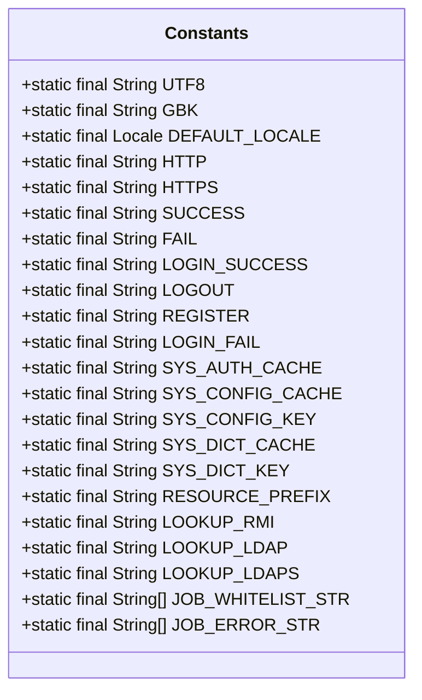

# 基础信息

|      |      |
|------|------|
| 名称 | Constants |
| 编码语言 | .java |
| 代码路径 | RuoYi-main/ruoyi-common/src/main/java/com/ruoyi/common/constant/Constants.java |
| 包名 | com.ruoyi.common.constant |
| 依赖项 | ['java.util.Locale'] |
| 概述说明 | 定义常量涵盖字符集、语言、协议、状态、缓存、路径、远程调用及定时任务限制。 |

# 说明

该内容定义了一系列常量，涵盖了字符集、语言、请求协议、状态标识、缓存配置、资源路径、远程调用以及定时任务限制。这些常量为系统提供了基础配置和运行规范，确保各模块在不同环境下的一致性和稳定性。字符集和语言常量用于处理多语言支持和编码问题，请求协议和状态标识则规范了网络通信流程，缓存配置和资源路径优化了系统性能，远程调用和定时任务限制则确保了系统的高效运行和资源管理。

# 类列表 Class Summary

| 名称   | 类型  | 说明 |
|-------|------|-------------|
| Constants | class | 定义常量包括字符集、语言、请求协议、状态标识、缓存配置、资源路径、远程调用及定时任务限制。 |

## 类 Constants

|      |      |
|------|------|
| 访问范围 | public |
| 类型 | class |
| 名称 | Constants |
| 说明 | 定义常量包括字符集、语言、请求协议、状态标识、缓存配置、资源路径、远程调用及定时任务限制。 |

### UML类图

### 描述
`Constants` 类是一个工具类，用于定义和存储应用程序中常用的常量。这些常量包括字符集编码（如 `UTF8` 和 `GBK`）、系统默认语言、HTTP/HTTPS 协议前缀、成功和失败标识、登录和注销状态、缓存名称和键、资源路径前缀、远程方法调用协议以及定时任务的白名单和违规字符列表。这些常量在整个应用程序中广泛使用，以确保代码的一致性和可维护性。

### 内部方法调用关系图

```mermaid
graph TD
    A["类Constants"]
    B["常量: String UTF8 = 'UTF-8'"]
    C["常量: String GBK = 'GBK'"]
    D["常量: Locale DEFAULT_LOCALE = Locale.SIMPLIFIED_CHINESE"]
    E["常量: String HTTP = 'http://'"]
    F["常量: String HTTPS = 'https://'"]
    G["常量: String SUCCESS = '0'"]
    H["常量: String FAIL = '1'"]
    I["常量: String LOGIN_SUCCESS = 'Success'"]
    J["常量: String LOGOUT = 'Logout'"]
    K["常量: String REGISTER = 'Register'"]
    L["常量: String LOGIN_FAIL = 'Error'"]
    M["常量: String SYS_AUTH_CACHE = 'sys-authCache'"]
    N["常量: String SYS_CONFIG_CACHE = 'sys-config'"]
    O["常量: String SYS_CONFIG_KEY = 'sys_config:'"]
    P["常量: String SYS_DICT_CACHE = 'sys-dict'"]
    Q["常量: String SYS_DICT_KEY = 'sys_dict:'"]
    R["常量: String RESOURCE_PREFIX = '/profile'"]
    S["常量: String LOOKUP_RMI = 'rmi:'"]
    T["常量: String LOOKUP_LDAP = 'ldap:'"]
    U["常量: String LOOKUP_LDAPS = 'ldaps:'"]
    V["常量: String[] JOB_WHITELIST_STR = { 'com.ruoyi.quartz.task' }"]
    W["常量: String[] JOB_ERROR_STR = { 'java.net.URL', 'javax.naming.InitialContext', 'org.yaml.snakeyaml', 'org.springframework', 'org.apache', 'com.ruoyi.common.utils.file', 'com.ruoyi.common.config', 'com.ruoyi.generator' }"]

    A --> B
    A --> C
    A --> D
    A --> E
    A --> F
    A --> G
    A --> H
    A --> I
    A --> J
    A --> K
    A --> L
    A --> M
    A --> N
    A --> O
    A --> P
    A --> Q
    A --> R
    A --> S
    A --> T
    A --> U
    A --> V
    A --> W
```

这段代码定义了一个名为`Constants`的类，其中包含多个静态常量，涵盖了字符集、HTTP协议、系统语言、成功/失败标识、登录/注销状态、缓存管理、资源路径前缀、远程方法调用、定时任务白名单和违规字符等。这些常量用于在系统中统一管理和引用常见的配置和参数，避免硬编码，提高代码的可维护性和可读性。

### 字段列表 Field List

| 名称  | 类型  | 说明 |
|-------|-------|------|
| UTF8 = "UTF-8" | String | 定义常量UTF8，值为字符串"UTF-8"。 |
| GBK = "GBK" | String | 定义了一个静态常量GBK，值为"GBK"。 |
| SUCCESS = "0" | String | 成功状态码为0。 |
| LOOKUP_LDAPS = "ldaps:" | String | 定义LDAPS查找的静态常量字符串。 |
| LOGIN_SUCCESS = "Success" | String | 登录成功常量定义为"Success"。 |
| HTTPS = "https://" | String | 定义常量HTTPS，值为"https://"。 |
| REGISTER = "Register" | String | 静态常量REGISTER表示字符串"Register"。 |
| DEFAULT_LOCALE = Locale.SIMPLIFIED_CHINESE | Locale | 默认区域设置为简体中文。 |
| LOOKUP_LDAP = "ldap:" | String | 定义静态常量LOOKUP_LDAP，值为"ldap:"。 |
| HTTP = "http://" | String | 定义了一个静态常量字符串HTTP，值为"http://"。 |
| LOGOUT = "Logout" | String | 定义常量LOGOUT，值为"Logout"。 |
| JOB_ERROR_STR = { "java.net.URL", "javax.naming.InitialContext", "org.yaml.snakeyaml",            "org.springframework", "org.apache", "com.ruoyi.common.utils.file", "com.ruoyi.common.config", "com.ruoyi.generator" } | String[] | JOB_ERROR_STR包含常见Java类和包名的错误字符串。 |
| SYS_DICT_KEY = "sys_dict:" | String | 系统字典键常量定义为"sys_dict:"。 |
| RESOURCE_PREFIX = "/profile" | String | 定义静态常量RESOURCE_PREFIX，值为"/profile"。 |
| FAIL = "1" | String | 定义静态常量FAIL，值为字符串"1"。 |
| SYS_AUTH_CACHE = "sys-authCache" | String | 系统认证缓存常量名为"sys-authCache"。 |
| SYS_CONFIG_KEY = "sys_config:" | String | 系统配置键常量定义为"sys_config:"。 |
| LOGIN_FAIL = "Error" | String | 定义常量LOGIN_FAIL，值为"Error"，表示登录失败。 |
| SYS_DICT_CACHE = "sys-dict" | String | 定义了一个静态常量SYS_DICT_CACHE，值为"sys-dict"。 |
| JOB_WHITELIST_STR = { "com.ruoyi.quartz.task" } | String[] | 定义静态字符串数组JOB_WHITELIST_STR，包含任务路径。 |
| SYS_CONFIG_CACHE = "sys-config" | String | 系统配置缓存常量定义为sys-config。 |
| LOOKUP_RMI = "rmi:" | String | 定义静态常量字符串LOOKUP_RMI，值为"rmi:"。 |

### 方法列表 Method List

| 名称  | 类型  | 说明 |
|-------|-------|------|

