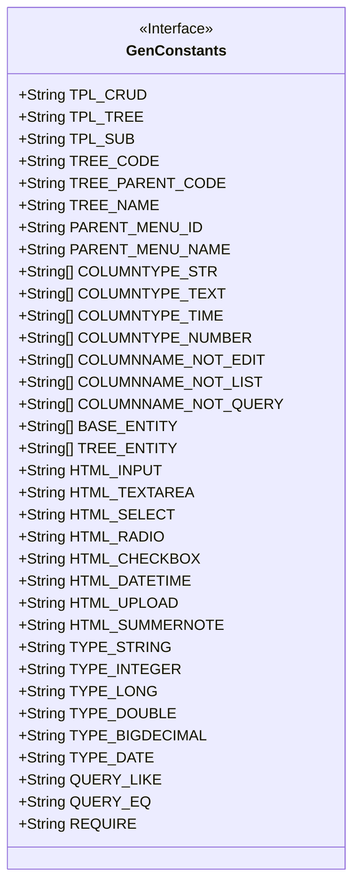

# 基础信息

|      |      |
|------|------|
| 名称 | GenConstants |
| 编码语言 | .java |
| 代码路径 | RuoYi-main/ruoyi-common/src/main/java/com/ruoyi/common/constant/GenConstants.java |
| 包名 | com.ruoyi.common.constant |
| 依赖项 | [] |
| 概述说明 | GenConstants类定义常用常量，涵盖模板、字段、数据库类型、HTML控件和查询类型。 |

# 说明

GenConstants类用于定义常用常量，涵盖模板、字段、数据库类型、HTML控件和查询类型等多个方面。这些常量为系统开发提供了统一的标准和便捷的引用，确保代码的一致性和可维护性。通过集中管理这些常量，开发人员可以更高效地进行开发和维护工作。

# 类列表 Class Summary

| 名称   | 类型  | 说明 |
|-------|------|-------------|
| GenConstants | class | GenConstants类定义常用常量，包括模板、字段、数据库类型、HTML控件、查询类型等。 |

## 类 GenConstants

|      |      |
|------|------|
| 访问范围 | public |
| 类型 | class |
| 名称 | GenConstants |
| 说明 | GenConstants类定义常用常量，包括模板、字段、数据库类型、HTML控件、查询类型等。 |

### UML类图

### 描述
`GenConstants` 类是一个常量类，主要用于存储和定义与代码生成相关的各种常量。这些常量包括模板类型（如增删改查、树表等）、数据库字段类型（如字符串、文本、时间等）、页面控件类型（如文本框、下拉框等）、查询类型（如模糊查询、相等查询等）以及其他常用字段（如树编码字段、上级菜单ID字段等）。该类通过静态常量提供了一系列预定义的值，方便在代码生成过程中直接引用，减少了硬编码的需求，提高了代码的可维护性和可读性。

### 内部方法调用关系图

```mermaid
graph TD
    A["类GenConstants"]
    B["常量: TPL_CRUD = 'crud'"]
    C["常量: TPL_TREE = 'tree'"]
    D["常量: TPL_SUB = 'sub'"]
    E["常量: TREE_CODE = 'treeCode'"]
    F["常量: TREE_PARENT_CODE = 'treeParentCode'"]
    G["常量: TREE_NAME = 'treeName'"]
    H["常量: PARENT_MENU_ID = 'parentMenuId'"]
    I["常量: PARENT_MENU_NAME = 'parentMenuName'"]
    J["常量: COLUMNTYPE_STR = {'char', 'varchar', 'nvarchar', 'varchar2'}"]
    K["常量: COLUMNTYPE_TEXT = {'tinytext', 'text', 'mediumtext', 'longtext'}"]
    L["常量: COLUMNTYPE_TIME = {'datetime', 'time', 'date', 'timestamp'}"]
    M["常量: COLUMNTYPE_NUMBER = {'tinyint', 'smallint', 'mediumint', 'int', 'number', 'integer', 'bit', 'bigint', 'float', 'double', 'decimal'}"]
    N["常量: COLUMNNAME_NOT_EDIT = {'id', 'create_by', 'create_time', 'del_flag'}"]
    O["常量: COLUMNNAME_NOT_LIST = {'id', 'create_by', 'create_time', 'del_flag', 'update_by', 'update_time'}"]
    P["常量: COLUMNNAME_NOT_QUERY = {'id', 'create_by', 'create_time', 'del_flag', 'update_by', 'update_time', 'remark'}"]
    Q["常量: BASE_ENTITY = {'createBy', 'createTime', 'updateBy', 'updateTime', 'remark'}"]
    R["常量: TREE_ENTITY = {'parentName', 'parentId', 'orderNum', 'ancestors'}"]
    S["常量: HTML_INPUT = 'input'"]
    T["常量: HTML_TEXTAREA = 'textarea'"]
    U["常量: HTML_SELECT = 'select'"]
    V["常量: HTML_RADIO = 'radio'"]
    W["常量: HTML_CHECKBOX = 'checkbox'"]
    X["常量: HTML_DATETIME = 'datetime'"]
    Y["常量: HTML_UPLOAD = 'upload'"]
    Z["常量: HTML_SUMMERNOTE = 'summernote'"]
    AA["常量: TYPE_STRING = 'String'"]
    AB["常量: TYPE_INTEGER = 'Integer'"]
    AC["常量: TYPE_LONG = 'Long'"]
    AD["常量: TYPE_DOUBLE = 'Double'"]
    AE["常量: TYPE_BIGDECIMAL = 'BigDecimal'"]
    AF["常量: TYPE_DATE = 'Date'"]
    AG["常量: QUERY_LIKE = 'LIKE'"]
    AH["常量: QUERY_EQ = 'EQ'"]
    AI["常量: REQUIRE = '1'"]

    A --> B
    A --> C
    A --> D
    A --> E
    A --> F
    A --> G
    A --> H
    A --> I
    A --> J
    A --> K
    A --> L
    A --> M
    A --> N
    A --> O
    A --> P
    A --> Q
    A --> R
    A --> S
    A --> T
    A --> U
    A --> V
    A --> W
    A --> X
    A --> Y
    A --> Z
    A --> AA
    A --> AB
    A --> AC
    A --> AD
    A --> AE
    A --> AF
    A --> AG
    A --> AH
    A --> AI
```

这段代码定义了一个名为 `GenConstants` 的类，其中包含了多个静态常量，这些常量用于表示不同的模板类型、数据库字段类型、HTML控件类型、查询条件等。这些常量在整个应用程序中可以被广泛引用，以确保代码的一致性和可维护性。通过将这些常量集中在一个类中，开发者可以更方便地管理和修改这些值，而不需要在代码中多次硬编码相同的字符串或数值。

### 字段列表 Field List

| 名称  | 类型  | 说明 |
|-------|-------|------|
| QUERY_LIKE = "LIKE" | String | 定义了一个公共静态常量字符串QUERY_LIKE，值为"LIKE"。 |
| COLUMNTYPE_TEXT = { "tinytext", "text", "mediumtext", "longtext" } | String[] | 定义了一个包含四种文本类型的字符串数组。 |
| HTML_TEXTAREA = "textarea" | String | HTML文本域常量定义为"textarea"。 |
| COLUMNTYPE_STR = { "char", "varchar", "nvarchar", "varchar2" } | String[] | 定义包含字符类型的静态字符串数组。 |
| TPL_TREE = "tree" | String | 定义静态常量TPL_TREE，值为"tree"。 |
| TPL_SUB = "sub" | String | TPL_SUB为静态常量字符串，值为"sub"。 |
| TPL_CRUD = "crud" | String | TPL_CRUD是定义为"crud"的公共静态常量字符串。 |
| REQUIRE = "1" | String | 常量REQUIRE定义为字符串"1"。 |
| TREE_CODE = "treeCode" | String | 定义一个静态常量字符串变量TREE_CODE，值为"treeCode"。 |
| TREE_NAME = "treeName" | String | 定义常量字符串TREE_NAME，值为"treeName"。 |
| TYPE_DATE = "Date" | String | 定义常量TYPE_DATE，值为"Date"。 |
| TREE_PARENT_CODE = "treeParentCode" | String | 定义静态常量字符串变量TREE_PARENT_CODE。 |
| COLUMNNAME_NOT_EDIT = { "id", "create_by", "create_time", "del_flag" } | String[] | 定义不可编辑的列名数组，包含id、create_by、create_time、del_flag。 |
| TYPE_INTEGER = "Integer" | String | 定义静态常量TYPE_INTEGER，值为"Integer"。 |
| TYPE_BIGDECIMAL = "BigDecimal" | String | 定义常量TYPE_BIGDECIMAL，值为"BigDecimal"。 |
| COLUMNTYPE_TIME = { "datetime", "time", "date", "timestamp" } | String[] | 定义字符串数组COLUMNTYPE_TIME，包含时间相关数据类型。 |
| BASE_ENTITY = { "createBy", "createTime", "updateBy", "updateTime", "remark" } | String[] | BASE_ENTITY包含创建者、创建时间、更新者、更新时间及备注字段。 |
| TYPE_LONG = "Long" | String | 定义静态常量字符串TYPE_LONG，值为"Long"。 |
| COLUMNTYPE_NUMBER = { "tinyint", "smallint", "mediumint", "int", "number", "integer",            "bit", "bigint", "float", "double", "decimal" } | String[] | 定义包含数字类型数据库列的常量数组。 |
| TYPE_STRING = "String" | String | 定义常量TYPE_STRING，值为"String"。 |
| HTML_DATETIME = "datetime" | String | 定义静态常量HTML_DATETIME，值为"datetime"。 |
| HTML_SELECT = "select" | String | 定义了一个公共静态常量HTML_SELECT，值为"select"。 |
| COLUMNNAME_NOT_QUERY = { "id", "create_by", "create_time", "del_flag", "update_by",            "update_time", "remark" } | String[] | 定义不查询的字段名数组，包括id、创建人、创建时间等。 |
| HTML_CHECKBOX = "checkbox" | String | 定义常量HTML_CHECKBOX，值为"checkbox"。 |
| QUERY_EQ = "EQ" | String | 定义静态常量字符串QUERY_EQ，值为"EQ"。 |
| HTML_SUMMERNOTE = "summernote" | String | 定义了一个静态常量HTML_SUMMERNOTE，值为"summernote"。 |
| HTML_RADIO = "radio" | String | HTML_RADIO为常量字符串，值为"radio"。 |
| HTML_UPLOAD = "upload" | String | 定义静态常量HTML_UPLOAD，值为"upload"。 |
| PARENT_MENU_NAME = "parentMenuName" | String | 定义常量字符串PARENT_MENU_NAME，值为"parentMenuName"。 |
| TYPE_DOUBLE = "Double" | String | 定义了一个静态不可变字符串常量TYPE_DOUBLE，值为"Double"。 |
| PARENT_MENU_ID = "parentMenuId" | String | 定义常量字符串PARENT_MENU_ID，值为"parentMenuId"。 |
| TREE_ENTITY = { "parentName", "parentId", "orderNum", "ancestors" } | String[] | 定义包含父名、父ID、顺序号和祖先的树实体字符串数组。 |
| COLUMNNAME_NOT_LIST = { "id", "create_by", "create_time", "del_flag", "update_by",            "update_time" } | String[] | 定义常量字符串数组，包含非列表字段名。 |
| HTML_INPUT = "input" | String | 定义了一个静态常量HTML_INPUT，值为"input"。 |

### 方法列表 Method List

| 名称  | 类型  | 说明 |
|-------|-------|------|

