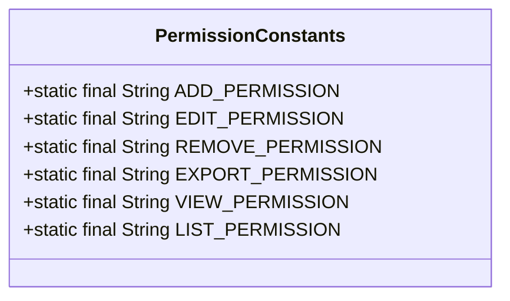
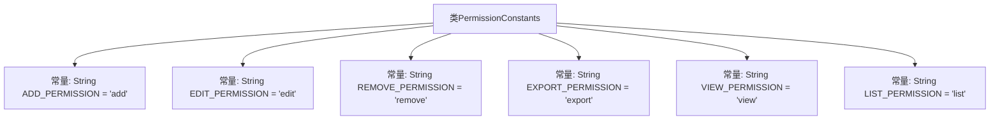

# 基础信息

|      |      |
|------|------|
| 名称 | PermissionConstants |
| 编码语言 | .java |
| 代码路径 | RuoYi-main/ruoyi-common/src/main/java/com/ruoyi/common/constant/PermissionConstants.java |
| 包名 | com.ruoyi.common.constant |
| 依赖项 | [] |
| 概述说明 | 新增权限常量类，包含增删改查及导出显示功能。 |

# 说明

权限常量类定义了六种操作权限，包括新增、修改、删除、导出、显示和查询。这些权限涵盖了常见的系统操作，确保用户在执行相关操作时具备相应的权限控制。新增权限允许用户创建新数据，修改权限允许用户更新现有数据，删除权限允许用户移除数据，导出权限允许用户将数据导出到外部文件，显示权限允许用户查看数据，查询权限允许用户搜索和检索数据。这些权限的设置有助于维护系统的安全性和数据完整性。

# 类列表 Class Summary

| 名称   | 类型  | 说明 |
|-------|------|-------------|
| PermissionConstants | class | 权限常量类定义新增、修改、删除、导出、显示和查询权限。 |

## 类 PermissionConstants

|      |      |
|------|------|
| 访问范围 | public |
| 类型 | class |
| 名称 | PermissionConstants |
| 说明 | 权限常量类定义新增、修改、删除、导出、显示和查询权限。 |

### UML类图

**描述：**  
`PermissionConstants` 类定义了一系列静态常量，用于表示不同的权限操作，如新增、修改、删除、导出、显示和查询。这些常量通常用于权限管理系统中，以标识用户是否具有执行特定操作的权限。通过使用常量，代码的可读性和可维护性得到了提升，避免了硬编码字符串的使用。

### 内部方法调用关系图

这段代码定义了一个名为 `PermissionConstants` 的类，其中包含了多个表示权限的静态常量。这些常量分别代表新增、修改、删除、导出、显示和查询权限。每个常量都是一个字符串类型的静态不可变字段，用于在代码中统一管理和引用权限标识。通过这种方式，代码的可读性和维护性得到了提升，避免了硬编码的权限字符串分散在代码各处。

### 字段列表 Field List

| 名称  | 类型  | 说明 |
|-------|-------|------|
| EXPORT_PERMISSION = "export" | String | 定义导出权限的静态常量字符串。 |
| EDIT_PERMISSION = "edit" | String | 定义编辑权限的静态常量字符串。 |
| LIST_PERMISSION = "list" | String | 定义了一个静态常量字符串LIST_PERMISSION，值为"list"。 |
| VIEW_PERMISSION = "view" | String | VIEW_PERMISSION 是表示查看权限的静态常量字符串。 |
| REMOVE_PERMISSION = "remove" | String | 定义了常量REMOVE_PERMISSION，值为"remove"。 |
| ADD_PERMISSION = "add" | String | 定义静态常量字符串ADD_PERMISSION，值为"add"。 |

### 方法列表 Method List

| 名称  | 类型  | 说明 |
|-------|-------|------|

