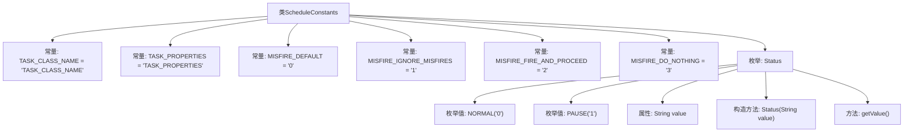

# 基础信息

|      |      |
|------|------|
| 名称 | ScheduleConstants |
| 编码语言 | .java |
| 代码路径 | RuoYi-main/ruoyi-common/src/main/java/com/ruoyi/common/constant/ScheduleConstants.java |
| 包名 | com.ruoyi.common.constant |
| 依赖项 | [] |
| 概述说明 | ScheduleConstants类含任务类名、属性、执行策略及状态枚举。 |

# 说明

ScheduleConstants类是一个用于定义任务调度相关常量的类。它包含了任务类名、任务属性、执行策略以及任务状态枚举等信息。任务类名用于标识具体的任务类型，任务属性描述了任务的基本特征和配置，执行策略定义了任务的执行方式和触发条件，状态枚举则用于表示任务的不同状态。这些常量为任务调度系统提供了统一的规范和标准，确保任务能够按照预定的策略和状态进行管理和执行。

# 类列表 Class Summary

| 名称   | 类型  | 说明 |
|-------|------|-------------|
| ScheduleConstants | class | ScheduleConstants类包含任务类名、属性、执行策略及状态枚举。 |


## 类 ScheduleConstants

|      |      |
|------|------|
| 访问范围 | public |
| 类型 | class |
| 名称 | ScheduleConstants |
| 说明 | ScheduleConstants类包含任务类名、属性、执行策略及状态枚举。 |


### UML类图

```mermaid
classDiagram
    class ScheduleConstants {
        <<final>> +String TASK_CLASS_NAME
        <<final>> +String TASK_PROPERTIES
        <<final>> +String MISFIRE_DEFAULT
        <<final>> +String MISFIRE_IGNORE_MISFIRES
        <<final>> +String MISFIRE_FIRE_AND_PROCEED
        <<final>> +String MISFIRE_DO_NOTHING
        +enum Status {
            <<enum>>
            +NORMAL("0")
            +PAUSE("1")
            -String value
            +Status(String value)
            +String getValue()
        }
    }
```

这段代码定义了一个名为 `ScheduleConstants` 的类，其中包含多个静态常量字符串，用于表示任务调度中的各种配置和状态。此外，类中还定义了一个枚举类型 `Status`，用于表示任务的状态，包括 `NORMAL` 和 `PAUSE`，并提供了获取状态值的方法 `getValue()`。这些常量和枚举类型通常用于任务调度系统中，以统一管理和使用任务相关的配置和状态信息。


### 内部方法调用关系图



这段代码定义了一个名为 `ScheduleConstants` 的类，其中包含多个静态常量和一个枚举类型 `Status`。静态常量用于定义任务类名、任务属性以及不同的触发策略。枚举类型 `Status` 包含两个枚举值 `NORMAL` 和 `PAUSE`，每个枚举值都有一个关联的字符串值，并提供了获取该值的方法 `getValue()`。流程图清晰地展示了类与常量、枚举类型及其内部结构之间的关系。

### 字段列表 Field List

| 名称  | 类型  | 说明 |
|-------|-------|------|
| TASK_CLASS_NAME = "TASK_CLASS_NAME" | String | 定义了一个公共静态常量字符串TASK_CLASS_NAME。 |
| TASK_PROPERTIES = "TASK_PROPERTIES" | String | 定义了一个静态常量字符串TASK_PROPERTIES。 |
| MISFIRE_DEFAULT = "0" | String | MISFIRE_DEFAULT为静态常量字符串，值为"0"。 |
| MISFIRE_IGNORE_MISFIRES = "1" | String | 定义常量MISFIRE_IGNORE_MISFIRES，值为"1"。 |
| MISFIRE_FIRE_AND_PROCEED = "2" | String | 静态常量MISFIRE_FIRE_AND_PROCEED值为"2"。 |
| MISFIRE_DO_NOTHING = "3" | String | MISFIRE_DO_NOTHING定义为常量值"3"。 |

### 方法列表 Method List

| 名称  | 类型  | 说明 |
|-------|-------|------|


