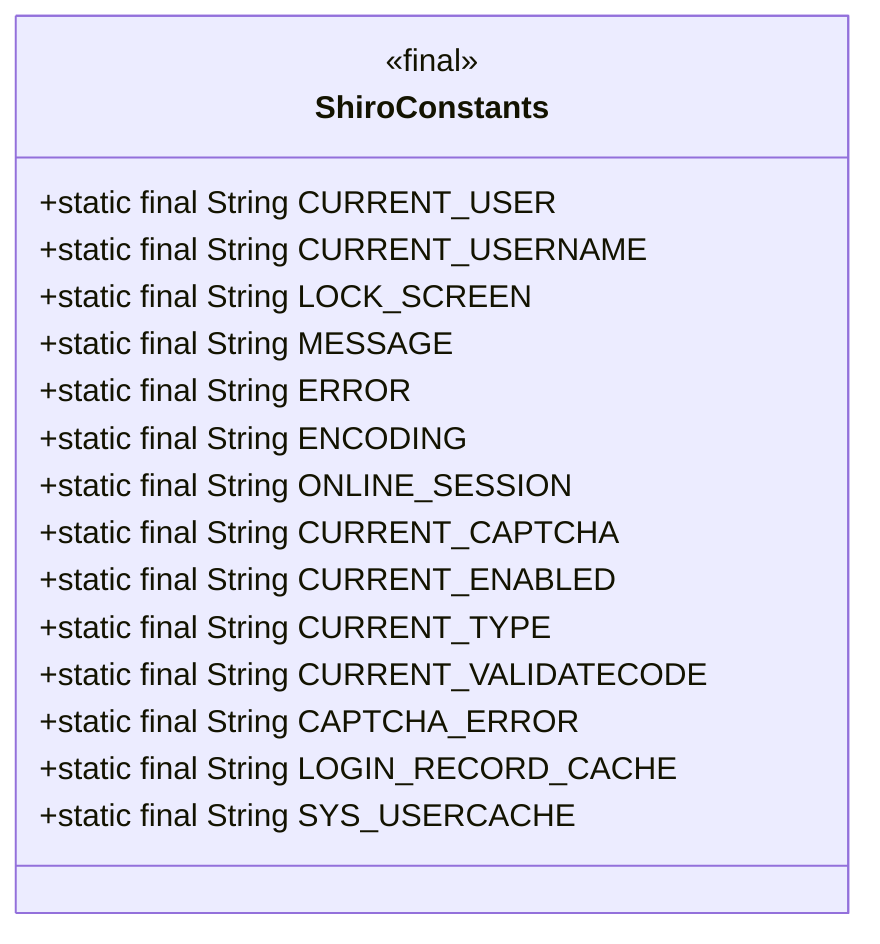

# 基础信息

|      |      |
|------|------|
| 名称 | ShiroConstants |
| 编码语言 | .java |
| 代码路径 | RuoYi-main/ruoyi-common/src/main/java/com/ruoyi/common/constant/ShiroConstants.java |
| 包名 | com.ruoyi.common.constant |
| 依赖项 | [] |
| 概述说明 | ShiroConstants类定义登录、验证码、会话和缓存管理常量。 |

# 说明

ShiroConstants类定义了多个常量，主要用于用户登录、验证码、会话和缓存管理。这些常量在系统中起到关键作用，帮助统一管理和控制与用户身份验证、会话状态及缓存相关的操作。通过定义这些常量，代码的可读性和维护性得到提升，同时也减少了硬编码的风险，确保系统在不同模块间的一致性和稳定性。

# 类列表 Class Summary

| 名称   | 类型  | 说明 |
|-------|------|-------------|
| ShiroConstants | class | ShiroConstants类定义多个常量，用于用户登录、验证码、会话和缓存管理。 |

## 类 ShiroConstants

|      |      |
|------|------|
| 访问范围 | public |
| 类型 | class |
| 名称 | ShiroConstants |
| 说明 | ShiroConstants类定义多个常量，用于用户登录、验证码、会话和缓存管理。 |

### UML类图

**描述：**  
`ShiroConstants` 类是一个包含多个静态常量的工具类，主要用于定义与Shiro框架相关的常量。这些常量包括当前用户、用户名、锁定屏幕、消息、错误信息、编码格式、在线会话、验证码及其相关配置、登录记录缓存和系统活跃用户缓存等。这些常量在应用程序中用于标识和访问特定的Shiro相关数据，确保代码的一致性和可维护性。

### 内部方法调用关系图

```mermaid
graph TD
    A["类ShiroConstants"]
    B["常量: CURRENT_USER = 'currentUser'"]
    C["常量: CURRENT_USERNAME = 'username'"]
    D["常量: LOCK_SCREEN = 'lockscreen'"]
    E["常量: MESSAGE = 'message'"]
    F["常量: ERROR = 'errorMsg'"]
    G["常量: ENCODING = 'UTF-8'"]
    H["常量: ONLINE_SESSION = 'online_session'"]
    I["常量: CURRENT_CAPTCHA = 'captcha'"]
    J["常量: CURRENT_ENABLED = 'captchaEnabled'"]
    K["常量: CURRENT_TYPE = 'captchaType'"]
    L["常量: CURRENT_VALIDATECODE = 'validateCode'"]
    M["常量: CAPTCHA_ERROR = 'captchaError'"]
    N["常量: LOGIN_RECORD_CACHE = 'loginRecordCache'"]
    O["常量: SYS_USERCACHE = 'sys-userCache'"]

    A --> B
    A --> C
    A --> D
    A --> E
    A --> F
    A --> G
    A --> H
    A --> I
    A --> J
    A --> K
    A --> L
    A --> M
    A --> N
    A --> O
```

这段代码定义了一个名为`ShiroConstants`的类，其中包含了多个静态常量字段，这些字段主要用于存储与Shiro框架相关的配置和状态信息。每个常量都代表了一个特定的键或值，例如当前登录用户、用户名、锁定屏幕状态、消息、错误信息、编码格式、在线会话、验证码相关配置等。这些常量在整个应用程序中可以被引用，以确保代码的一致性和可维护性。

### 字段列表 Field List

| 名称  | 类型  | 说明 |
|-------|-------|------|
| CURRENT_USERNAME = "username" | String | 定义常量CURRENT_USERNAME，值为"username"。 |
| CURRENT_CAPTCHA = "captcha" | String | 定义常量CURRENT_CAPTCHA，值为"captcha"。 |
| CAPTCHA_ERROR = "captchaError" | String | CAPTCHA错误常量定义。 |
| LOCK_SCREEN = "lockscreen" | String | 定义静态常量字符串LOCK_SCREEN为"lockscreen"。 |
| ENCODING = "UTF-8" | String | 定义常量ENCODING，值为UTF-8。 |
| CURRENT_ENABLED = "captchaEnabled" | String | 常量CURRENT_ENABLED表示验证码启用状态。 |
| ERROR = "errorMsg" | String | 定义静态常量ERROR，值为"errorMsg"。 |
| SYS_USERCACHE = "sys-userCache" | String | 定义常量SYS_USERCACHE，值为"sys-userCache"。 |
| CURRENT_USER = "currentUser" | String | 定义了一个静态常量字符串CURRENT_USER，值为"currentUser"。 |
| CURRENT_TYPE = "captchaType" | String | 定义常量CURRENT_TYPE，值为"captchaType"。 |
| ONLINE_SESSION = "online_session" | String | 定义了一个静态常量字符串ONLINE_SESSION，值为"online_session"。 |
| CURRENT_VALIDATECODE = "validateCode" | String | 定义常量CURRENT_VALIDATECODE，值为"validateCode"。 |
| MESSAGE = "message" | String | 定义静态常量MESSAGE，值为"message"。 |
| LOGIN_RECORD_CACHE = "loginRecordCache" | String | 定义登录记录缓存常量LOGIN_RECORD_CACHE。 |

### 方法列表 Method List

| 名称  | 类型  | 说明 |
|-------|-------|------|

