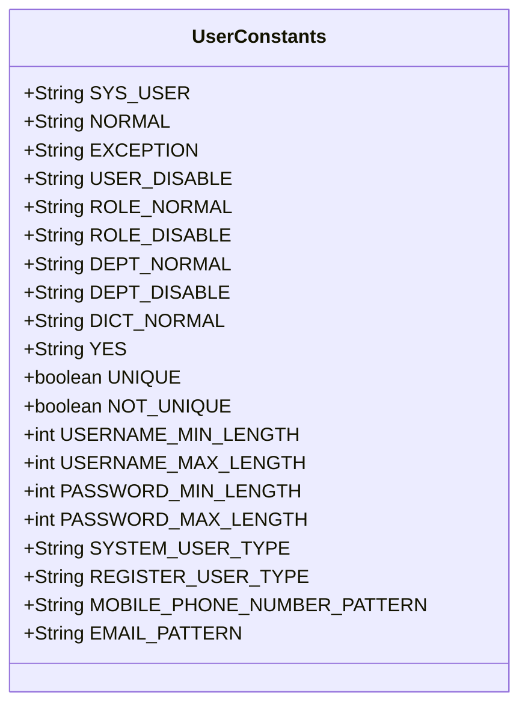
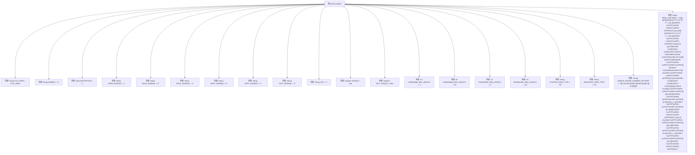

# 基础信息

|      |      |
|------|------|
| 名称 | UserConstants |
| 编码语言 | .java |
| 代码路径 | RuoYi-main/ruoyi-common/src/main/java/com/ruoyi/common/constant/UserConstants.java |
| 包名 | com.ruoyi.common.constant |
| 依赖项 | [] |
| 概述说明 | 定义用户角色部门状态常量及用户名密码手机邮箱格式限制。 |

# 说明

该内容定义了系统中所涉及的核心元素和限制条件。包括用户、角色、部门等基本实体，以及字典状态常量的设定。同时，对用户名、密码、手机号码和邮箱的格式进行了明确的限制，确保这些字段符合特定的规范要求。这些定义和限制为系统的数据管理和用户操作提供了基础框架和约束条件，确保数据的准确性和一致性。

# 类列表 Class Summary

| 名称   | 类型  | 说明 |
|-------|------|-------------|
| UserConstants | class | 定义用户、角色、部门、字典状态常量及用户名、密码、手机、邮箱格式限制。 |

## 类 UserConstants

|      |      |
|------|------|
| 访问范围 | public |
| 类型 | class |
| 名称 | UserConstants |
| 说明 | 定义用户、角色、部门、字典状态常量及用户名、密码、手机、邮箱格式限制。 |

### UML类图

**描述：**
`UserConstants` 类是一个常量类，用于定义系统中用户、角色、部门、字典等实体的状态和限制条件。它包含了各种静态常量，如用户状态、角色状态、部门状态、字典状态、用户名和密码的长度限制、用户类型、手机号码和邮箱的格式限制等。这些常量在整个系统中被广泛使用，以确保一致性和减少硬编码。

### 内部方法调用关系图

这段代码定义了一个名为`UserConstants`的类，其中包含了一系列用于用户管理的常量。这些常量涵盖了用户状态、角色状态、部门状态、字典状态、用户类型、用户名和密码的长度限制、手机号码和邮箱的格式验证等。这些常量在系统中用于统一管理和维护用户相关的配置和验证规则，确保系统的一致性和可维护性。

### 字段列表 Field List

| 名称  | 类型  | 说明 |
|-------|-------|------|
| PASSWORD_MIN_LENGTH = 5 | int | 密码最小长度为5。 |
| NORMAL = "0" | String | 定义静态常量NORMAL，值为字符串"0"。 |
| USERNAME_MIN_LENGTH = 2 | int | 用户名最小长度为2。 |
| SYSTEM_USER_TYPE = "00" | String | 系统用户类型常量定义为"00"。 |
| SYS_USER = "SYS_USER" | String | 定义系统用户常量SYS_USER。 |
| ROLE_NORMAL = "0" | String | ROLE_NORMAL为常量字符串，值为"0"。 |
| EXCEPTION = "1" | String | 定义常量字符串EXCEPTION，值为"1"。 |
| USER_DISABLE = "1" | String | USER_DISABLE常量值为"1"。 |
| UNIQUE = true | boolean | 定义了一个不可变且唯一的静态布尔常量。 |
| DICT_NORMAL = "0" | String | 定义静态常量DICT_NORMAL值为"0"。 |
| PASSWORD_MAX_LENGTH = 20 | int | 密码最大长度为20。 |
| DEPT_DISABLE = "1" | String | 静态常量DEPT_DISABLE值为"1"。 |
| EMAIL_PATTERN = "^((([a-z]|\\d|[!#\\$%&'\\*\\+\\-\\/=\\?\\^_`{\\|}~]|[\\u00A0-\\uD7FF\\uF900-\\uFDCF\\uFDF0-\\uFFEF])+(\\.([a-z]|\\d|[!#\\$%&'\\*\\+\\-\\/=\\?\\^_`{\\|}~]|[\\u00A0-\\uD7FF\\uF900-\\uFDCF\\uFDF0-\\uFFEF])+)*)|((\\x22)((((\\x20|\\x09)*(\\x0d\\x0a))?(\\x20|\\x09)+)?(([\\x01-\\x08\\x0b\\x0c\\x0e-\\x1f\\x7f]|\\x21|[\\x23-\\x5b]|[\\x5d-\\x7e]|[\\u00A0-\\uD7FF\\uF900-\\uFDCF\\uFDF0-\\uFFEF])|(\\\\([\\x01-\\x09\\x0b\\x0c\\x0d-\\x7f]|[\\u00A0-\\uD7FF\\uF900-\\uFDCF\\uFDF0-\\uFFEF]))))*(((\\x20|\\x09)*(\\x0d\\x0a))?(\\x20|\\x09)+)?(\\x22)))@((([a-z]|\\d|[\\u00A0-\\uD7FF\\uF900-\\uFDCF\\uFDF0-\\uFFEF])|(([a-z]|\\d|[\\u00A0-\\uD7FF\\uF900-\\uFDCF\\uFDF0-\\uFFEF])([a-z]|\\d|-|\\.|_|~|[\\u00A0-\\uD7FF\\uF900-\\uFDCF\\uFDF0-\\uFFEF])*([a-z]|\\d|[\\u00A0-\\uD7FF\\uF900-\\uFDCF\\uFDF0-\\uFFEF])))\\.)+(([a-z]|[\\u00A0-\\uD7FF\\uF900-\\uFDCF\\uFDF0-\\uFFEF])|(([a-z]|[\\u00A0-\\uD7FF\\uF900-\\uFDCF\\uFDF0-\\uFFEF])([a-z]|\\d|-|\\.|_|~|[\\u00A0-\\uD7FF\\uF900-\\uFDCF\\uFDF0-\\uFFEF])*([a-z]|[\\u00A0-\\uD7FF\\uF900-\\uFDCF\\uFDF0-\\uFFEF])))\\.?" | String | 定义了一个用于验证电子邮件格式的正则表达式。 |
| YES = "Y" | String | 定义了一个不可变的字符串常量YES，值为"Y"。 |
| NOT_UNIQUE = false | boolean | NOT_UNIQUE为不可修改的静态布尔常量，值为false。 |
| DEPT_NORMAL = "0" | String | 常量DEPT_NORMAL值为"0"。 |
| MOBILE_PHONE_NUMBER_PATTERN = "^0{0,1}(13[0-9]|15[0-9]|14[0-9]|18[0-9])[0-9]{8}$" | String | 定义手机号码正则表达式，匹配13、14、15、18开头的11位数字。 |
| USERNAME_MAX_LENGTH = 20 | int | 用户名最大长度为20字符。 |
| REGISTER_USER_TYPE = "01" | String | 定义常量REGISTER_USER_TYPE，值为"01"。 |
| ROLE_DISABLE = "1" | String | 定义常量ROLE_DISABLE，值为"1"。 |

### 方法列表 Method List

| 名称  | 类型  | 说明 |
|-------|-------|------|

