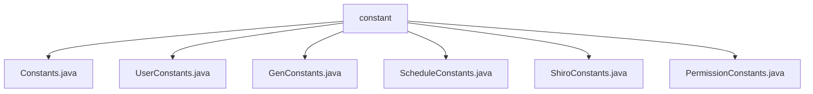

# 基础信息

|      |      |
|------|------|
| 名称 | constant |
| 编码语言 | .java |
| 代码路径 | RuoYi-main/ruoyi-common/src/main/java/com/ruoyi/common/constant |
| 包名 | RuoYi-main.ruoyi-common.src.main.java.com.ruoyi.common.constant |
| 概述说明 | 定义了系统常量，涵盖字符集、语言、协议、缓存、任务调度、权限等，确保系统稳定性和一致性。 |

# 说明

## 概述
该代码模块主要定义了一系列常量，涵盖了字符集、语言、请求协议、状态标识、缓存配置、资源路径、远程调用、定时任务限制、用户和角色管理、任务调度、权限控制等多个方面。这些常量为系统提供了基础配置和运行规范，确保各模块在不同环境下的一致性和稳定性。通过集中管理这些常量，代码的可读性、维护性和可扩展性得到了显著提升，同时也减少了硬编码的风险。

## 主要业务场景
1. **多语言支持和编码处理**：通过字符集和语言常量，系统能够处理多语言支持和编码问题，确保在不同语言环境下的正确显示和处理。
2. **网络通信流程规范**：请求协议和状态标识常量规范了网络通信流程，确保系统在网络通信中的一致性和稳定性。
3. **系统性能优化**：缓存配置和资源路径常量优化了系统性能，减少了资源加载时间和系统响应时间。
4. **高效运行和资源管理**：远程调用和定时任务限制常量确保了系统的高效运行和资源管理，避免了资源浪费和系统过载。
5. **用户和角色管理**：用户、角色、部门等基本实体的定义和限制，确保了系统数据管理的准确性和一致性。
6. **任务调度管理**：任务调度相关常量为任务调度系统提供了统一的规范和标准，确保任务能够按照预定的策略和状态进行管理和执行。
7. **权限控制**：权限常量定义了六种操作权限，包括新增、修改、删除、导出、显示和查询，确保用户在执行相关操作时具备相应的权限控制，维护系统的安全性和数据完整性。
8. **用户身份验证和会话管理**：ShiroConstants类定义的常量用于用户登录、验证码、会话和缓存管理，确保用户身份验证和会话状态的一致性和稳定性。

### 包内部结构视图

该流程图展示了`constant`文件夹与其内部文件的层级关系。`constant`文件夹下包含了多个常量定义文件，如`Constants.java`、`UserConstants.java`等。这些文件均直接归属于`constant`文件夹，没有进一步的子文件夹结构。

# 文件列表 File List

| 名称   | 类型  | 说明 |
|-------|------|-------------|
| [ShiroConstants.java](ShiroConstants.md) | file | ShiroConstants类定义登录、验证码、会话和缓存管理常量。 |
| [PermissionConstants.java](PermissionConstants.md) | file | 新增权限常量类，包含增删改查及导出显示功能。 |
| [ScheduleConstants.java](ScheduleConstants.md) | file | ScheduleConstants类含任务类名、属性、执行策略及状态枚举。 |
| [GenConstants.java](GenConstants.md) | file | GenConstants类定义常用常量，涵盖模板、字段、数据库类型、HTML控件和查询类型。 |
| [UserConstants.java](UserConstants.md) | file | 定义用户角色部门状态常量及用户名密码手机邮箱格式限制。 |
| [Constants.java](Constants.md) | file | 定义常量涵盖字符集、语言、协议、状态、缓存、路径、远程调用及定时任务限制。 |

