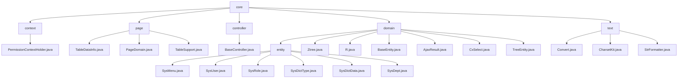

# 基础信息

|      |      |
|------|------|
| 名称 | core |
| 编码语言 | .java |
| 代码路径 | RuoYi-main/ruoyi-common/src/main/java/com/ruoyi/common/core |
| 包名 | RuoYi-main.ruoyi-common.src.main.java.com.ruoyi.common.core |
| 概述说明 | PermissionContextHolder管理权限上下文，TableDataInfo等类管理分页数据，BaseController提供常用功能，SysMenu等类管理系统核心数据，Convert等类处理文本转换。 |

# 说明

## 概述
该代码模块是一个基于Java的后台管理系统，主要围绕表格数据的分页管理、权限上下文管理、核心实体数据管理以及文本处理展开。模块包含多个核心类，分别用于处理分页逻辑、权限上下文、系统核心实体数据（如菜单、用户、角色、字典、部门）以及文本转换和格式化操作。模块的设计注重灵活性、可扩展性和代码的可维护性，旨在简化开发流程，提升系统的安全性和一致性。

## 主要业务场景
1. **表格数据分页管理**：
   - 通过 `TableDataInfo`、`PageDomain` 和 `TableSupport` 类，模块提供了高效的分页管理功能，适用于需要展示和管理表格数据的场景，如数据查询结果的返回。`TableDataInfo` 负责存储表格数据及其元信息，`PageDomain` 管理分页参数，`TableSupport` 封装分页查询所需的关键信息，确保分页操作的规范性和一致性。

2. **权限上下文管理**：
   - `PermissionContextHolder` 类在请求范围内管理和操作权限上下文，确保权限信息在单个请求的处理过程中能够被有效传递和访问。该功能适用于需要统一管理和维护权限数据的场景，提升系统的安全性和一致性。

3. **核心实体数据管理**：
   - 模块通过多个类（如 `SysMenu`、`SysUser`、`SysRole`、`SysDictType`、`SysDictData`、`SysDept`）管理系统的核心实体数据，包括菜单、用户、角色、字典和部门。这些类提供了对系统核心数据的全面管理功能，支持数据的导入导出、层级关系管理以及状态控制，确保系统的高效运行和数据的完整性。

4. **文本处理**：
   - 模块通过 `Convert`、`CharsetKit` 和 `StrFormatter` 类提供了强大的文本处理功能，适用于数据类型转换、字符集转换和字符串格式化等场景。`Convert` 类支持多种类型的数据转换，`CharsetKit` 类简化了字符集转换流程，`StrFormatter` 类用于字符串格式化操作，确保文本处理的准确性和一致性。

这些业务场景共同构成了系统的核心功能，确保系统数据的高效管理和操作，同时提升开发效率和系统稳定性。

### 包内部结构视图

该流程图展示了RuoYi项目中`ruoyi-common`模块的目录结构。从`core`目录出发，分为`context`、`page`、`controller`、`domain`和`text`五个主要子目录。每个子目录下包含多个文件或进一步细分的子目录，如`domain`下的`entity`目录，其中包含了多个实体类文件。整体结构清晰，反映了模块化设计的思路。

# 文件列表 File List

| 名称   | 类型  | 说明 |
|-------|------|-------------|
| [text](text/_module.md) | package | Convert类支持类型转换与默认值，CharsetKit类简化字符集转换，StrFormatter类处理字符串格式化与转义。 |
| [domain](domain/_module.md) | package | Java后台管理系统，管理菜单、用户、角色、字典、部门等核心数据，支持导入导出和层级管理。 |
| [controller](controller/_module.md) | package | BaseController类集成日志、日期转换、分页、排序、请求响应和用户信息功能。 |
| [page](page/_module.md) | package | TableDataInfo类存储表格数据及元信息，PageDomain类管理分页参数，TableSupport类封装分页信息。 |
| [context](context/_module.md) | package | PermissionContextHolder类管理请求范围内的权限上下文。 |

