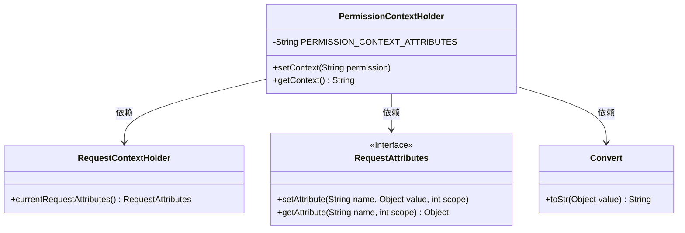
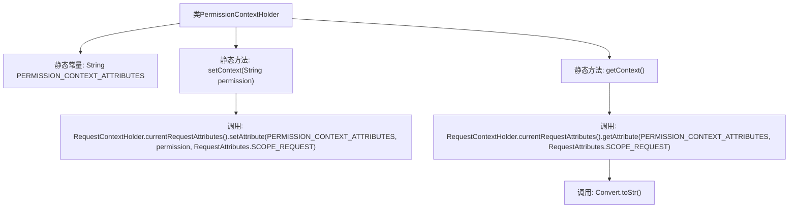

# 基础信息

|      |      |
|------|------|
| 名称 | PermissionContextHolder |
| 编码语言 | .java |
| 代码路径 | RuoYi-main/ruoyi-common/src/main/java/com/ruoyi/common/core/context/PermissionContextHolder.java |
| 包名 | com.ruoyi.common.core.context |
| 依赖项 | ['org.springframework.web.context.request.RequestAttributes', 'org.springframework.web.context.request.RequestContextHolder', 'com.ruoyi.common.core.text.Convert'] |
| 概述说明 | PermissionContextHolder类管理请求范围内的权限上下文。 |

# 说明

PermissionContextHolder类的主要功能是在请求范围内管理和操作权限上下文。它提供了设置和获取权限上下文的方法，确保在单个请求的处理过程中，权限信息能够被有效传递和访问。该类的作用是帮助开发者在一个请求的生命周期内，统一管理和维护与权限相关的数据，从而提高系统的安全性和一致性。

# 类列表 Class Summary

| 名称   | 类型  | 说明 |
|-------|------|-------------|
| PermissionContextHolder | class | PermissionContextHolder类用于在请求范围内设置和获取权限上下文。 |

## 类 PermissionContextHolder

|      |      |
|------|------|
| 访问范围 | public |
| 类型 | class |
| 名称 | PermissionContextHolder |
| 说明 | PermissionContextHolder类用于在请求范围内设置和获取权限上下文。 |

### UML类图

这段代码定义了一个`PermissionContextHolder`类，用于在请求上下文中设置和获取权限信息。`PermissionContextHolder`依赖于`RequestContextHolder`来获取当前请求的属性，并通过`RequestAttributes`接口来设置和获取权限属性。`Convert`类用于将获取的属性值转换为字符串。整个类图展示了`PermissionContextHolder`如何与其他类协作来管理权限上下文。

### 内部方法调用关系图

这段代码定义了一个名为`PermissionContextHolder`的类，用于在请求上下文中设置和获取权限信息。类中包含一个静态常量`PERMISSION_CONTEXT_ATTRIBUTES`，用于标识权限上下文的属性名。`setContext`方法用于将权限信息设置到当前请求的上下文中，而`getContext`方法则从当前请求的上下文中获取权限信息，并将其转换为字符串。代码通过`RequestContextHolder`来操作请求属性，确保权限信息在请求范围内有效。

### 字段列表 Field List

| 名称  | 类型  | 说明 |
|-------|-------|------|
| PERMISSION_CONTEXT_ATTRIBUTES = "PERMISSION_CONTEXT" | String | 定义权限上下文属性的静态常量字符串。 |

### 方法列表 Method List

| 名称  | 类型  | 说明 |
|-------|-------|------|
| getContext | String | 静态方法获取请求上下文中的权限属性值。 |
| setContext | void | 静态方法`setContext`设置请求属性`PERMISSION_CONTEXT_ATTRIBUTES`。 |

