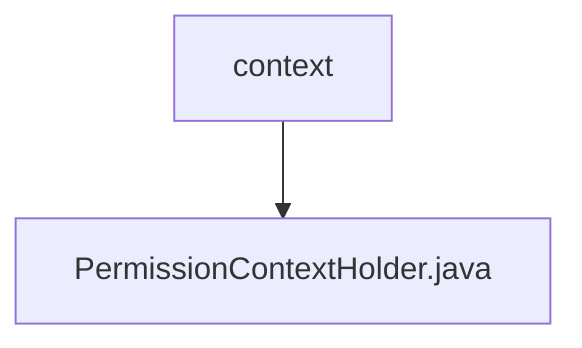

# 基础信息

|      |      |
|------|------|
| 名称 | context |
| 编码语言 | .java |
| 代码路径 | RuoYi-main/ruoyi-common/src/main/java/com/ruoyi/common/core/context |
| 包名 | RuoYi-main.ruoyi-common.src.main.java.com.ruoyi.common.core.context |
| 概述说明 | PermissionContextHolder类管理请求范围内的权限上下文。 |

# 说明

PermissionContextHolder类的主要功能是在请求范围内管理和操作权限上下文。它提供了设置和获取权限上下文的方法，确保在单个请求的处理过程中，权限信息能够被有效传递和访问。该类的作用是帮助开发者在一个请求的生命周期内，统一管理和维护与权限相关的数据，从而提高系统的安全性和一致性。

### 包内部结构视图

该流程图展示了路径中的层级关系，`context`文件夹包含`PermissionContextHolder.java`文件。这种结构清晰地反映了文件在项目中的位置，便于理解和管理。

# 文件列表 File List

| 名称   | 类型  | 说明 |
|-------|------|-------------|
| [PermissionContextHolder.java](PermissionContextHolder.md) | file | PermissionContextHolder类管理请求范围内的权限上下文。 |

