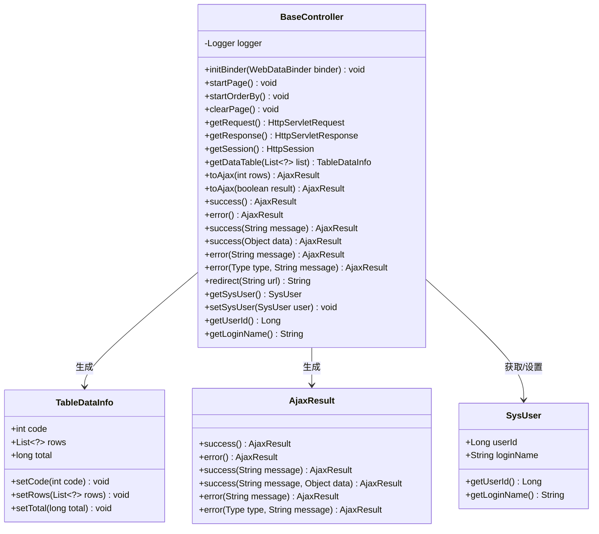

# 基础信息

|      |      |
|------|------|
| 名称 | BaseController |
| 编码语言 | .java |
| 代码路径 | RuoYi-main/ruoyi-common/src/main/java/com/ruoyi/common/core/controller/BaseController.java |
| 包名 | com.ruoyi.common.core.controller |
| 依赖项 | ['java.beans.PropertyEditorSupport', 'java.util.Date', 'java.util.List', 'javax.servlet.http.HttpServletRequest', 'javax.servlet.http.HttpServletResponse', 'javax.servlet.http.HttpSession', 'org.slf4j.Logger', 'org.slf4j.LoggerFactory', 'org.springframework.web.bind.WebDataBinder', 'org.springframework.web.bind.annotation.InitBinder', 'com.github.pagehelper.PageHelper', 'com.github.pagehelper.PageInfo', 'com.ruoyi.common.core.domain.AjaxResult', 'com.ruoyi.common.core.domain.AjaxResult.Type', 'com.ruoyi.common.core.domain.entity.SysUser', 'com.ruoyi.common.core.page.PageDomain', 'com.ruoyi.common.core.page.TableDataInfo', 'com.ruoyi.common.core.page.TableSupport', 'com.ruoyi.common.utils.DateUtils', 'com.ruoyi.common.utils.PageUtils', 'com.ruoyi.common.utils.ServletUtils', 'com.ruoyi.common.utils.ShiroUtils', 'com.ruoyi.common.utils.StringUtils', 'com.ruoyi.common.utils.sql.SqlUtil'] |
| 概述说明 | BaseController类集成日志、日期转换、分页、排序、请求响应和用户信息功能。 |

# 说明

BaseController类是一个功能丰富的基类，提供了多种常用功能以简化开发流程。它集成了日志记录功能，便于跟踪和调试程序运行状态。日期转换功能支持不同格式的日期处理，确保时间数据的准确性和一致性。分页和排序功能帮助管理大量数据，提升查询效率。请求响应处理功能简化了前后端数据交互，确保通信顺畅。用户信息管理功能方便获取和操作用户相关数据，增强了系统的用户管理能力。这些功能共同提升了开发效率和系统稳定性。

# 类列表 Class Summary

| 名称   | 类型  | 说明 |
|-------|------|-------------|
| BaseController | class | BaseController类提供日志、日期转换、分页、排序、请求响应、用户信息等功能。 |

## 类 BaseController

|      |      |
|------|------|
| 访问范围 | public |
| 类型 | class |
| 名称 | BaseController |
| 说明 | BaseController类提供日志、日期转换、分页、排序、请求响应、用户信息等功能。 |

### UML类图

### 描述
`BaseController` 是一个基础控制器类，提供了多种通用方法，如日期转换、分页处理、请求响应、用户信息获取等。它依赖于 `TableDataInfo` 类来生成分页数据响应，依赖于 `AjaxResult` 类来生成操作结果响应，并且能够通过 `SysUser` 类获取和设置用户信息。这些类共同构成了一个处理Web请求的基础框架。

### 内部方法调用关系图

```mermaid
graph TD
    A["类BaseController"]
    B["属性: Logger logger"]
    C["方法: initBinder(WebDataBinder binder)"]
    D["方法: startPage()"]
    E["方法: startOrderBy()"]
    F["方法: clearPage()"]
    G["方法: getRequest()"]
    H["方法: getResponse()"]
    I["方法: getSession()"]
    J["方法: getDataTable(List<?> list)"]
    K["方法: toAjax(int rows)"]
    L["方法: toAjax(boolean result)"]
    M["方法: success()"]
    N["方法: error()"]
    O["方法: success(String message)"]
    P["方法: success(Object data)"]
    Q["方法: error(String message)"]
    R["方法: error(Type type, String message)"]
    S["方法: redirect(String url)"]
    T["方法: getSysUser()"]
    U["方法: setSysUser(SysUser user)"]
    V["方法: getUserId()"]
    W["方法: getLoginName()"]

    A --> B
    A --> C
    A --> D
    A --> E
    A --> F
    A --> G
    A --> H
    A --> I
    A --> J
    A --> K
    A --> L
    A --> M
    A --> N
    A --> O
    A --> P
    A --> Q
    A --> R
    A --> S
    A --> T
    A --> U
    A --> V
    A --> W
```

该流程图展示了`BaseController`类的主要方法和属性。`BaseController`类是一个控制器基类，包含了日志记录、日期转换、分页处理、请求响应处理、用户信息获取等功能。每个方法都有明确的职责，如`initBinder`用于日期格式转换，`startPage`和`startOrderBy`用于分页和排序处理，`getDataTable`用于响应分页数据，`toAjax`用于返回操作结果等。这些方法共同构成了一个功能丰富的控制器基类，支持多种业务场景的需求。

### 字段列表 Field List

| 名称  | 类型  | 说明 |
|-------|-------|------|
| logger = LoggerFactory.getLogger(this.getClass()) | Logger | 类中声明并初始化了一个受保护的Logger实例。 |

### 方法列表 Method List

| 名称  | 类型  | 说明 |
|-------|-------|------|
| clearPage | void | 清除页面内容的方法。 |
| getSession | HttpSession | 获取当前请求的会话对象。 |
| toAjax | AjaxResult | 根据行数返回成功或错误结果。 |
| getLoginName | String | 获取系统用户的登录名。 |
| getRequest | HttpServletRequest | 获取当前HTTP请求对象。 |
| getSysUser | SysUser | 该方法返回当前系统用户对象。 |
| getUserId | Long | 该方法返回系统用户的用户ID。 |
| setSysUser | void | 设置系统用户，通过ShiroUtils工具类实现。 |
| initBinder | void | 该方法用于将字符串转换为Date类型，注册自定义编辑器。 |
| error | AjaxResult | AjaxResult类的error方法返回错误结果。 |
| error | AjaxResult | AjaxResult错误方法返回包含错误信息的AjaxResult对象。 |
| startOrderBy | void | 该方法根据页面请求构建排序条件，并确保SQL安全。 |
| startPage | void | `startPage`方法调用`PageUtils.startPage()`开始页面。 |
| toAjax | AjaxResult | `toAjax`方法根据布尔值`result`返回成功或错误结果。 |
| redirect | String | 方法redirect接收URL参数，返回格式化的重定向字符串。 |
| success | AjaxResult | 静态方法返回操作成功的Ajax结果，包含数据。 |
| error | AjaxResult | 定义公共方法error，返回包含类型和消息的AjaxResult对象。 |
| getDataTable | TableDataInfo | 方法`getDataTable`封装列表数据为表格响应，包含状态码、数据行和总数。 |
| success | AjaxResult | 定义一个返回成功AjaxResult对象的方法，传入消息参数。 |
| success | AjaxResult | 公共方法返回成功AjaxResult对象。 |
| getResponse | HttpServletResponse | 获取HTTP响应对象的方法。 |

