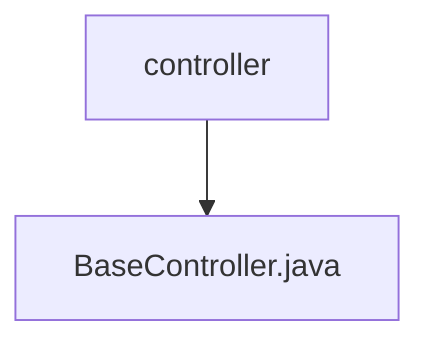

# 基础信息

|      |      |
|------|------|
| 名称 | controller |
| 编码语言 | .java |
| 代码路径 | RuoYi-main/ruoyi-common/src/main/java/com/ruoyi/common/core/controller |
| 包名 | RuoYi-main.ruoyi-common.src.main.java.com.ruoyi.common.core.controller |
| 概述说明 | BaseController类集成日志、日期转换、分页、排序、请求响应和用户信息功能。 |

# 说明

BaseController类是一个功能丰富的基类，提供了多种常用功能以简化开发流程。它集成了日志记录功能，便于跟踪和调试程序运行状态。日期转换功能支持不同格式的日期处理，确保时间数据的准确性和一致性。分页和排序功能帮助管理大量数据，提升查询效率。请求响应处理功能简化了前后端数据交互，确保通信顺畅。用户信息管理功能方便获取和操作用户相关数据，增强了系统的用户管理能力。这些功能共同提升了开发效率和系统稳定性。

### 包内部结构视图

流程图展示了RuoYi项目中`controller`文件夹与`BaseController.java`文件之间的层级关系。`controller`文件夹包含了一个名为`BaseController.java`的文件，该文件可能是控制器的基类，用于定义通用的控制器行为。

# 文件列表 File List

| 名称   | 类型  | 说明 |
|-------|------|-------------|
| [BaseController.java](BaseController.md) | file | BaseController类集成日志、日期转换、分页、排序、请求响应和用户信息功能。 |

