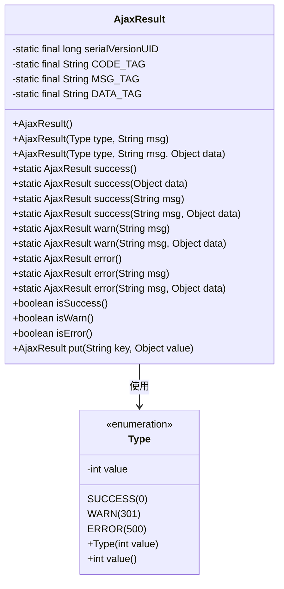

# 基础信息

|      |      |
|------|------|
| 名称 | AjaxResult |
| 编码语言 | .java |
| 代码路径 | RuoYi-main/ruoyi-common/src/main/java/com/ruoyi/common/core/domain/AjaxResult.java |
| 包名 | com.ruoyi.common.core.domain |
| 依赖项 | ['java.util.HashMap', 'java.util.Objects', 'com.ruoyi.common.utils.StringUtils'] |
| 概述说明 | AjaxResult类封装Ajax请求结果，包含状态码、消息和数据。 |

# 说明

AjaxResult类是一个用于封装Ajax请求结果的类，其主要功能是存储和传递请求的状态信息。该类包含三个核心属性：状态码、消息和数据对象。状态码用于表示请求的成功或失败状态，消息提供对请求结果的详细描述，而数据对象则用于存储请求返回的具体数据。通过这种方式，AjaxResult类能够有效地组织和传递Ajax请求的相关信息，便于后续处理和分析。

# 类列表 Class Summary

| 名称   | 类型  | 说明 |
|-------|------|-------------|
| AjaxResult | class | AjaxResult类用于封装Ajax请求结果，包含状态码、消息和数据对象。 |

## 类 AjaxResult

|      |      |
|------|------|
| 访问范围 | public |
| 类型 | class |
| 名称 | AjaxResult |
| 说明 | AjaxResult类用于封装Ajax请求结果，包含状态码、消息和数据对象。 |

### UML类图

**描述：**  
`AjaxResult` 类是一个用于封装 Ajax 请求结果的工具类，继承自 `HashMap<String, Object>`。它包含状态码、返回内容和数据对象等字段，并提供了多种静态方法来生成不同类型的响应结果（成功、警告、错误）。`Type` 枚举类定义了状态类型及其对应的值。`AjaxResult` 类还提供了链式调用的 `put` 方法，方便在构建响应时添加额外的键值对。

### 内部方法调用关系图

```mermaid
graph TD
    A["类AjaxResult"]
    B["属性: long serialVersionUID"]
    C["常量: String CODE_TAG"]
    D["常量: String MSG_TAG"]
    E["常量: String DATA_TAG"]
    F["枚举Type"]
    G["枚举值: SUCCESS(0)"]
    H["枚举值: WARN(301)"]
    I["枚举值: ERROR(500)"]
    J["构造方法: AjaxResult()"]
    K["构造方法: AjaxResult(Type type, String msg)"]
    L["构造方法: AjaxResult(Type type, String msg, Object data)"]
    M["方法: success()"]
    N["方法: success(Object data)"]
    O["方法: success(String msg)"]
    P["方法: success(String msg, Object data)"]
    Q["方法: warn(String msg)"]
    R["方法: warn(String msg, Object data)"]
    S["方法: error()"]
    T["方法: error(String msg)"]
    U["方法: error(String msg, Object data)"]
    V["方法: isSuccess()"]
    W["方法: isWarn()"]
    X["方法: isError()"]
    Y["方法: put(String key, Object value)"]

    A --> B
    A --> C
    A --> D
    A --> E
    A --> F
    F --> G
    F --> H
    F --> I
    A --> J
    A --> K
    A --> L
    A --> M
    A --> N
    A --> O
    A --> P
    A --> Q
    A --> R
    A --> S
    A --> T
    A --> U
    A --> V
    A --> W
    A --> X
    A --> Y
```

这段代码定义了一个名为 `AjaxResult` 的类，该类继承自 `HashMap<String, Object>`，用于封装Ajax请求的返回结果。类中包含了一些常量、枚举类型、构造方法以及多个静态方法和实例方法。这些方法主要用于生成不同类型的返回结果（如成功、警告、错误），并提供了链式调用的支持。流程图展示了类的主要结构及其内部方法的调用关系，帮助理解代码的组织和功能。

### 字段列表 Field List

| 名称  | 类型  | 说明 |
|-------|-------|------|
| serialVersionUID = 1L | long | 定义静态长整型常量serialVersionUID，值为1L。 |
| MSG_TAG = "msg" | String | 定义静态常量字符串MSG_TAG，值为"msg"。 |
| CODE_TAG = "code" | String | 定义常量字符串CODE_TAG，值为"code"。 |
| DATA_TAG = "data" | String | 定义常量字符串DATA_TAG，值为"data"。 |

### 方法列表 Method List

| 名称  | 类型  | 说明 |
|-------|-------|------|
| isWarn | boolean | 判断当前对象类型是否为警告类型。 |
| success | AjaxResult | 静态方法返回操作成功的Ajax结果。 |
| error | AjaxResult | 静态方法返回操作失败的Ajax结果。 |
| error | AjaxResult | 静态方法error返回AjaxResult对象，包含错误信息msg。 |
| isSuccess | boolean | 该方法检查对象类型是否为成功并返回布尔值。 |
| isError | boolean | 方法isError检查对象类型是否为ERROR。 |
| put | AjaxResult | 重写put方法，调用父类并返回当前对象。 |
| warn | AjaxResult | 静态方法`warn`返回带警告信息的`AjaxResult`对象。 |
| success | AjaxResult | 静态方法success返回包含成功类型、消息和数据的AjaxResult对象。 |
| success | AjaxResult | 静态方法返回成功Ajax结果，带消息无数据。 |
| error | AjaxResult | 静态方法error返回包含错误类型、消息和数据的AjaxResult对象。 |
| warn | AjaxResult | 静态方法warn返回AjaxResult对象，包含警告类型、消息和数据。 |
| success | AjaxResult | AjaxResult成功方法返回操作成功和数据。 |

