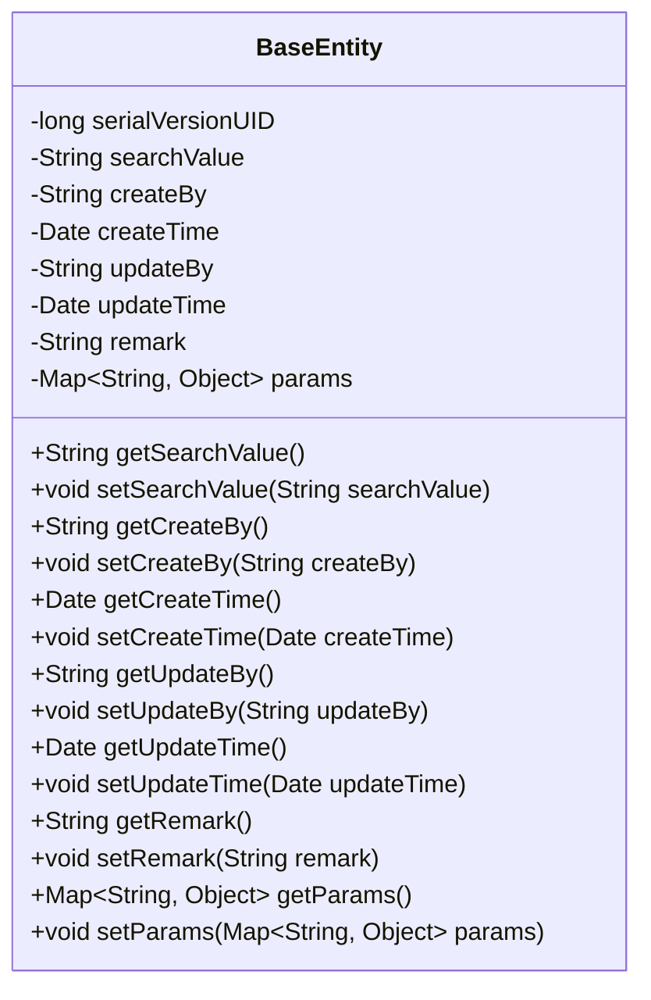

# 基础信息

|      |      |
|------|------|
| 名称 | BaseEntity |
| 编码语言 | .java |
| 代码路径 | RuoYi-main/ruoyi-common/src/main/java/com/ruoyi/common/core/domain/BaseEntity.java |
| 包名 | com.ruoyi.common.core.domain |
| 依赖项 | ['java.io.Serializable', 'java.util.Date', 'java.util.HashMap', 'java.util.Map', 'com.fasterxml.jackson.annotation.JsonFormat', 'com.fasterxml.jackson.annotation.JsonIgnore', 'com.fasterxml.jackson.annotation.JsonInclude'] |
| 概述说明 | BaseEntity类实现Serializable，包含搜索值等字段及其getter和setter方法。 |

# 说明

BaseEntity类实现了Serializable接口，包含多个字段及其对应的getter和setter方法。这些字段包括搜索值、创建者、创建时间、更新者、更新时间和备注，以及请求参数。通过这些字段和方法，BaseEntity类能够有效地管理和操作实体数据，支持序列化操作，便于数据的存储和传输。

# 类列表 Class Summary

| 名称   | 类型  | 说明 |
|-------|------|-------------|
| BaseEntity | class | BaseEntity类实现Serializable，包含搜索值、创建者、创建时间、更新者、更新时间、备注和请求参数等字段及其getter和setter方法。 |

## 类 BaseEntity

|      |      |
|------|------|
| 访问范围 | public |
| 类型 | class |
| 名称 | BaseEntity |
| 说明 | BaseEntity类实现Serializable，包含搜索值、创建者、创建时间、更新者、更新时间、备注和请求参数等字段及其getter和setter方法。 |

### UML类图

BaseEntity类是一个基础实体类，实现了Serializable接口，用于序列化。它包含多个属性，如搜索值、创建者、创建时间、更新者、更新时间、备注和请求参数。每个属性都有对应的getter和setter方法。其中，params属性在获取时会进行非空检查，确保返回的Map对象不为空。这个类主要用于存储和管理实体类的基本信息，适用于需要序列化和反序列化的场景。

### 内部方法调用关系图

```mermaid
graph TD
    A["类BaseEntity"]
    B["属性: String searchValue"]
    C["属性: String createBy"]
    D["属性: Date createTime"]
    E["属性: String updateBy"]
    F["属性: Date updateTime"]
    G["属性: String remark"]
    H["属性: Map<String, Object> params"]
    I["方法: String getSearchValue()"]
    J["方法: void setSearchValue(String searchValue)"]
    K["方法: String getCreateBy()"]
    L["方法: void setCreateBy(String createBy)"]
    M["方法: Date getCreateTime()"]
    N["方法: void setCreateTime(Date createTime)"]
    O["方法: String getUpdateBy()"]
    P["方法: void setUpdateBy(String updateBy)"]
    Q["方法: Date getUpdateTime()"]
    R["方法: void setUpdateTime(Date updateTime)"]
    S["方法: String getRemark()"]
    T["方法: void setRemark(String remark)"]
    U["方法: Map<String, Object> getParams()"]
    V["方法: void setParams(Map<String, Object> params)"]

    A --> B
    A --> C
    A --> D
    A --> E
    A --> F
    A --> G
    A --> H
    A --> I
    A --> J
    A --> K
    A --> L
    A --> M
    A --> N
    A --> O
    A --> P
    A --> Q
    A --> R
    A --> S
    A --> T
    A --> U
    A --> V
```

这段代码定义了一个名为`BaseEntity`的类，该类实现了`Serializable`接口，包含多个属性和对应的getter和setter方法。属性包括`searchValue`、`createBy`、`createTime`、`updateBy`、`updateTime`、`remark`和`params`，分别用于存储搜索值、创建者、创建时间、更新者、更新时间、备注和请求参数。每个属性都有对应的getter和setter方法，用于获取和设置属性值。`getParams`方法在`params`为空时会初始化一个新的`HashMap`。

### 字段列表 Field List

| 名称  | 类型  | 说明 |
|-------|-------|------|
| serialVersionUID = 1L | long | 定义了一个私有静态常量serialVersionUID，值为1L。 |
| remark | String | 定义了一个私有字符串变量remark。 |
| searchValue | String | 忽略JSON序列化中的searchValue字段。 |
| updateBy | String | 私有字符串变量用于记录更新者信息。 |
| createBy | String | 私有字符串变量createBy。 |
| params | Map<String, Object> | 该代码定义了一个非空参数映射。 |
| updateTime | Date | 定义日期格式为"yyyy-MM-dd HH:mm:ss"，时区为GMT+8。 |
| createTime | Date | 日期字段，格式为yyyy-MM-dd HH:mm:ss，时区GMT+8。 |

### 方法列表 Method List

| 名称  | 类型  | 说明 |
|-------|-------|------|
| setCreateBy | void | 设置创建者属性的方法。 |
| getCreateBy | String | 获取创建者信息的方法。 |
| setRemark | void | 设置备注信息的方法。 |
| getRemark | String | 获取备注信息的Java方法。 |
| getUpdateBy | String | 该方法返回更新者信息。 |
| getCreateTime | Date | 获取创建时间的公共方法。 |
| setUpdateTime | void | 设置更新时间方法，接收Date类型参数。 |
| getSearchValue | String | 获取搜索值的方法。 |
| setCreateTime | void | 设置创建时间的方法，参数为Date类型。 |
| getUpdateTime | Date | 获取更新时间的方法，返回Date类型变量updateTime。 |
| setUpdateBy | void | 设置更新者方法，参数为字符串updateBy。 |
| setParams | void | 设置参数方法，将传入的Map赋值给类的params属性。 |
| getParams | Map<String, Object> | 获取或初始化并返回参数映射。 |
| setSearchValue | void | 设置搜索值的公共方法，将传入的searchValue赋值给类的成员变量。 |

