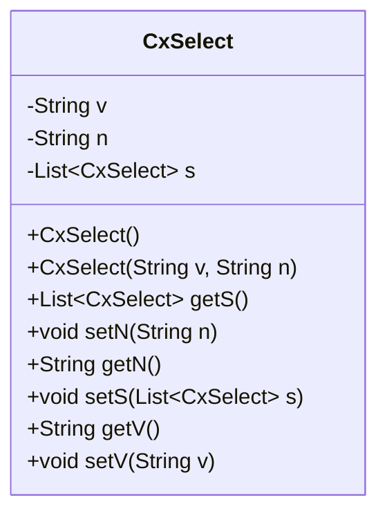
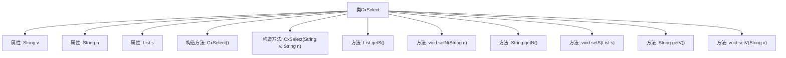

# 基础信息

|      |      |
|------|------|
| 名称 | CxSelect |
| 编码语言 | .java |
| 代码路径 | RuoYi-main/ruoyi-common/src/main/java/com/ruoyi/common/core/domain/CxSelect.java |
| 包名 | com.ruoyi.common.core.domain |
| 依赖项 | ['java.io.Serializable', 'java.util.List'] |
| 概述说明 | CxSelect类实现Serializable，含v、n、s字段及getter、setter方法。 |

# 说明

CxSelect类实现了Serializable接口，包含三个主要字段：值字段v、标题字段n和子集字段s。该类为每个字段提供了相应的getter和setter方法，以便于访问和修改这些字段的值。通过实现Serializable接口，CxSelect类的实例可以被序列化，从而支持对象的持久化存储和网络传输。

# 类列表 Class Summary

| 名称   | 类型  | 说明 |
|-------|------|-------------|
| CxSelect | class | CxSelect类实现Serializable，包含值字段v、标题字段n和子集字段s，提供getter和setter方法。 |

## 类 CxSelect

|      |      |
|------|------|
| 访问范围 | public |
| 类型 | class |
| 名称 | CxSelect |
| 说明 | CxSelect类实现Serializable，包含值字段v、标题字段n和子集字段s，提供getter和setter方法。 |

### UML类图

这段代码定义了一个名为 `CxSelect` 的类，该类实现了 `Serializable` 接口，表明其实例可以被序列化。类中包含三个私有成员变量：`v`（数据值字段名称）、`n`（数据标题字段名称）和 `s`（子集数据字段名称，类型为 `List<CxSelect>`）。类提供了默认构造函数和带参数的构造函数，以及用于获取和设置这些成员变量的公有方法。`CxSelect` 类的主要作用是存储和操作与选择相关的数据，特别是支持嵌套的子集数据。

### 内部方法调用关系图

这段代码定义了一个名为 `CxSelect` 的类，该类实现了 `Serializable` 接口，用于序列化对象。类中包含三个属性：`v`（数据值字段名称）、`n`（数据标题字段名称）和 `s`（子集数据字段名称）。类提供了两个构造方法，一个无参构造方法和一个带有 `v` 和 `n` 参数的构造方法。此外，类中还提供了多个 getter 和 setter 方法，用于访问和修改这些属性的值。

### 字段列表 Field List

| 名称  | 类型  | 说明 |
|-------|-------|------|
| v | String | 声明了一个私有的字符串变量v。 |
| serialVersionUID = 1L | long | 定义了一个私有静态常量serialVersionUID，值为1L。 |
| n | String | 定义私有字符串变量n。 |
| s | List<CxSelect> | 定义了一个私有列表变量s，存储CxSelect类型对象。 |

### 方法列表 Method List

| 名称  | 类型  | 说明 |
|-------|-------|------|
| getN | String | 获取字符串类型变量n的值。 |
| setS | void | 设置CxSelect列表的方法。 |
| getS | List<CxSelect> | 该方法返回一个包含CxSelect对象的列表s。 |
| getV | String | 方法getV返回字符串类型变量v的值。 |
| setN | void | 定义方法setN，用于设置类成员变量n的值。 |
| setV | void | 该方法用于设置变量v的值。 |

