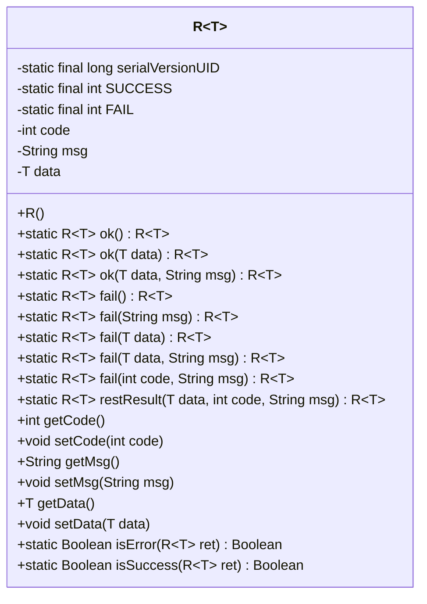

# 基础信息

|      |      |
|------|------|
| 名称 | R |
| 编码语言 | .java |
| 代码路径 | RuoYi-main/ruoyi-common/src/main/java/com/ruoyi/common/core/domain/R.java |
| 包名 | com.ruoyi.common.core.domain |
| 依赖项 | ['java.io.Serializable'] |
| 概述说明 | R类实现序列化，含状态码、消息和数据，提供静态方法生成结果。 |

# 说明

R类实现了序列化功能，用于封装操作结果。该类包含三个主要属性：状态码、消息和数据。状态码用于表示操作的成功或失败，消息提供操作的详细描述，数据则存储操作返回的具体内容。R类还提供了静态方法，用于方便地生成标准化的结果对象。通过这种方式，R类能够统一处理并返回操作结果，确保代码的一致性和可维护性。

# 类列表 Class Summary

| 名称   | 类型  | 说明 |
|-------|------|-------------|
| R | class | R类实现序列化，包含成功失败状态码、消息和数据，提供静态方法生成结果。 |

## 类 R

|      |      |
|------|------|
| 访问范围 | public |
| 类型 | class |
| 名称 | R |
| 说明 | R类实现序列化，包含成功失败状态码、消息和数据，提供静态方法生成结果。 |

### UML类图

**描述：**  
`R<T>` 是一个泛型类，实现了 `Serializable` 接口，用于封装操作结果。它包含成功和失败的静态常量，以及用于存储操作状态码、消息和数据的私有字段。类提供了多个静态方法用于创建成功或失败的结果对象，并提供了获取和设置这些字段的方法。此外，还提供了判断操作是否成功或失败的静态方法。这个类通常用于API响应，封装操作结果并返回给调用者。

### 内部方法调用关系图

```mermaid
graph TD
    A["类R<T>"]
    B["属性: int code"]
    C["属性: String msg"]
    D["属性: T data"]
    E["静态常量: SUCCESS = 0"]
    F["静态常量: FAIL = 500"]
    G["方法: static <T> R<T> ok()"]
    H["方法: static <T> R<T> ok(T data)"]
    I["方法: static <T> R<T> ok(T data, String msg)"]
    J["方法: static <T> R<T> fail()"]
    K["方法: static <T> R<T> fail(String msg)"]
    L["方法: static <T> R<T> fail(T data)"]
    M["方法: static <T> R<T> fail(T data, String msg)"]
    N["方法: static <T> R<T> fail(int code, String msg)"]
    O["方法: static <T> R<T> restResult(T data, int code, String msg)"]
    P["方法: int getCode()"]
    Q["方法: void setCode(int code)"]
    R["方法: String getMsg()"]
    S["方法: void setMsg(String msg)"]
    T["方法: T getData()"]
    U["方法: void setData(T data)"]
    V["方法: static <T> Boolean isError(R<T> ret)"]
    W["方法: static <T> Boolean isSuccess(R<T> ret)"]

    A --> B
    A --> C
    A --> D
    A --> E
    A --> F
    A --> G
    A --> H
    A --> I
    A --> J
    A --> K
    A --> L
    A --> M
    A --> N
    A --> O
    A --> P
    A --> Q
    A --> R
    A --> S
    A --> T
    A --> U
    A --> V
    A --> W
```

这段代码定义了一个泛型类 `R<T>`，用于封装操作结果。类中包含多个静态方法用于生成成功或失败的结果对象，并通过 `restResult` 方法统一设置结果的状态码、消息和数据。类还提供了判断结果是否成功或失败的方法。流程图展示了类的属性、常量和方法之间的调用关系，清晰地描述了类的结构和功能。

### 字段列表 Field List

| 名称  | 类型  | 说明 |
|-------|-------|------|
| code | int | 定义了一个私有的整型变量code。 |
| msg | String | 定义了一个私有的字符串变量msg。 |
| SUCCESS = 0 | int | 定义静态常量SUCCESS，值为0。 |
| serialVersionUID = 1L | long | 定义序列化版本号，确保类版本兼容性。 |
| data | T | 定义私有类型T的变量data。 |
| FAIL = 500 | int | 定义静态常量FAIL，值为500。 |

### 方法列表 Method List

| 名称  | 类型  | 说明 |
|-------|-------|------|
| isSuccess | Boolean | 判断返回结果是否成功的静态方法。 |
| setData | void | 设置对象数据属性的方法。 |
| setMsg | void | 设置类中msg属性的值。 |
| getMsg | String | 方法getMsg返回字符串msg。 |
| isError | Boolean | 判断R<T>类型返回值是否为错误的静态方法。 |
| fail | R<T> | 静态方法返回失败结果，包含空数据、状态码和消息。 |
| fail | R<T> | 静态方法返回失败结果，包含空数据和错误信息。 |
| setCode | void | 该方法用于设置整数类型的code变量值。 |
| restResult | R<T> | 静态方法restResult返回包含数据、状态码和消息的R对象。 |
| fail | R<T> | 静态方法 `fail` 返回包含失败信息的结果对象。 |
| getCode | int | 获取代码值的方法，返回整型变量code。 |
| fail | R<T> | 静态方法返回操作失败的R对象。 |
| ok | R<T> | 静态方法返回成功结果，包含数据和消息。 |
| getData | T | 获取并返回数据对象。 |
| fail | R<T> | 静态方法返回操作失败结果，包含数据和失败信息。 |
| ok | R<T> | 静态方法返回操作成功的R对象，状态为SUCCESS，信息为"操作成功"。 |
| ok | R<T> | 静态方法返回操作成功的R对象，包含数据和状态码。 |

