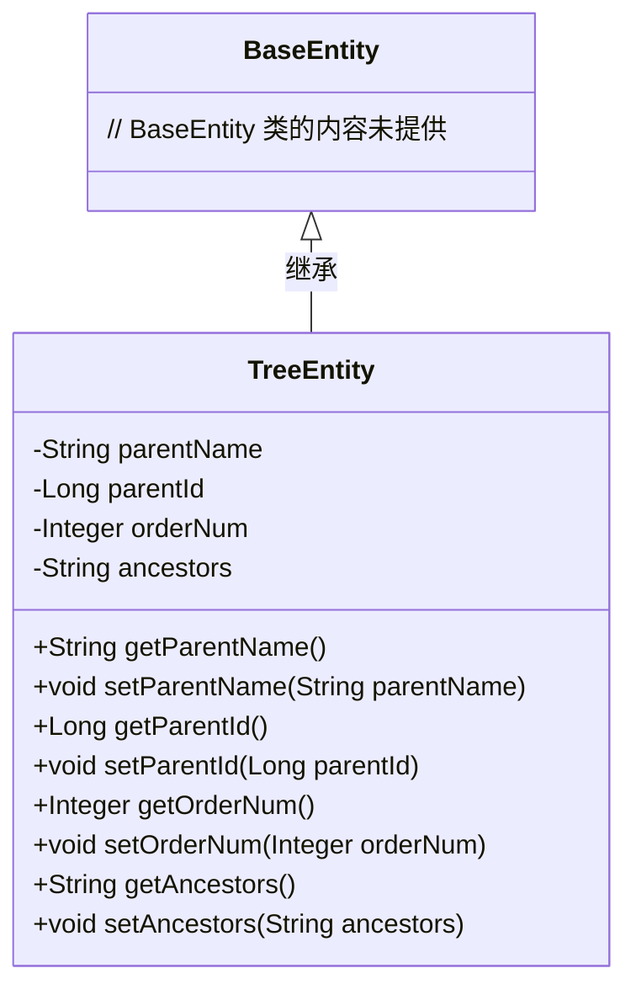

# 基础信息

|      |      |
|------|------|
| 名称 | TreeEntity |
| 编码语言 | .java |
| 代码路径 | RuoYi-main/ruoyi-common/src/main/java/com/ruoyi/common/core/domain/TreeEntity.java |
| 包名 | com.ruoyi.common.core.domain |
| 依赖项 | [] |
| 概述说明 | TreeEntity继承BaseEntity，包含父菜单名、ID、顺序和祖级列表属性及其getter和setter方法。 |

# 说明

TreeEntity类继承自BaseEntity类，具备父菜单名称、父菜单ID、显示顺序和祖级列表四个属性。每个属性都配有相应的getter和setter方法，用于获取和设置这些属性的值。父菜单名称和父菜单ID用于标识和管理菜单的层级关系，显示顺序控制菜单项的排列顺序，祖级列表则记录了菜单的祖先层级信息。这些属性和方法共同支持了树形结构菜单的管理和操作。

# 类列表 Class Summary

| 名称   | 类型  | 说明 |
|-------|------|-------------|
| TreeEntity | class | TreeEntity类继承BaseEntity，包含父菜单名称、父菜单ID、显示顺序和祖级列表属性及其getter和setter方法。 |

## 类 TreeEntity

|      |      |
|------|------|
| 访问范围 | public |
| 类型 | class |
| 名称 | TreeEntity |
| 说明 | TreeEntity类继承BaseEntity，包含父菜单名称、父菜单ID、显示顺序和祖级列表属性及其getter和setter方法。 |

### UML类图

这段代码定义了一个 `TreeEntity` 类，该类继承自 `BaseEntity`。`TreeEntity` 类包含四个私有属性：`parentName`、`parentId`、`orderNum` 和 `ancestors`，并为每个属性提供了相应的 getter 和 setter 方法。`TreeEntity` 类通过继承 `BaseEntity` 获得了其所有属性和方法。该类主要用于表示树形结构中的实体，包含父节点名称、父节点ID、显示顺序和祖级列表等信息。

### 内部方法调用关系图

```mermaid
graph TD
    A["类TreeEntity"]
    B["继承: BaseEntity"]
    C["属性: String parentName"]
    D["属性: Long parentId"]
    E["属性: Integer orderNum"]
    F["属性: String ancestors"]
    G["方法: String getParentName()"]
    H["方法: void setParentName(String parentName)"]
    I["方法: Long getParentId()"]
    J["方法: void setParentId(Long parentId)"]
    K["方法: Integer getOrderNum()"]
    L["方法: void setOrderNum(Integer orderNum)"]
    M["方法: String getAncestors()"]
    N["方法: void setAncestors(String ancestors)"]

    A --> B
    A --> C
    A --> D
    A --> E
    A --> F
    A --> G
    A --> H
    A --> I
    A --> J
    A --> K
    A --> L
    A --> M
    A --> N
```

这段代码定义了一个名为`TreeEntity`的类，它继承自`BaseEntity`。类中包含了四个属性：`parentName`、`parentId`、`orderNum`和`ancestors`，并分别为这些属性提供了对应的`getter`和`setter`方法。流程图展示了类的继承关系、属性定义以及方法调用关系，清晰地描述了类的结构和功能。

### 字段列表 Field List

| 名称  | 类型  | 说明 |
|-------|-------|------|
| parentId | Long | 父级ID字段为长整型。 |
| ancestors | String | 定义私有字符串变量`ancestors`。 |
| serialVersionUID = 1L | long | 定义静态长整型常量serialVersionUID，值为1L。 |
| parentName | String | 定义私有字符串变量parentName。 |
| orderNum | Integer | 私有整型变量orderNum。 |

### 方法列表 Method List

| 名称  | 类型  | 说明 |
|-------|-------|------|
| setParentName | void | 设置父级名称的方法。 |
| getParentId | Long | 获取父ID的方法，返回类型为Long。 |
| setAncestors | void | 设置祖先属性的方法。 |
| setParentId | void | 该方法用于设置父ID属性。 |
| getParentName | String | 该方法返回父级名称的字符串值。 |
| setOrderNum | void | 设置订单编号的方法。 |
| getOrderNum | Integer | 获取订单编号的方法。 |
| getAncestors | String | 获取祖先信息的方法，返回祖先字符串。 |

