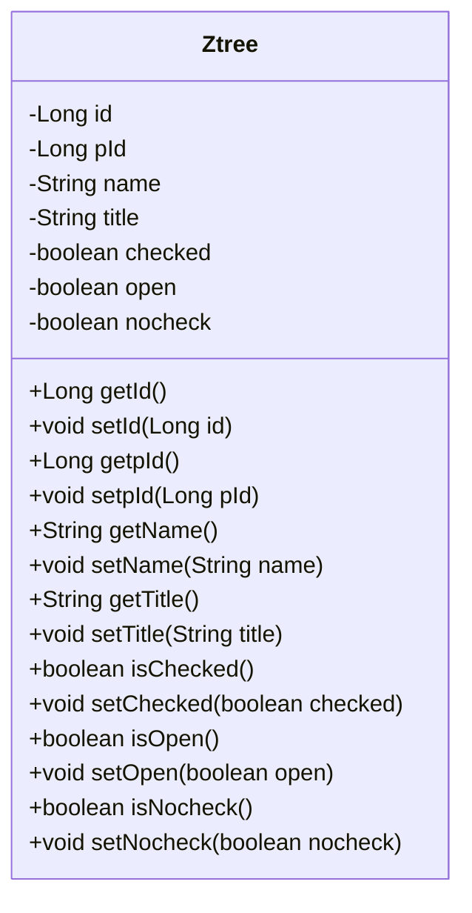

# 基础信息

|      |      |
|------|------|
| 名称 | Ztree |
| 编码语言 | .java |
| 代码路径 | RuoYi-main/ruoyi-common/src/main/java/com/ruoyi/common/core/domain/Ztree.java |
| 包名 | com.ruoyi.common.core.domain |
| 依赖项 | ['java.io.Serializable'] |
| 概述说明 | Ztree类实现Serializable，包含节点ID、父ID、名称、标题及勾选、展开、能否勾选等属性。 |

# 说明

Ztree类实现了Serializable接口，具备序列化能力。该类包含多个关键属性：节点ID用于唯一标识节点，父ID表示节点的层级关系，名称和标题分别描述节点的标识和显示内容。此外，节点还包含勾选状态、展开状态以及能否被勾选的属性，这些属性共同管理节点的交互行为和显示状态。

# 类列表 Class Summary

| 名称   | 类型  | 说明 |
|-------|------|-------------|
| Ztree | class | Ztree类实现Serializable，包含节点ID、父ID、名称、标题及勾选、展开、能否勾选等属性。 |

## 类 Ztree

|      |      |
|------|------|
| 访问范围 | public |
| 类型 | class |
| 名称 | Ztree |
| 说明 | Ztree类实现Serializable，包含节点ID、父ID、名称、标题及勾选、展开、能否勾选等属性。 |

### UML类图

该代码定义了一个名为 `Ztree` 的类，用于表示树形结构中的节点。类中包含节点的基本属性，如 `id`、`pId`、`name`、`title`，以及节点的状态属性，如 `checked`、`open`、`nocheck`。每个属性都有对应的 `getter` 和 `setter` 方法，用于访问和修改这些属性。该类实现了 `Serializable` 接口，表明其实例可以被序列化。

### 内部方法调用关系图

```mermaid
graph TD
    A["类Ztree"]
    B["属性: Long id"]
    C["属性: Long pId"]
    D["属性: String name"]
    E["属性: String title"]
    F["属性: boolean checked"]
    G["属性: boolean open"]
    H["属性: boolean nocheck"]
    I["方法: Long getId()"]
    J["方法: void setId(Long id)"]
    K["方法: Long getpId()"]
    L["方法: void setpId(Long pId)"]
    M["方法: String getName()"]
    N["方法: void setName(String name)"]
    O["方法: String getTitle()"]
    P["方法: void setTitle(String title)"]
    Q["方法: boolean isChecked()"]
    R["方法: void setChecked(boolean checked)"]
    S["方法: boolean isOpen()"]
    T["方法: void setOpen(boolean open)"]
    U["方法: boolean isNocheck()"]
    V["方法: void setNocheck(boolean nocheck)"]

    A --> B
    A --> C
    A --> D
    A --> E
    A --> F
    A --> G
    A --> H
    A --> I
    A --> J
    A --> K
    A --> L
    A --> M
    A --> N
    A --> O
    A --> P
    A --> Q
    A --> R
    A --> S
    A --> T
    A --> U
    A --> V
```

这段代码定义了一个名为 `Ztree` 的类，该类实现了 `Serializable` 接口，表明其实例可以被序列化。类中包含多个属性，如 `id`、`pId`、`name`、`title` 等，分别用于存储节点的ID、父节点ID、节点名称、节点标题等信息。此外，类中还定义了多个 `getter` 和 `setter` 方法，用于访问和修改这些属性的值。这些方法分别对应每个属性，提供了对属性的读取和写入操作。

### 字段列表 Field List

| 名称  | 类型  | 说明 |
|-------|-------|------|
| id | Long | 定义一个长整型私有变量id。 |
| open = false | boolean | 私有布尔变量open初始值为false。 |
| serialVersionUID = 1L | long | 定义序列化版本号的静态常量。 |
| nocheck = false | boolean | 私有布尔变量nocheck初始值为false。 |
| name | String | 声明一个私有字符串变量name。 |
| pId | Long | 定义了一个长整型私有变量pId。 |
| title | String | 定义了一个私有的字符串类型变量title。 |
| checked = false | boolean | 布尔变量checked初始值为false。 |

### 方法列表 Method List

| 名称  | 类型  | 说明 |
|-------|-------|------|
| setName | void | 该方法用于设置对象的名称属性。 |
| getpId | Long | 获取pId值的Java方法。 |
| setTitle | void | 该方法用于设置对象的标题属性。 |
| setpId | void | 设置对象pId属性的方法。 |
| isChecked | boolean | 该方法返回布尔值checked的状态。 |
| isOpen | boolean | 方法isOpen返回布尔值open的状态。 |
| setChecked | void | 设置选中状态的布尔值。 |
| isNocheck | boolean | 该方法返回布尔值nocheck的状态。 |
| getTitle | String | 获取标题的方法，返回字符串类型的title。 |
| setId | void | 方法setId用于设置对象ID，接收Long类型参数id。 |
| setNocheck | void | 方法设置nocheck属性值。 |
| setOpen | void | 该方法用于设置布尔变量open的值。 |
| getName | String | 获取并返回对象名称的方法。 |
| getId | Long | 返回长整型id值的方法。 |

