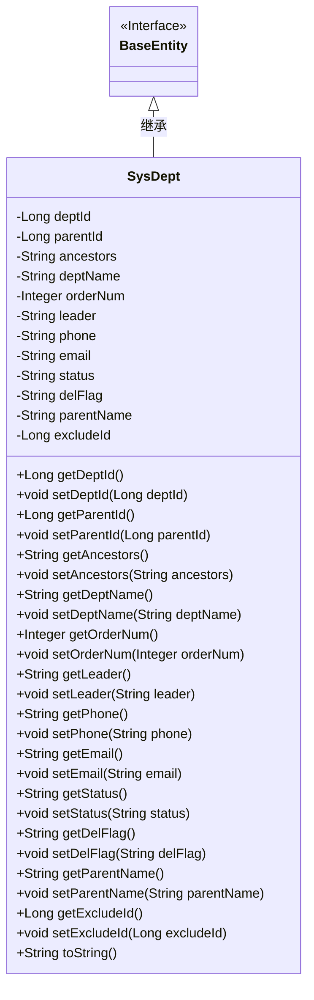

# 基础信息

|      |      |
|------|------|
| 名称 | SysDept |
| 编码语言 | .java |
| 代码路径 | RuoYi-main/ruoyi-common/src/main/java/com/ruoyi/common/core/domain/entity/SysDept.java |
| 包名 | com.ruoyi.common.core.domain.entity |
| 依赖项 | ['javax.validation.constraints.Email', 'javax.validation.constraints.NotBlank', 'javax.validation.constraints.NotNull', 'javax.validation.constraints.Size', 'org.apache.commons.lang3.builder.ToStringBuilder', 'org.apache.commons.lang3.builder.ToStringStyle', 'com.fasterxml.jackson.annotation.JsonIgnore', 'com.ruoyi.common.core.domain.BaseEntity'] |
| 概述说明 | SysDept类继承BaseEntity，包含部门ID、父部门ID、部门名称、负责人、联系电话等属性。 |

# 说明

SysDept类继承自BaseEntity，包含多个属性：部门ID用于唯一标识部门，父部门ID表示上级部门，祖级列表记录所有上级部门，部门名称描述部门名称，显示顺序确定部门在列表中的排序，负责人指定部门主管，联系电话和邮箱用于联系，部门状态标识部门是否启用，删除标志表示是否已删除，父部门名称显示上级部门名称，排除编号用于特定场景下的部门筛选。这些属性共同构成了部门的完整信息结构。

# 类列表 Class Summary

| 名称   | 类型  | 说明 |
|-------|------|-------------|
| SysDept | class | SysDept类继承BaseEntity，包含部门ID、父部门ID、祖级列表、部门名称、显示顺序、负责人、联系电话、邮箱、部门状态、删除标志、父部门名称和排除编号等属性。 |

## 类 SysDept

|      |      |
|------|------|
| 访问范围 | public |
| 类型 | class |
| 名称 | SysDept |
| 说明 | SysDept类继承BaseEntity，包含部门ID、父部门ID、祖级列表、部门名称、显示顺序、负责人、联系电话、邮箱、部门状态、删除标志、父部门名称和排除编号等属性。 |

### UML类图

### 描述
`SysDept`类继承自`BaseEntity`接口，表示一个部门实体。它包含多个私有字段，如部门ID、父部门ID、部门名称等，并提供了相应的getter和setter方法。`toString`方法用于生成部门的字符串表示。类中还包含一些字段的验证注解，如`@NotBlank`、`@Size`和`@Email`，用于确保数据的合法性。

### 内部方法调用关系图

```mermaid
graph TD
    A["类SysDept"]
    B["属性: Long deptId"]
    C["属性: Long parentId"]
    D["属性: String ancestors"]
    E["属性: String deptName"]
    F["属性: Integer orderNum"]
    G["属性: String leader"]
    H["属性: String phone"]
    I["属性: String email"]
    J["属性: String status"]
    K["属性: String delFlag"]
    L["属性: String parentName"]
    M["属性: Long excludeId"]
    N["方法: Long getDeptId()"]
    O["方法: void setDeptId(Long deptId)"]
    P["方法: Long getParentId()"]
    Q["方法: void setParentId(Long parentId)"]
    R["方法: String getAncestors()"]
    S["方法: void setAncestors(String ancestors)"]
    T["方法: String getDeptName()"]
    U["方法: void setDeptName(String deptName)"]
    V["方法: Integer getOrderNum()"]
    W["方法: void setOrderNum(Integer orderNum)"]
    X["方法: String getLeader()"]
    Y["方法: void setLeader(String leader)"]
    Z["方法: String getPhone()"]
    AA["方法: void setPhone(String phone)"]
    AB["方法: String getEmail()"]
    AC["方法: void setEmail(String email)"]
    AD["方法: String getStatus()"]
    AE["方法: void setStatus(String status)"]
    AF["方法: String getDelFlag()"]
    AG["方法: void setDelFlag(String delFlag)"]
    AH["方法: String getParentName()"]
    AI["方法: void setParentName(String parentName)"]
    AJ["方法: Long getExcludeId()"]
    AK["方法: void setExcludeId(Long excludeId)"]
    AL["方法: String toString()"]

    A --> B
    A --> C
    A --> D
    A --> E
    A --> F
    A --> G
    A --> H
    A --> I
    A --> J
    A --> K
    A --> L
    A --> M
    A --> N
    A --> O
    A --> P
    A --> Q
    A --> R
    A --> S
    A --> T
    A --> U
    A --> V
    A --> W
    A --> X
    A --> Y
    A --> Z
    A --> AA
    A --> AB
    A --> AC
    A --> AD
    A --> AE
    A --> AF
    A --> AG
    A --> AH
    A --> AI
    A --> AJ
    A --> AK
    A --> AL
```

该流程图展示了`SysDept`类的结构和其内部方法之间的关系。`SysDept`类继承自`BaseEntity`，包含多个属性如`deptId`、`parentId`、`deptName`等，并为每个属性提供了对应的`getter`和`setter`方法。此外，`toString`方法用于生成对象的字符串表示。流程图中每个属性和方法都清晰地展示了它们与类`SysDept`的关联关系。

### 字段列表 Field List

| 名称  | 类型  | 说明 |
|-------|-------|------|
| delFlag | String | 私有字符串变量delFlag。 |
| deptId | Long | 部门ID为长整型变量。 |
| orderNum | Integer | 私有整型变量orderNum。 |
| parentId | Long | 父级ID为长整型。 |
| email | String | 定义了一个私有字符串类型的email变量。 |
| leader | String | 定义了一个私有字符串变量leader。 |
| deptName | String | 定义私有字符串变量deptName。 |
| excludeId | Long | 排除指定ID的私有长整型变量。 |
| phone | String | 定义了一个私有字符串变量phone。 |
| parentName | String | 声明一个私有字符串变量parentName。 |
| ancestors | String | 该代码定义了一个私有字符串变量ancestors。 |
| status | String | 定义一个私有字符串变量status。 |
| serialVersionUID = 1L | long | 声明序列化版本号以确保类版本兼容性。 |

### 方法列表 Method List

| 名称  | 类型  | 说明 |
|-------|-------|------|
| getStatus | String | 该方法返回状态字符串。 |
| setDeptName | void | 设置部门名称的方法。 |
| getParentId | Long | 获取父ID的Java方法。 |
| setAncestors | void | 设置祖先字符串的方法。 |
| getDelFlag | String | 获取删除标志的方法。 |
| setLeader | void | 设置团队领导者的方法。 |
| getPhone | String | 联系电话长度限制为0到11个字符。 |
| toString | String | 重写toString方法，返回包含部门信息的字符串。 |
| getEmail | String | 邮箱格式需正确，长度不超过50字符。 |
| getAncestors | String | 该方法返回祖先信息。 |
| setDelFlag | void | 设置删除标志方法，用于更新对象的删除标志属性。 |
| getExcludeId | Long | 该方法忽略JSON序列化中的excludeId字段。 |
| getDeptName | String | 部门名称非空且长度不超过30字符。 |
| getParentName | String | 该方法返回父级名称。 |
| getDeptId | Long | 获取部门ID的方法，返回类型为Long。 |
| setEmail | void | 该方法用于设置对象的电子邮件属性。 |
| setPhone | void | 设置电话号码的方法，将输入值赋给类成员变量phone。 |
| setOrderNum | void | 设置订单编号的方法，将传入的orderNum赋值给当前对象的orderNum属性。 |
| getOrderNum | Integer | 显示顺序不能为空，返回orderNum值。 |
| setStatus | void | 设置对象状态的方法，参数为字符串类型。 |
| setExcludeId | void | 设置排除ID的方法，参数为长整型excludeId。 |
| setDeptId | void | 设置部门ID的方法，将传入的deptId赋值给当前对象的deptId属性。 |
| setParentId | void | 该方法用于设置父ID属性。 |
| setParentName | void | 设置父名称的方法，将传入的parentName赋值给类成员变量。 |
| getLeader | String | 获取领导者姓名的Java方法。 |

