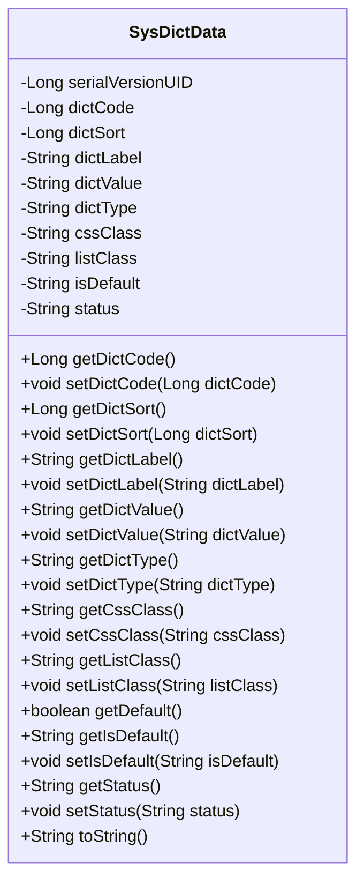

# 基础信息

|      |      |
|------|------|
| 名称 | SysDictData |
| 编码语言 | .java |
| 代码路径 | RuoYi-main/ruoyi-common/src/main/java/com/ruoyi/common/core/domain/entity/SysDictData.java |
| 包名 | com.ruoyi.common.core.domain.entity |
| 依赖项 | ['javax.validation.constraints', 'org.apache.commons.lang3.builder.ToStringBuilder', 'org.apache.commons.lang3.builder.ToStringStyle', 'com.ruoyi.common.annotation.Excel', 'com.ruoyi.common.annotation.Excel.ColumnType', 'com.ruoyi.common.constant.UserConstants', 'com.ruoyi.common.core.domain.BaseEntity'] |
| 概述说明 | SysDictData继承BaseEntity，含编码、排序、标签、键值、类型、样式、默认状态和状态等属性。 |

# 说明

SysDictData类继承自BaseEntity，包含多个关键属性。这些属性包括字典编码，用于唯一标识字典项；排序，用于确定字典项的显示顺序；标签，表示字典项的显示名称；键值，存储字典项的实际值；类型，标识字典项的分类；样式，用于定义字典项的显示样式；默认状态，表示字典项的初始状态；状态，用于标识字典项的当前状态。这些属性共同构成了SysDictData类的核心数据结构，支持字典项的管理和操作。

# 类列表 Class Summary

| 名称   | 类型  | 说明 |
|-------|------|-------------|
| SysDictData | class | SysDictData类继承BaseEntity，包含字典编码、排序、标签、键值、类型、样式、默认状态和状态等属性。 |

## 类 SysDictData

|      |      |
|------|------|
| 访问范围 | public |
| 类型 | class |
| 名称 | SysDictData |
| 说明 | SysDictData类继承BaseEntity，包含字典编码、排序、标签、键值、类型、样式、默认状态和状态等属性。 |

### UML类图

**描述：**
`SysDictData` 类是一个用于管理系统字典数据的实体类，继承自 `BaseEntity`。它包含多个字段，如字典编码、字典排序、字典标签、字典键值等，并提供了相应的 getter 和 setter 方法。此外，`toString` 方法用于生成对象的字符串表示。该类通过注解对字段进行验证，确保数据的有效性和一致性。

### 内部方法调用关系图

```mermaid
graph TD
    A["类SysDictData"]
    B["属性: Long dictCode"]
    C["属性: Long dictSort"]
    D["属性: String dictLabel"]
    E["属性: String dictValue"]
    F["属性: String dictType"]
    G["属性: String cssClass"]
    H["属性: String listClass"]
    I["属性: String isDefault"]
    J["属性: String status"]
    K["方法: Long getDictCode()"]
    L["方法: void setDictCode(Long dictCode)"]
    M["方法: Long getDictSort()"]
    N["方法: void setDictSort(Long dictSort)"]
    O["方法: String getDictLabel()"]
    P["方法: void setDictLabel(String dictLabel)"]
    Q["方法: String getDictValue()"]
    R["方法: void setDictValue(String dictValue)"]
    S["方法: String getDictType()"]
    T["方法: void setDictType(String dictType)"]
    U["方法: String getCssClass()"]
    V["方法: void setCssClass(String cssClass)"]
    W["方法: String getListClass()"]
    X["方法: void setListClass(String listClass)"]
    Y["方法: boolean getDefault()"]
    Z["方法: String getIsDefault()"]
    AA["方法: void setIsDefault(String isDefault)"]
    AB["方法: String getStatus()"]
    AC["方法: void setStatus(String status)"]
    AD["重写方法: String toString()"]

    A --> B
    A --> C
    A --> D
    A --> E
    A --> F
    A --> G
    A --> H
    A --> I
    A --> J
    A --> K
    A --> L
    A --> M
    A --> N
    A --> O
    A --> P
    A --> Q
    A --> R
    A --> S
    A --> T
    A --> U
    A --> V
    A --> W
    A --> X
    A --> Y
    A --> Z
    A --> AA
    A --> AB
    A --> AC
    A --> AD
```

该流程图展示了`SysDictData`类的结构和内部方法调用关系。`SysDictData`类继承了`BaseEntity`，并包含了多个属性和对应的getter和setter方法。类中的属性包括字典编码、字典排序、字典标签等，每个属性都有相应的getter和setter方法。此外，类中还重写了`toString`方法，用于生成对象的字符串表示。流程图清晰地展示了类与属性、方法之间的关系，便于理解类的整体结构和功能。

### 字段列表 Field List

| 名称  | 类型  | 说明 |
|-------|-------|------|
| dictSort | Long | Excel列类型为数值，用于字典排序。 |
| isDefault | String | Excel字段“是否默认”使用Y/N表示是/否。 |
| dictValue | String | Excel字典键值字段为dictValue。 |
| cssClass | String | Excel字典样式的CSS类定义。 |
| dictCode | Long | Excel列名为“字典编码”，数据类型为长整型。 |
| listClass | String | 私有字符串变量listClass定义。 |
| serialVersionUID = 1L | long | 声明一个私有的静态常量序列化版本号为1L。 |
| status | String | 状态字段：0表示正常，1表示停用。 |
| dictLabel | String | Excel字典标签对应的私有字符串变量dictLabel。 |
| dictType | String | Excel中定义了一个名为“字典类型”的私有字符串变量。 |

### 方法列表 Method List

| 名称  | 类型  | 说明 |
|-------|-------|------|
| getDictSort | Long | 获取字典排序值的方法。 |
| setDictType | void | 设置字典类型的方法。 |
| setStatus | void | 设置状态属性的方法。 |
| getStatus | String | 该方法返回当前状态字符串。 |
| setIsDefault | void | 设置默认状态的方法。 |
| getIsDefault | String | 获取默认状态值的方法。 |
| getListClass | String | 获取列表类名的方法。 |
| setListClass | void | 设置列表类属性的方法。 |
| getDefault | boolean | 该方法检查当前对象是否为默认用户。 |
| getDictValue | String | 字典键值非空且长度不超过100字符。 |
| getDictType | String | 字典类型校验：非空且长度不超过100字符。 |
| getDictCode | Long | 该方法返回长整型字典编码。 |
| getCssClass | String | 获取CSS类名，长度限制为0到100字符。 |
| setDictCode | void | 该方法用于设置字典代码，参数为长整型。 |
| setDictValue | void | 该方法用于设置字典值，将传入的dictValue赋值给类的成员变量dictValue。 |
| setDictSort | void | 该方法用于设置字典排序字段的值。 |
| setCssClass | void | 设置CSS类的方法，接受字符串参数并赋值给成员变量。 |
| getDictLabel | String | 字典标签长度限制为100字符，不可为空。 |
| toString | String | 重写toString方法，返回多行格式的字典对象信息。 |
| setDictLabel | void | 设置字典标签方法，将输入值赋给类的dictLabel属性。 |

