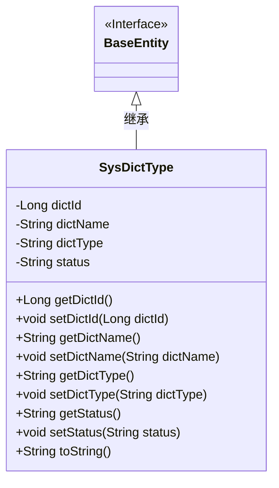

# 基础信息

|      |      |
|------|------|
| 名称 | SysDictType |
| 编码语言 | .java |
| 代码路径 | RuoYi-main/ruoyi-common/src/main/java/com/ruoyi/common/core/domain/entity/SysDictType.java |
| 包名 | com.ruoyi.common.core.domain.entity |
| 依赖项 | ['javax.validation.constraints', 'org.apache.commons.lang3.builder.ToStringBuilder', 'org.apache.commons.lang3.builder.ToStringStyle', 'com.ruoyi.common.annotation.Excel', 'com.ruoyi.common.annotation.Excel.ColumnType', 'com.ruoyi.common.core.domain.BaseEntity'] |
| 概述说明 | SysDictType类含主键、名称、类型、状态属性，支持数据验证和导出。 |

# 说明

SysDictType类是一个用于管理字典数据的类，包含字典主键、名称、类型和状态四个主要属性。该类具备数据验证功能，确保输入的数据符合预期格式和规则。此外，SysDictType类还提供了数据导出功能，可以将字典数据以特定格式导出，便于进一步处理或存储。这些功能使得SysDictType类在字典数据管理中具有高效性和可靠性。

# 类列表 Class Summary

| 名称   | 类型  | 说明 |
|-------|------|-------------|
| SysDictType | class | SysDictType类包含字典主键、名称、类型和状态属性，并带有数据验证和导出功能。 |

## 类 SysDictType

|      |      |
|------|------|
| 访问范围 | public |
| 类型 | class |
| 名称 | SysDictType |
| 说明 | SysDictType类包含字典主键、名称、类型和状态属性，并带有数据验证和导出功能。 |

### UML类图

**描述：**  
`SysDictType` 类继承自 `BaseEntity` 接口，用于表示系统字典类型。该类包含四个私有属性：`dictId`（字典主键）、`dictName`（字典名称）、`dictType`（字典类型）和 `status`（状态）。每个属性都有对应的 `getter` 和 `setter` 方法，并且 `dictName` 和 `dictType` 属性在设置时有额外的校验规则。`toString` 方法用于返回对象的字符串表示，包含所有属性和继承自 `BaseEntity` 的属性。

### 内部方法调用关系图

```mermaid
graph TD
    A["类SysDictType"]
    B["属性: Long dictId"]
    C["属性: String dictName"]
    D["属性: String dictType"]
    E["属性: String status"]
    F["方法: Long getDictId()"]
    G["方法: void setDictId(Long dictId)"]
    H["方法: String getDictName()"]
    I["方法: void setDictName(String dictName)"]
    J["方法: String getDictType()"]
    K["方法: void setDictType(String dictType)"]
    L["方法: String getStatus()"]
    M["方法: void setStatus(String status)"]
    N["重写方法: String toString()"]

    A --> B
    A --> C
    A --> D
    A --> E
    A --> F
    A --> G
    A --> H
    A --> I
    A --> J
    A --> K
    A --> L
    A --> M
    A --> N
```

这段代码定义了一个名为 `SysDictType` 的类，该类继承自 `BaseEntity`。类中包含四个私有属性：`dictId`、`dictName`、`dictType` 和 `status`，并为每个属性提供了相应的 getter 和 setter 方法。此外，`toString` 方法被重写，用于返回对象的字符串表示，包含所有属性的值。类中的属性和方法通过注解进行了验证和约束，确保数据的有效性。

### 字段列表 Field List

| 名称  | 类型  | 说明 |
|-------|-------|------|
| dictName | String | Excel字典名称字段定义 |
| dictType | String | 字典类型字段定义为私有字符串类型。 |
| dictId | Long | Excel字典主键为长整型数字。 |
| serialVersionUID = 1L | long | 声明一个私有的静态常量序列化版本UID，值为1L。 |
| status | String | Excel字段状态映射：0为正常，1为停用。 |

### 方法列表 Method List

| 名称  | 类型  | 说明 |
|-------|-------|------|
| setDictType | void | 设置字典类型的方法。 |
| setDictName | void | 该方法用于设置字典名称。 |
| setStatus | void | 设置状态的方法，将传入的status赋值给当前对象的status属性。 |
| getDictId | Long | 获取字典ID的方法，返回类型为Long。 |
| getStatus | String | 方法getStatus返回字符串类型的状态值。 |
| toString | String | 重写toString方法，返回多行格式的字典信息。 |
| setDictId | void | 设置字典ID的方法，将传入的Long类型值赋给dictId。 |
| getDictType | String | 字典类型校验：非空、长度≤100、字母开头、仅含小写字母数字下划线。 |
| getDictName | String | 字典名称不能为空且长度不超过100字符。 |

