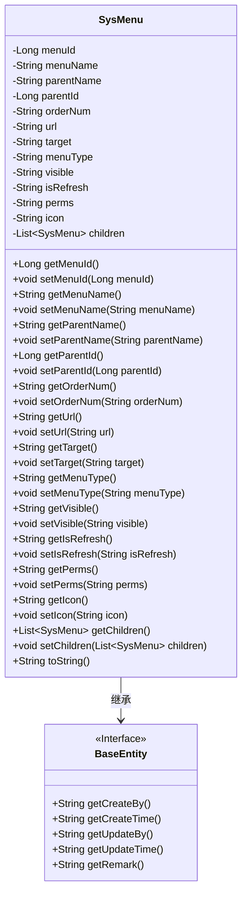

# 基础信息

|      |      |
|------|------|
| 名称 | SysMenu |
| 编码语言 | .java |
| 代码路径 | RuoYi-main/ruoyi-common/src/main/java/com/ruoyi/common/core/domain/entity/SysMenu.java |
| 包名 | com.ruoyi.common.core.domain.entity |
| 依赖项 | ['java.util.List', 'java.util.ArrayList', 'javax.validation.constraints', 'org.apache.commons.lang3.builder.ToStringBuilder', 'org.apache.commons.lang3.builder.ToStringStyle', 'com.ruoyi.common.core.domain.BaseEntity'] |
| 概述说明 | SysMenu类定义菜单属性，含ID、名称、父菜单、URL、类型、状态、权限，支持子菜单。 |

# 说明

SysMenu类用于定义菜单的各类属性，包括菜单的唯一标识ID、菜单名称、父菜单的关联信息、菜单对应的URL地址、菜单的类型、当前状态以及相关的权限设置。此外，该类还支持子菜单的定义，使得菜单结构可以呈现层级关系，便于管理和展示。通过这些属性，SysMenu类能够全面描述菜单的各项关键信息，确保菜单系统的灵活性和可扩展性。

# 类列表 Class Summary

| 名称   | 类型  | 说明 |
|-------|------|-------------|
| SysMenu | class | SysMenu类定义菜单属性，包括ID、名称、父菜单、URL、类型、状态、权限等，支持子菜单。 |

## 类 SysMenu

|      |      |
|------|------|
| 访问范围 | public |
| 类型 | class |
| 名称 | SysMenu |
| 说明 | SysMenu类定义菜单属性，包括ID、名称、父菜单、URL、类型、状态、权限等，支持子菜单。 |

### UML类图

**描述：**  
`SysMenu` 类继承自 `BaseEntity` 接口，用于表示系统中的菜单项。该类包含了菜单的各种属性，如菜单ID、名称、父菜单ID、显示顺序、URL、打开方式、类型、状态、是否刷新、权限字符串、图标以及子菜单列表。每个属性都有对应的 `getter` 和 `setter` 方法，并且在某些属性上使用了注解进行数据校验。`toString` 方法用于将对象转换为字符串表示形式，方便调试和日志记录。

### 内部方法调用关系图

这段代码定义了一个名为 `SysMenu` 的类，继承自 `BaseEntity`。该类包含多个属性，如 `menuId`、`menuName`、`parentName` 等，每个属性都有对应的 `getter` 和 `setter` 方法。类中还重写了 `toString` 方法，用于返回对象的字符串表示。流程图展示了类的属性和方法之间的调用关系，帮助理解类的结构和功能。

### 字段列表 Field List

| 名称  | 类型  | 说明 |
|-------|-------|------|
| target | String | 定义了一个私有字符串变量target。 |
| menuName | String | 私有字符串变量menuName。 |
| parentName | String | 定义一个私有字符串变量parentName。 |
| menuType | String | 定义了一个私有字符串变量menuType。 |
| perms | String | 私有字符串变量perms声明。 |
| icon | String | 定义一个私有字符串变量icon。 |
| url | String | 定义一个私有字符串变量url。 |
| isRefresh | String | 定义一个私有字符串变量isRefresh。 |
| parentId | Long | 父级ID为长整型变量。 |
| children = new ArrayList<SysMenu>() | List<SysMenu> | 私有子菜单列表初始化为空数组。 |
| orderNum | String | 订单号字段为私有字符串类型。 |
| serialVersionUID = 1L | long | 定义了一个静态常量序列化版本号，值为1L。 |
| menuId | Long | 包含长整型菜单ID的私有变量。 |
| visible | String | 声明一个私有字符串变量visible。 |

### 方法列表 Method List

| 名称  | 类型  | 说明 |
|-------|-------|------|
| getMenuId | Long | 获取菜单ID的方法。 |
| setUrl | void | 设置URL属性的方法。 |
| setOrderNum | void | 设置订单编号方法。 |
| setParentName | void | 设置父名称的方法。 |
| getIsRefresh | String | 该方法返回isRefresh变量的值。 |
| getParentName | String | 该方法返回父级名称。 |
| setChildren | void | 设置子菜单列表的方法。 |
| setMenuName | void | 设置菜单名称的方法。 |
| getChildren | List<SysMenu> | 获取子菜单列表的方法。 |
| setVisible | void | 设置可见性属性的方法。 |
| setPerms | void | 设置权限字符串的方法。 |
| getIcon | String | 获取图标字符串的方法。 |
| getUrl | String | 获取URL方法，长度限制0到200字符。 |
| getParentId | Long | 获取父ID的方法，返回父ID值。 |
| getPerms | String | 方法返回权限标识，长度限制为100字符。 |
| getVisible | String | 获取可见性状态的方法。 |
| getMenuType | String | 验证菜单类型非空并返回其值。 |
| setMenuId | void | 设置菜单ID的方法。 |
| getMenuName | String | 菜单名称长度限制50字符，不能为空。 |
| getOrderNum | String | 方法getOrderNum返回orderNum，显示顺序不能为空。 |
| setIsRefresh | void | 设置刷新状态的方法。 |
| toString | String | 重写toString方法，返回包含菜单属性多行格式的字符串。 |
| setParentId | void | 设置父ID的方法，将参数parentId赋值给当前对象的parentId属性。 |
| getTarget | String | 获取目标字符串的方法。 |
| setIcon | void | 设置图标的方法，将传入的字符串赋值给类成员变量icon。 |
| setTarget | void | 该方法用于设置目标字符串。 |
| setMenuType | void | 设置菜单类型的方法，将传入的menuType赋值给当前对象的menuType属性。 |

