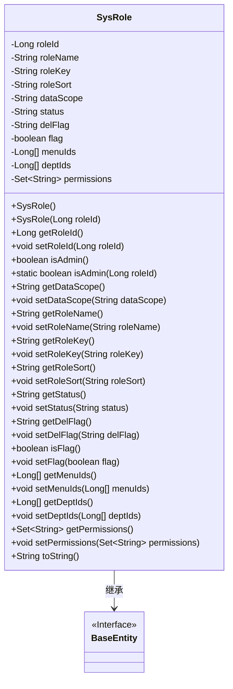

# 基础信息

|      |      |
|------|------|
| 名称 | SysRole |
| 编码语言 | .java |
| 代码路径 | RuoYi-main/ruoyi-common/src/main/java/com/ruoyi/common/core/domain/entity/SysRole.java |
| 包名 | com.ruoyi.common.core.domain.entity |
| 依赖项 | ['java.util.Set', 'javax.validation.constraints', 'org.apache.commons.lang3.builder.ToStringBuilder', 'org.apache.commons.lang3.builder.ToStringStyle', 'com.ruoyi.common.annotation.Excel', 'com.ruoyi.common.annotation.Excel.ColumnType', 'com.ruoyi.common.core.domain.BaseEntity'] |
| 概述说明 | SysRole类定义角色属性及方法，包括ID、名称、权限、排序、数据范围、状态和删除标志。 |

# 说明

SysRole类是一个用于定义角色属性的类，包含多个关键属性，如ID、名称、权限、排序、数据范围、状态和删除标志。该类还提供了与这些属性相关的方法，用于管理和操作角色信息。通过SysRole类，可以方便地对角色进行定义、查询和修改，确保系统角色的完整性和一致性。

# 类列表 Class Summary

| 名称   | 类型  | 说明 |
|-------|------|-------------|
| SysRole | class | SysRole类定义了角色属性，包括ID、名称、权限、排序、数据范围、状态、删除标志等，并提供相关方法。 |

## 类 SysRole

|      |      |
|------|------|
| 访问范围 | public |
| 类型 | class |
| 名称 | SysRole |
| 说明 | SysRole类定义了角色属性，包括ID、名称、权限、排序、数据范围、状态、删除标志等，并提供相关方法。 |

### UML类图

### 描述
`SysRole` 类继承自 `BaseEntity` 接口，表示系统中的角色信息。该类包含角色的基本属性，如角色ID、角色名称、角色权限、角色排序等，并提供了相应的getter和setter方法。此外，`SysRole` 类还包含一些业务逻辑方法，如判断是否为管理员角色的 `isAdmin` 方法。该类还重写了 `toString` 方法，用于格式化输出角色信息。

### 内部方法调用关系图

这段代码定义了一个名为`SysRole`的类，继承自`BaseEntity`。该类包含了多个属性，如`roleId`、`roleName`、`roleKey`等，并提供了相应的getter和setter方法。此外，类中还定义了一些辅助方法，如`isAdmin()`用于判断角色是否为管理员，以及`toString()`方法用于生成对象的字符串表示。代码中使用了注解来对某些字段进行校验，如`@NotBlank`和`@Size`，确保数据的有效性。整体上，该类用于管理系统中的角色信息，并提供了一系列操作这些信息的方法。

### 字段列表 Field List

| 名称  | 类型  | 说明 |
|-------|-------|------|
| roleName | String | Excel注解用于定义角色名称字段。 |
| roleKey | String | Excel中定义了角色权限的键字段。 |
| serialVersionUID = 1L | long | 定义序列化版本号，确保类版本兼容性。 |
| flag = false | boolean | 定义一个布尔类型私有变量flag，初始值为false。 |
| status | String | 角色状态字段，0表示正常，1表示停用。 |
| roleSort | String | Excel列“角色排序”为数字类型，存储角色排序信息。 |
| deptIds | Long[] | 定义了一个Long类型的数组变量deptIds。 |
| roleId | Long | 定义了一个名为roleId的私有长整型变量，用于存储角色序号。 |
| delFlag | String | 定义了一个私有字符串变量delFlag。 |
| permissions | Set<String> | 私有字符串集合，存储权限信息。 |
| menuIds | Long[] | 包含长整型数组的菜单ID。 |
| dataScope | String | 数据范围权限设置：1=全部，2=自定义，3=本部门，4=本部门及以下，5=仅本人。 |

### 方法列表 Method List

| 名称  | 类型  | 说明 |
|-------|-------|------|
| setStatus | void | 设置对象状态的方法。 |
| setDelFlag | void | 该方法用于设置删除标志。 |
| setDeptIds | void | 设置部门ID数组的方法。 |
| setFlag | void | 设置布尔类型标志值的方法。 |
| setRoleKey | void | 设置角色键值的方法。 |
| getDelFlag | String | 获取删除标志的方法。 |
| setMenuIds | void | 设置菜单ID数组。 |
| getPermissions | Set<String> | 该方法返回一个包含权限的字符串集合。 |
| isAdmin | boolean | 检查当前用户是否为管理员。 |
| setPermissions | void | 设置权限集合方法。 |
| getDeptIds | Long[] | 该方法返回一个包含部门ID的长整型数组。 |
| getRoleId | Long | 获取角色ID的方法，返回长整型值。 |
| setRoleName | void | 方法setRoleName用于设置角色名称。 |
| getStatus | String | 该方法返回状态变量的值。 |
| getRoleKey | String | 校验权限字符非空且长度不超过100。 |
| setRoleSort | void | 设置角色排序的公共方法。 |
| getRoleSort | String | 代码验证显示顺序字段非空并返回其值。 |
| getMenuIds | Long[] | 获取菜单ID数组的方法。 |
| setRoleId | void | 设置角色ID的方法，将传入的roleId赋值给当前对象的roleId属性。 |
| getRoleName | String | 角色名称校验：非空且长度不超过30字符。 |
| setDataScope | void | 设置数据范围的方法，参数为dataScope。 |
| getDataScope | String | 获取数据范围的方法，返回dataScope变量。 |
| isAdmin | boolean | 该方法检查roleId是否为1，是则返回true，否则返回false。 |
| toString | String | 重写toString方法，输出对象的多行属性信息。 |
| isFlag | boolean | 该方法返回布尔变量flag的值。 |

