# 基础信息

|      |      |
|------|------|
| 名称 | SysUser |
| 编码语言 | .java |
| 代码路径 | RuoYi-main/ruoyi-common/src/main/java/com/ruoyi/common/core/domain/entity/SysUser.java |
| 包名 | com.ruoyi.common.core.domain.entity |
| 依赖项 | ['java.util.Date', 'java.util.List', 'javax.validation.constraints', 'org.apache.commons.lang3.builder.ToStringBuilder', 'org.apache.commons.lang3.builder.ToStringStyle', 'com.fasterxml.jackson.annotation.JsonIgnore', 'com.ruoyi.common.annotation.Excel', 'com.ruoyi.common.annotation.Excel.ColumnType', 'com.ruoyi.common.annotation.Excel.Type', 'com.ruoyi.common.annotation.Excels', 'com.ruoyi.common.core.domain.BaseEntity', 'com.ruoyi.common.xss.Xss'] |
| 概述说明 | SysUser类包含用户信息属性，支持Excel导入导出。 |

# 说明

SysUser类是一个用于管理用户信息的类，包含用户ID、部门ID、登录名、用户名、邮箱、手机号、性别、头像、密码和状态等多个属性。该类支持通过Excel文件进行数据的导入和导出，便于批量处理用户信息。这些属性涵盖了用户的基本信息和状态，提供了全面的用户管理功能。

# 类列表 Class Summary

| 名称   | 类型  | 说明 |
|-------|------|-------------|
| SysUser | class | SysUser类包含用户ID、部门ID、登录名、用户名、邮箱、手机号、性别、头像、密码、状态等属性，支持Excel导入导出。 |

## 类 SysUser

|      |      |
|------|------|
| 访问范围 | public |
| 类型 | class |
| 名称 | SysUser |
| 说明 | SysUser类包含用户ID、部门ID、登录名、用户名、邮箱、手机号、性别、头像、密码、状态等属性，支持Excel导入导出。 |

### UML类图

```mermaid
classDiagram
    class BaseEntity {
        <<Interface>>
    }
    class SysUser {
        -Long serialVersionUID
        -Long userId
        -Long deptId
        -Long parentId
        -Long roleId
        -String loginName
        -String userName
        -String userType
        -String email
        -String phonenumber
        -String sex
        -String avatar
        -String password
        -String salt
        -String status
        -String delFlag
        -String loginIp
        -Date loginDate
        -Date pwdUpdateDate
        -SysDept dept
        -List~SysRole~ roles
        -Long[] roleIds
        -Long[] postIds
        +SysUser()
        +SysUser(Long userId)
        +Long getUserId()
        +void setUserId(Long userId)
        +boolean isAdmin()
        +static boolean isAdmin(Long userId)
        +Long getDeptId()
        +void setDeptId(Long deptId)
        +Long getParentId()
        +void setParentId(Long parentId)
        +Long getRoleId()
        +void setRoleId(Long roleId)
        +String getLoginName()
        +void setLoginName(String loginName)
        +String getUserName()
        +void setUserName(String userName)
        +String getUserType()
        +void setUserType(String userType)
        +String getEmail()
        +void setEmail(String email)
        +String getPhonenumber()
        +void setPhonenumber(String phonenumber)
        +String getSex()
        +void setSex(String sex)
        +String getAvatar()
        +void setAvatar(String avatar)
        +String getPassword()
        +void setPassword(String password)
        +String getSalt()
        +void setSalt(String salt)
        +String getStatus()
        +void setStatus(String status)
        +String getDelFlag()
        +void setDelFlag(String delFlag)
        +String getLoginIp()
        +void setLoginIp(String loginIp)
        +Date getLoginDate()
        +void setLoginDate(Date loginDate)
        +Date getPwdUpdateDate()
        +void setPwdUpdateDate(Date pwdUpdateDate)
        +SysDept getDept()
        +void setDept(SysDept dept)
        +List~SysRole~ getRoles()
        +void setRoles(List~SysRole~ roles)
        +Long[] getRoleIds()
        +void setRoleIds(Long[] roleIds)
        +Long[] getPostIds()
        +void setPostIds(Long[] postIds)
        +String toString()
    }
    class SysDept {
        <<Interface>>
    }
    class SysRole {
        <<Interface>>
    }
    SysUser --> BaseEntity : 继承
    SysUser --> SysDept : 依赖
    SysUser --> SysRole : 依赖
```

这段代码定义了一个 `SysUser` 类，该类继承自 `BaseEntity`，并包含多个属性和方法，用于管理用户信息。`SysUser` 类包含了用户的基本信息（如用户ID、登录名、密码等）、部门信息、角色信息等。此外，`SysUser` 类还提供了对这些属性的访问和修改方法，并实现了 `toString` 方法以便于打印用户信息。`SysUser` 类与 `SysDept` 和 `SysRole` 类之间存在依赖关系，分别用于管理部门和角色信息。

### 内部方法调用关系图

这段代码定义了一个名为 `SysUser` 的类，该类继承自 `BaseEntity`，包含了多个属性和方法。属性包括用户ID、部门ID、登录名称、用户名称等，方法包括获取和设置这些属性的值，以及一些辅助方法如 `isAdmin()` 和 `toString()`。流程图展示了类 `SysUser` 的结构，包括其属性、构造方法和各种方法的调用关系。

### 字段列表 Field List

| 名称  | 类型  | 说明 |
|-------|-------|------|
| userType | String | 私有字符串变量userType用于存储用户类型。 |
| email | String | 用户邮箱字段定义为私有字符串类型。 |
| salt | String | 定义私有字符串变量salt。 |
| loginName | String | Excel实体类中包含登录名称字段。 |
| userId | Long | 用户序号为长整型，用于导出用户编号。 |
| parentId | Long | 父ID字段，类型为长整型。 |
| deptId | Long | 导入部门编号，类型为长整型。 |
| dept | SysDept | 导出部门名称和负责人信息。 |
| roleId | Long | 定义长整型角色ID变量。 |
| postIds | Long[] | 包含多个长整型帖子ID的数组。 |
| roles | List<SysRole> | 私有角色列表变量，存储系统角色对象。 |
| userName | String | Excel中定义用户名称字段为字符串类型。 |
| serialVersionUID = 1L | long | 定义了一个私有的静态最终长整型序列化版本号常量。 |
| pwdUpdateDate | Date | 私有日期变量记录密码更新日期。 |
| roleIds | Long[] | 定义了一个长整型数组变量roleIds。 |
| loginDate | Date | 导出Excel列：最后登录时间，格式为yyyy-MM-dd HH:mm:ss。 |
| phonenumber | String | Excel表格中定义手机号码为文本类型的私有字符串变量。 |
| status | String | 帐号状态字段，0表示正常，1表示停用。 |
| sex | String | 用户性别字段，0表示男，1表示女，2表示未知。 |
| delFlag | String | 私有字符串变量delFlag。 |
| loginIp | String | Excel导出字段：最后登录IP，类型为字符串。 |
| avatar | String | 定义私有字符串变量avatar。 |
| password | String | 声明了一个私有字符串变量password。 |

### 方法列表 Method List

| 名称  | 类型  | 说明 |
|-------|-------|------|
| setSex | void | 设置性别属性的方法。 |
| setPwdUpdateDate | void | 设置密码更新日期的方法。 |
| setUserType | void | 设置用户类型的方法。 |
| getEmail | String | 邮箱格式需正确且长度不超过50字符。 |
| setLoginIp | void | 设置登录IP地址的方法。 |
| setStatus | void | 设置对象状态的方法。 |
| getParentId | Long | 获取父ID的Java方法。 |
| getRoles | List<SysRole> | 该方法返回系统角色列表。 |
| setDeptId | void | 设置部门ID的方法。 |
| getDelFlag | String | 获取删除标志的字符串值。 |
| getLoginIp | String | 获取登录IP地址的方法。 |
| setRoleIds | void | 该方法用于设置角色ID数组。 |
| getPwdUpdateDate | Date | 该方法返回密码更新日期。 |
| getSex | String | 获取性别信息的Java方法。 |
| getStatus | String | 方法返回当前状态值。 |
| getUserType | String | 获取用户类型的方法，返回userType变量。 |
| getPassword | String | 忽略JSON序列化的密码获取方法。 |
| setUserName | void | 该方法用于设置用户名属性。 |
| getDeptId | Long | 获取部门ID的方法，返回长整型数值。 |
| getUserId | Long | 该方法返回用户ID，类型为长整型。 |
| setDept | void | 设置部门属性值为传入的部门对象。 |
| setLoginDate | void | 设置用户登录日期的方法。 |
| getSalt | String | 忽略JSON序列化的getSalt方法，返回salt值。 |
| setEmail | void | 设置类中email属性的方法。 |
| getLoginDate | Date | 获取登录日期的方法，返回loginDate变量。 |
| setDelFlag | void | 设置删除标志的方法，更新对象的delFlag属性。 |
| setPassword | void | 设置密码的方法，将输入字符串赋值给类成员变量。 |
| getPostIds | Long[] | 该方法返回长整型数组postIds。 |
| getRoleId | Long | 获取角色ID的方法，返回类型为Long。 |
| isAdmin | boolean | 检查用户ID是否为管理员，仅当ID为1时返回真。 |
| setRoles | void | 该方法用于设置系统角色列表。 |
| getAvatar | String | 该方法返回字符串类型的头像信息。 |
| isAdmin | boolean | 该方法通过userId判断用户是否为管理员并返回布尔值。 |
| getLoginName | String | 登录账号需非空、无脚本字符且长度不超过30。 |
| toString | String | 重写toString方法，输出用户信息及关联数据。 |
| setPhonenumber | void | 定义设置电话号码的方法。 |
| getPhonenumber | String | 验证手机号码长度不超过11个字符。 |
| setParentId | void | 设置父ID的方法，将传入的parentId赋值给当前对象的parentId属性。 |
| getDept | SysDept | 获取部门对象，若为空则创建新实例。 |
| setLoginName | void | 设置登录名的方法，将传入的登录名赋值给类变量。 |
| setUserId | void | 设置用户ID的方法，将传入的Long类型值赋给类成员变量userId。 |
| setAvatar | void | 该方法用于设置用户头像，将传入的avatar参数赋值给当前对象的avatar属性。 |
| getUserName | String | 用户昵称限制：无脚本字符，长度不超过30字符。 |
| getRoleIds | Long[] | 获取角色ID数组的方法。 |
| setPostIds | void | 设置postIds数组为指定值。 |
| setSalt | void | 设置字符串类型的盐值。 |
| setRoleId | void | 设置角色ID的方法，将传入的roleId赋值给当前对象的roleId属性。 |

