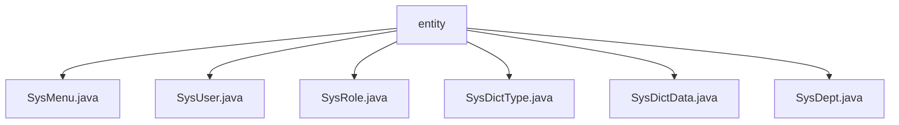

# 基础信息

|      |      |
|------|------|
| 名称 | entity |
| 编码语言 | .java |
| 代码路径 | RuoYi-main/ruoyi-common/src/main/java/com/ruoyi/common/core/domain/entity |
| 包名 | RuoYi-main.ruoyi-common.src.main.java.com.ruoyi.common.core.domain.entity |
| 概述说明 | SysMenu类定义菜单属性，SysUser类管理用户信息，SysRole类定义角色属性，SysDictType类管理字典数据，SysDictData类继承BaseEntity管理字典项，SysDept类继承BaseEntity管理部门信息。 |

# 说明

## 概述

该代码模块是一个基于Java的后台管理系统，主要用于管理系统的核心实体数据。模块中包含多个类，分别用于管理菜单、用户、角色、字典类型、字典数据以及部门信息。这些类通过定义各类实体的属性和方法，提供了对系统核心数据的全面管理功能。模块的设计注重灵活性和可扩展性，支持数据的导入导出、层级关系管理以及状态控制等功能，确保系统的高效运行和数据的完整性。

## 主要业务场景

1. **菜单管理**  
   - 通过`SysMenu`类定义菜单的层级结构，支持菜单的唯一标识、名称、URL、类型、状态以及权限设置。菜单可以包含子菜单，便于构建复杂的菜单树结构，满足不同业务场景的需求。

2. **用户管理**  
   - `SysUser`类用于管理用户的基本信息，包括登录名、用户名、邮箱、手机号、性别、头像、密码和状态等。支持通过Excel文件进行用户数据的批量导入和导出，简化用户信息的管理流程。

3. **角色管理**  
   - `SysRole`类定义角色的属性，如ID、名称、权限、排序、数据范围、状态和删除标志。通过该类，可以方便地对角色进行增删改查操作，确保系统角色的权限管理和一致性。

4. **字典管理**  
   - `SysDictType`类和`SysDictData`类共同管理系统的字典数据。`SysDictType`类用于定义字典类型，`SysDictData`类用于管理具体的字典项，支持字典项的排序、标签、键值、类型、样式和状态等属性。字典数据可以导出，便于进一步处理或存储。

5. **部门管理**  
   - `SysDept`类用于管理部门的层级结构，包含部门ID、父部门ID、部门名称、显示顺序、负责人、联系电话、邮箱、部门状态和删除标志等属性。通过该类，可以构建部门的树形结构，支持部门的增删改查和状态控制。

这些业务场景共同构成了系统的核心管理功能，确保系统数据的高效管理和操作。

### 包内部结构视图

该流程图展示了`entity`文件夹下的多个Java文件，包括`SysMenu.java`、`SysUser.java`、`SysRole.java`、`SysDictType.java`、`SysDictData.java`和`SysDept.java`。这些文件均位于`entity`目录下，表示它们属于同一层级，且都与系统实体相关。

# 文件列表 File List

| 名称   | 类型  | 说明 |
|-------|------|-------------|
| [SysDictType.java](SysDictType.md) | file | SysDictType类含主键、名称、类型、状态属性，支持数据验证和导出。 |
| [SysDept.java](SysDept.md) | file | SysDept类继承BaseEntity，包含部门ID、父部门ID、部门名称、负责人、联系电话等属性。 |
| [SysDictData.java](SysDictData.md) | file | SysDictData继承BaseEntity，含编码、排序、标签、键值、类型、样式、默认状态和状态等属性。 |
| [SysRole.java](SysRole.md) | file | SysRole类定义角色属性及方法，包括ID、名称、权限、排序、数据范围、状态和删除标志。 |
| [SysUser.java](SysUser.md) | file | SysUser类包含用户信息属性，支持Excel导入导出。 |
| [SysMenu.java](SysMenu.md) | file | SysMenu类定义菜单属性，含ID、名称、父菜单、URL、类型、状态、权限，支持子菜单。 |

