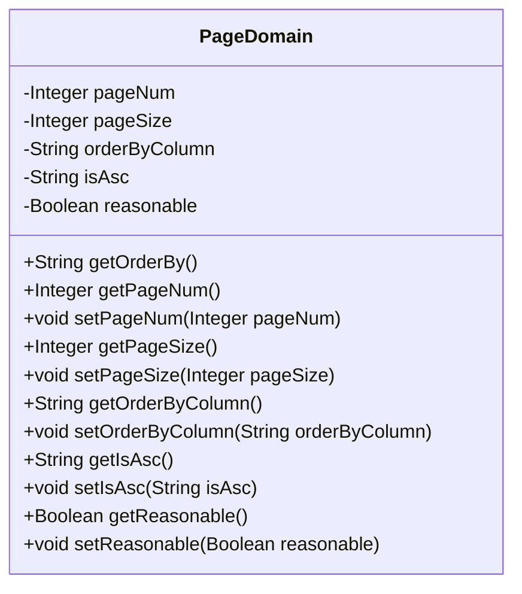

# 基础信息

|      |      |
|------|------|
| 名称 | PageDomain |
| 编码语言 | .java |
| 代码路径 | RuoYi-main/ruoyi-common/src/main/java/com/ruoyi/common/core/page/PageDomain.java |
| 包名 | com.ruoyi.common.core.page |
| 依赖项 | ['com.ruoyi.common.utils.StringUtils'] |
| 概述说明 | PageDomain类管理分页参数，包括页码、页数和排序信息。 |

# 说明

PageDomain类负责管理分页相关的参数，包括当前页码、总页数、排序列、排序方向等。此外，该类还确保这些参数的合理性和有效性，以便在分页操作中提供准确和一致的数据支持。通过这种方式，PageDomain类简化了分页逻辑的处理，提升了代码的可维护性和可读性。

# 类列表 Class Summary

| 名称   | 类型  | 说明 |
|-------|------|-------------|
| PageDomain | class | PageDomain类管理分页参数，包括页码、页数、排序列、排序方向及参数合理化。 |

## 类 PageDomain

|      |      |
|------|------|
| 访问范围 | public |
| 类型 | class |
| 名称 | PageDomain |
| 说明 | PageDomain类管理分页参数，包括页码、页数、排序列、排序方向及参数合理化。 |

### UML类图

这段代码定义了一个名为 `PageDomain` 的类，用于管理分页相关的参数。类中包含五个私有属性：`pageNum`（当前记录起始索引）、`pageSize`（每页显示记录数）、`orderByColumn`（排序列）、`isAsc`（排序方向，默认为 "asc"）、`reasonable`（分页参数合理化，默认为 `true`）。类提供了对这些属性的 `getter` 和 `setter` 方法，并包含一个 `getOrderBy` 方法，用于生成排序字符串。该类主要用于处理分页查询时的参数设置和获取。

### 内部方法调用关系图

```mermaid
graph TD
    A["类PageDomain"]
    B["属性: Integer pageNum"]
    C["属性: Integer pageSize"]
    D["属性: String orderByColumn"]
    E["属性: String isAsc = 'asc'"]
    F["属性: Boolean reasonable = true"]
    G["方法: String getOrderBy()"]
    H["方法: Integer getPageNum()"]
    I["方法: void setPageNum(Integer pageNum)"]
    J["方法: Integer getPageSize()"]
    K["方法: void setPageSize(Integer pageSize)"]
    L["方法: String getOrderByColumn()"]
    M["方法: void setOrderByColumn(String orderByColumn)"]
    N["方法: String getIsAsc()"]
    O["方法: void setIsAsc(String isAsc)"]
    P["方法: Boolean getReasonable()"]
    Q["方法: void setReasonable(Boolean reasonable)"]

    A --> B
    A --> C
    A --> D
    A --> E
    A --> F
    A --> G
    A --> H
    A --> I
    A --> J
    A --> K
    A --> L
    A --> M
    A --> N
    A --> O
    A --> P
    A --> Q
```

**描述：**  
`PageDomain`类用于管理分页相关的参数，包括当前页码、每页记录数、排序列、排序方向以及分页参数合理化。类中提供了多个getter和setter方法来访问和修改这些属性。`getOrderBy`方法用于生成排序字符串，`getReasonable`方法用于获取分页参数合理化状态，默认值为`true`。通过这些方法，可以方便地管理和操作分页数据。

### 字段列表 Field List

| 名称  | 类型  | 说明 |
|-------|-------|------|
| reasonable = true | Boolean | 私有布尔变量reasonable初始化为true。 |
| pageNum | Integer | 定义私有整型变量pageNum。 |
| pageSize | Integer | 定义私有整型变量pageSize。 |
| isAsc = "asc" | String | 私有字符串变量isAsc初始化为"asc"。 |
| orderByColumn | String | 私有字符串变量orderByColumn。 |

### 方法列表 Method List

| 名称  | 类型  | 说明 |
|-------|-------|------|
| getPageNum | Integer | 获取当前页码的方法。 |
| setReasonable | void | 设置布尔值reasonable的方法。 |
| getOrderByColumn | String | 该方法返回orderByColumn的值。 |
| setOrderByColumn | void | 设置排序字段的方法。 |
| getPageSize | Integer | 获取页面大小的方法，返回整数值。 |
| setPageSize | void | 设置页面大小的方法，参数为整数类型。 |
| setIsAsc | void | 设置isAsc属性的方法，参数为String类型。 |
| setPageNum | void | 定义方法setPageNum，用于设置pageNum属性。 |
| getOrderBy | String | 方法getOrderBy返回排序字段和顺序，若为空则返回空字符串。 |
| getReasonable | Boolean | 方法getReasonable检查reasonable是否为空，为空则返回true，否则返回reasonable值。 |
| getIsAsc | String | 方法getIsAsc返回字符串变量isAsc的值。 |

