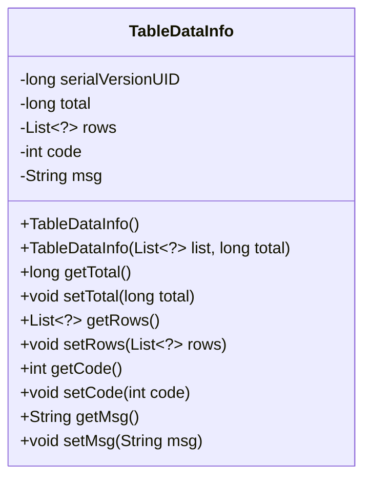

# 基础信息

|      |      |
|------|------|
| 名称 | TableDataInfo |
| 编码语言 | .java |
| 代码路径 | RuoYi-main/ruoyi-common/src/main/java/com/ruoyi/common/core/page/TableDataInfo.java |
| 包名 | com.ruoyi.common.core.page |
| 依赖项 | ['java.io.Serializable', 'java.util.List'] |
| 概述说明 | TableDataInfo类存储表格数据，含记录数、列表、状态码和消息。 |

# 说明

TableDataInfo类用于存储表格数据，包含四个主要属性：总记录数、列表数据、状态码和消息内容。总记录数表示数据的总条目数量，列表数据存储具体的表格数据项，状态码用于标识操作或请求的状态，消息内容则提供与状态码相关的详细信息或反馈。该类旨在高效地管理和传递表格数据及其相关元信息。

# 类列表 Class Summary

| 名称   | 类型  | 说明 |
|-------|------|-------------|
| TableDataInfo | class | TableDataInfo类用于存储表格数据，包含总记录数、列表数据、状态码和消息内容。 |

## 类 TableDataInfo

|      |      |
|------|------|
| 访问范围 | public |
| 类型 | class |
| 名称 | TableDataInfo |
| 说明 | TableDataInfo类用于存储表格数据，包含总记录数、列表数据、状态码和消息内容。 |

### UML类图

这段代码定义了一个名为 `TableDataInfo` 的类，该类实现了 `Serializable` 接口，用于序列化对象。类中包含四个私有成员变量：`total`（总记录数）、`rows`（列表数据）、`code`（消息状态码）和 `msg`（消息内容）。类提供了两个构造函数，一个无参构造函数和一个接受列表数据和总记录数的构造函数。此外，类中还提供了对这些成员变量的 `getter` 和 `setter` 方法，以便外部代码可以访问和修改这些数据。这个类的主要作用是封装表格数据，并提供对这些数据的访问和操作接口。

### 内部方法调用关系图

```mermaid
graph TD
    A["类TableDataInfo"]
    B["属性: long total"]
    C["属性: List<?> rows"]
    D["属性: int code"]
    E["属性: String msg"]
    F["构造方法: TableDataInfo()"]
    G["构造方法: TableDataInfo(List<?> list, long total)"]
    H["方法: long getTotal()"]
    I["方法: void setTotal(long total)"]
    J["方法: List<?> getRows()"]
    K["方法: void setRows(List<?> rows)"]
    L["方法: int getCode()"]
    M["方法: void setCode(int code)"]
    N["方法: String getMsg()"]
    O["方法: void setMsg(String msg)"]

    A --> B
    A --> C
    A --> D
    A --> E
    A --> F
    A --> G
    A --> H
    A --> I
    A --> J
    A --> K
    A --> L
    A --> M
    A --> N
    A --> O
```

这段代码定义了一个名为 `TableDataInfo` 的类，用于存储表格数据信息。类中包含四个属性：`total`（总记录数）、`rows`（列表数据）、`code`（消息状态码）和 `msg`（消息内容）。类提供了两个构造方法，一个无参构造方法和一个带有 `list` 和 `total` 参数的构造方法。此外，类还提供了对每个属性的 `getter` 和 `setter` 方法，用于获取和设置属性值。这段代码主要用于管理和操作表格数据，适用于需要分页和数据展示的场景。

### 字段列表 Field List

| 名称  | 类型  | 说明 |
|-------|-------|------|
| serialVersionUID = 1L | long | 声明序列化版本号为1L的静态常量。 |
| total | long | 定义一个长整型变量total。 |
| rows | List<?> | 私有列表变量`rows`，存储任意类型元素。 |
| code | int | 定义了一个私有整型变量code。 |
| msg | String | 定义了一个私有的字符串变量msg。 |

### 方法列表 Method List

| 名称  | 类型  | 说明 |
|-------|-------|------|
| getRows | List<?> | 该方法返回一个包含所有行的列表。 |
| setTotal | void | 设置总数值的方法，接受长整型参数。 |
| getCode | int | 获取并返回整型变量code的值。 |
| setCode | void | 设置整数类型变量code的值。 |
| getTotal | long | 获取总数值的方法，返回长整型变量total。 |
| setMsg | void | 定义方法setMsg，用于设置msg变量的值。 |
| setRows | void | 该方法用于设置行数据，将传入的列表赋值给类的成员变量rows。 |
| getMsg | String | 获取消息字符串的方法。 |

