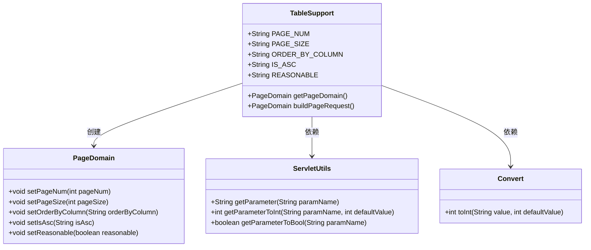
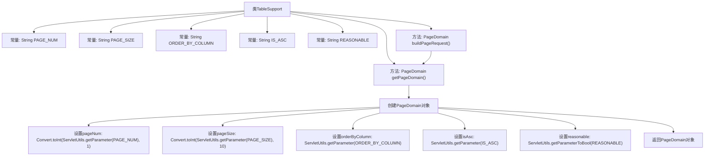

# 基础信息

|      |      |
|------|------|
| 名称 | TableSupport |
| 编码语言 | .java |
| 代码路径 | RuoYi-main/ruoyi-common/src/main/java/com/ruoyi/common/core/page/TableSupport.java |
| 包名 | com.ruoyi.common.core.page |
| 依赖项 | ['com.ruoyi.common.core.text.Convert', 'com.ruoyi.common.utils.ServletUtils'] |
| 概述说明 | TableSupport类封装分页参数，包括页码、记录数、排序列及排序方向。 |

# 说明

TableSupport类是一个用于封装分页相关参数的类，其主要功能包括管理页码、每页记录数、排序列、排序方向以及分页合理化。通过该类，可以有效地组织和传递分页查询所需的关键信息，确保数据分页操作的规范性和一致性。

# 类列表 Class Summary

| 名称   | 类型  | 说明 |
|-------|------|-------------|
| TableSupport | class | TableSupport类封装分页参数，包括页码、每页记录数、排序列、排序方向及分页合理化。 |

## 类 TableSupport

|      |      |
|------|------|
| 访问范围 | public |
| 类型 | class |
| 名称 | TableSupport |
| 说明 | TableSupport类封装分页参数，包括页码、每页记录数、排序列、排序方向及分页合理化。 |

### UML类图

这段代码定义了一个`TableSupport`类，用于封装分页相关的参数和逻辑。`TableSupport`类包含多个静态常量，用于标识分页参数，并提供了`getPageDomain`和`buildPageRequest`方法来获取和构建分页对象`PageDomain`。`PageDomain`类用于存储分页信息，如页码、每页大小、排序列等。`TableSupport`类依赖于`ServletUtils`和`Convert`类来获取和处理请求参数。整体设计简洁，便于在分页场景中使用。

### 内部方法调用关系图

这段代码定义了一个名为 `TableSupport` 的类，主要用于封装分页请求的相关参数。类中定义了多个常量，用于表示分页请求中的关键字段，如 `PAGE_NUM`、`PAGE_SIZE` 等。`getPageDomain` 方法通过调用 `ServletUtils` 类的方法获取这些参数，并将其封装到一个 `PageDomain` 对象中。`buildPageRequest` 方法则直接调用 `getPageDomain` 方法，返回封装好的 `PageDomain` 对象。流程图清晰地展示了类中各个常量和方法的调用关系。

### 字段列表 Field List

| 名称  | 类型  | 说明 |
|-------|-------|------|
| PAGE_SIZE = "pageSize" | String | 定义常量PAGE_SIZE，值为"pageSize"。 |
| REASONABLE = "reasonable" | String | 定义静态常量REASONABLE，值为"reasonable"。 |
| IS_ASC = "isAsc" | String | 定义常量字符串IS_ASC，值为"isAsc"。 |
| ORDER_BY_COLUMN = "orderByColumn" | String | 定义常量ORDER_BY_COLUMN，值为"orderByColumn"。 |
| PAGE_NUM = "pageNum" | String | 定义静态常量PAGE_NUM，值为"pageNum"。 |

### 方法列表 Method List

| 名称  | 类型  | 说明 |
|-------|-------|------|
| buildPageRequest | PageDomain | 静态方法buildPageRequest返回PageDomain对象。 |
| getPageDomain | PageDomain | 获取分页信息并设置PageDomain对象参数。 |

