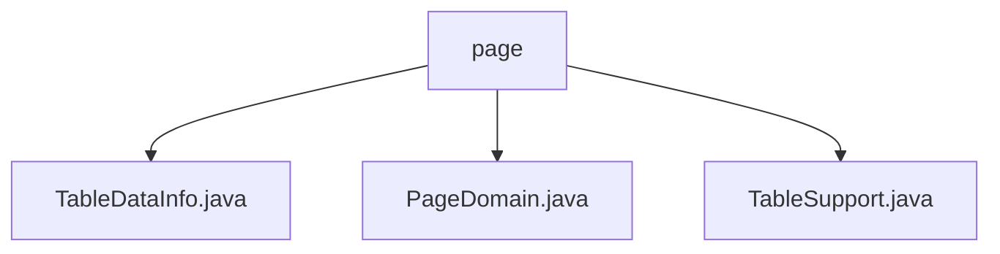

# 基础信息

|      |      |
|------|------|
| 名称 | page |
| 编码语言 | .java |
| 代码路径 | RuoYi-main/ruoyi-common/src/main/java/com/ruoyi/common/core/page |
| 包名 | RuoYi-main.ruoyi-common.src.main.java.com.ruoyi.common.core.page |
| 概述说明 | TableDataInfo类存储表格数据及元信息，PageDomain类管理分页参数，TableSupport类封装分页信息。 |

# 说明

## 概述
该代码模块主要围绕表格数据的分页管理展开，包含三个核心类：`TableDataInfo`、`PageDomain` 和 `TableSupport`。这些类共同协作，用于高效地管理和传递表格数据及其相关的分页信息。`TableDataInfo` 负责存储表格数据及其元信息，`PageDomain` 管理分页参数并确保其合理性和有效性，而 `TableSupport` 则封装分页相关参数，确保分页操作的规范性和一致性。通过这一模块，开发者可以简化分页逻辑的处理，提升代码的可维护性和可读性。

## 主要业务场景
1. **表格数据管理**：`TableDataInfo` 类用于存储表格数据的总记录数、列表数据、状态码和消息内容，适用于需要展示和管理表格数据的场景，如数据查询结果的返回。
2. **分页参数管理**：`PageDomain` 类负责管理分页相关的参数，如当前页码、总页数、排序列和排序方向，适用于需要分页查询的场景，确保分页操作的准确性和一致性。
3. **分页查询封装**：`TableSupport` 类用于封装分页查询所需的关键信息，如页码、每页记录数、排序列和排序方向，适用于需要规范化和一致性的分页查询场景，确保分页逻辑的合理性和可维护性。

### 包内部结构视图

该流程图展示了RuoYi项目中`page`目录下的文件层级关系。`page`作为根节点，包含了三个文件：`TableDataInfo.java`、`PageDomain.java`和`TableSupport.java`。这些文件均位于`com/ruoyi/common/core/page`路径下，用于处理分页相关的逻辑和数据管理。

# 文件列表 File List

| 名称   | 类型  | 说明 |
|-------|------|-------------|
| [PageDomain.java](PageDomain.md) | file | PageDomain类管理分页参数，包括页码、页数和排序信息。 |
| [TableSupport.java](TableSupport.md) | file | TableSupport类封装分页参数，包括页码、记录数、排序列及排序方向。 |
| [TableDataInfo.java](TableDataInfo.md) | file | TableDataInfo类存储表格数据，含记录数、列表、状态码和消息。 |

