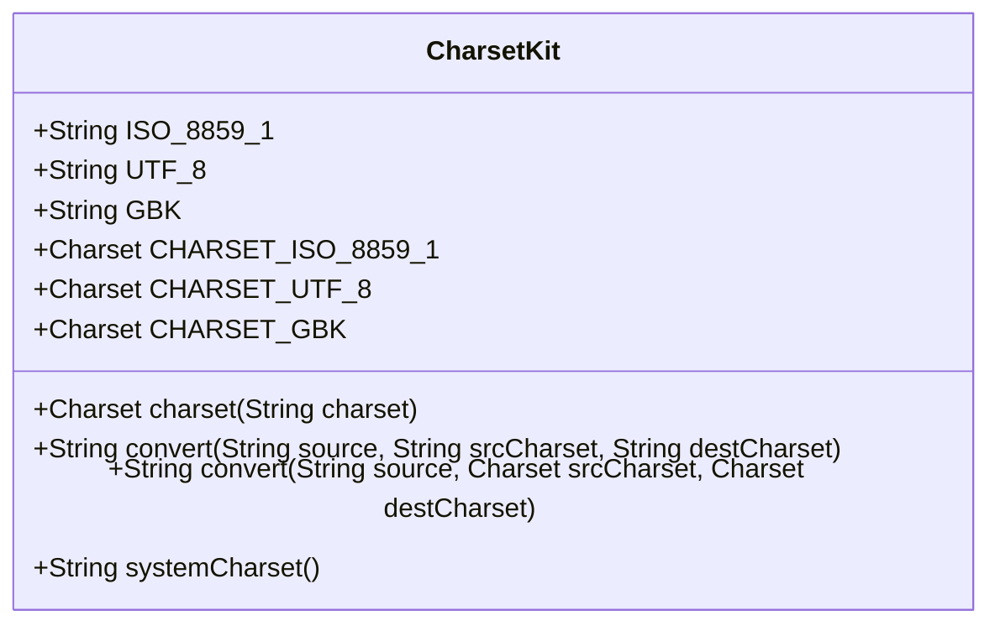
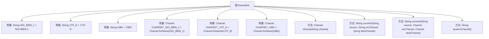

# 基础信息

|      |      |
|------|------|
| 名称 | CharsetKit |
| 编码语言 | .java |
| 代码路径 | RuoYi-main/ruoyi-common/src/main/java/com/ruoyi/common/core/text/CharsetKit.java |
| 包名 | com.ruoyi.common.core.text |
| 依赖项 | ['java.nio.charset.Charset', 'java.nio.charset.StandardCharsets', 'com.ruoyi.common.utils.StringUtils'] |
| 概述说明 | CharsetKit类支持ISO-8859-1、UTF-8和GBK字符集转换，提供默认方法。 |

# 说明

CharsetKit类是一个提供字符集转换功能的工具，支持多种常见字符集，包括ISO-8859-1、UTF-8和GBK。该类具备默认的转换方法，能够方便地实现不同字符集之间的转换操作。通过使用CharsetKit类，用户可以简化字符集转换的流程，确保数据在不同编码环境下的兼容性和准确性。

# 类列表 Class Summary

| 名称   | 类型  | 说明 |
|-------|------|-------------|
| CharsetKit | class | CharsetKit类提供字符集转换功能，支持ISO-8859-1、UTF-8和GBK，默认转换方法。 |

## 类 CharsetKit

|      |      |
|------|------|
| 访问范围 | public |
| 类型 | class |
| 名称 | CharsetKit |
| 说明 | CharsetKit类提供字符集转换功能，支持ISO-8859-1、UTF-8和GBK，默认转换方法。 |

### UML类图

这段代码定义了一个名为 `CharsetKit` 的工具类，主要用于处理字符集相关的操作。类中包含了三个静态常量 `ISO_8859_1`、`UTF_8` 和 `GBK`，分别表示常见的字符集名称。此外，类中还定义了三个 `Charset` 类型的常量，用于表示对应的字符集对象。类提供了多个静态方法，包括将字符串转换为指定字符集的 `charset` 方法，以及在不同字符集之间转换字符串的 `convert` 方法。最后，`systemCharset` 方法用于获取系统默认的字符集名称。这些方法可以帮助开发者在处理字符编码时更加方便和高效。

### 内部方法调用关系图

这段代码定义了一个名为 `CharsetKit` 的类，主要用于处理字符集相关的操作。类中包含多个常量，分别表示常见的字符集名称和对应的 `Charset` 对象。类中还提供了多个方法，用于将字符串转换为指定的字符集、获取系统默认字符集等。流程图展示了类的结构及其内部方法之间的关系。

### 字段列表 Field List

| 名称  | 类型  | 说明 |
|-------|-------|------|
| CHARSET_UTF_8 = Charset.forName(UTF_8) | Charset | 定义UTF-8字符集常量。 |
| GBK = "GBK" | String | 定义常量GBK，值为"GBK"。 |
| CHARSET_ISO_8859_1 = Charset.forName(ISO_8859_1) | Charset | 定义ISO-8859-1字符集的静态常量。 |
| UTF_8 = "UTF-8" | String | 定义了一个静态常量UTF_8，值为"UTF-8"。 |
| ISO_8859_1 = "ISO-8859-1" | String | 定义常量ISO_8859_1，值为"ISO-8859-1"。 |
| CHARSET_GBK = Charset.forName(GBK) | Charset | 定义静态常量CHARSET_GBK，表示GBK字符集。 |

### 方法列表 Method List

| 名称  | 类型  | 说明 |
|-------|-------|------|
| systemCharset | String | 该方法返回系统默认字符集的名称。 |
| convert | String | 静态方法将字符串从源字符集转换为目标字符集。 |
| charset | Charset | 该方法根据传入字符集名称返回对应字符集，若为空则返回默认字符集。 |
| convert | String | 将字符串从源字符集转换为目标字符集，默认源为ISO-8859-1，目标为UTF-8。 |

