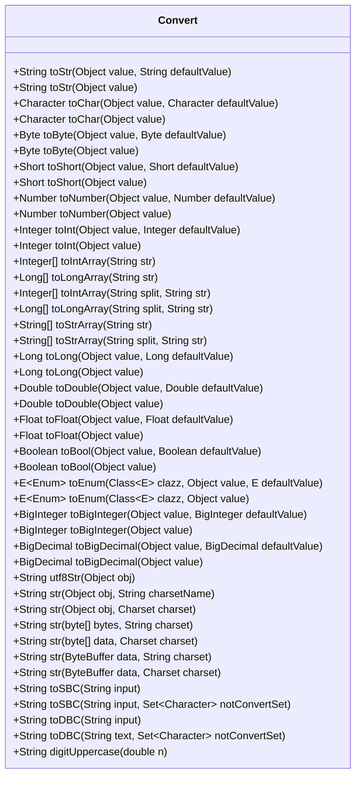

# 基础信息

|      |      |
|------|------|
| 名称 | Convert |
| 编码语言 | .java |
| 代码路径 | RuoYi-main/ruoyi-common/src/main/java/com/ruoyi/common/core/text/Convert.java |
| 包名 | com.ruoyi.common.core.text |
| 依赖项 | ['java.math.BigDecimal', 'java.math.BigInteger', 'java.math.RoundingMode', 'java.nio.ByteBuffer', 'java.nio.charset.Charset', 'java.text.NumberFormat', 'java.util.Set', 'com.ruoyi.common.utils.StringUtils', 'org.apache.commons.lang3.ArrayUtils'] |
| 概述说明 | Convert类支持多类型转换，默认值处理，失败不报错。 |

# 说明

Convert类是一个功能强大的工具，提供了多种类型转换方法，能够将数据从一种类型转换为另一种类型。该类的一个显著特点是支持默认值设置，即在转换失败时不会抛出错误，而是返回预先定义的默认值，从而增强了代码的健壮性和容错性。这种设计使得在处理不确定或异常数据时更加安全和便捷，确保程序能够平稳运行而不会因为类型转换问题而中断。

# 类列表 Class Summary

| 名称   | 类型  | 说明 |
|-------|------|-------------|
| Convert | class | Convert类提供多种类型转换方法，支持默认值，转换失败不报错。 |

## 类 Convert

|      |      |
|------|------|
| 访问范围 | public |
| 类型 | class |
| 名称 | Convert |
| 说明 | Convert类提供多种类型转换方法，支持默认值，转换失败不报错。 |

### UML类图

### 描述
`Convert` 类是一个工具类，提供了多种将对象转换为不同类型的方法。这些方法包括将对象转换为字符串、字符、字节、短整型、整型、长整型、浮点数、双精度数、布尔值、枚举、大整数和大十进制数等。此外，还提供了将字符串数组、整数数组和长整数数组转换为相应类型的方法。该类还支持字符集转换、全角半角转换以及数字金额的大写转换。所有转换方法都支持默认值，并在转换失败时返回默认值，确保不会抛出异常。

### 内部方法调用关系图

这段代码定义了一个名为 `Convert` 的类，其中包含了多个静态方法，用于将不同类型的对象转换为字符串、字符、数字等。每个方法都处理了可能的空值或转换失败的情况，并提供了默认值。这些方法涵盖了从基本类型到复杂类型的转换，并且通过调用内部方法 `toStr` 来统一处理字符串转换。代码结构清晰，功能全面，适合用于需要类型转换的场景。

### 字段列表 Field List

| 名称  | 类型  | 说明 |
|-------|-------|------|

### 方法列表 Method List

| 名称  | 类型  | 说明 |
|-------|-------|------|
| toStr | String | 静态方法将对象转换为字符串，支持默认值。 |
| toShort | Short | 将对象转换为Short类型，支持默认值。 |
| toIntArray | Integer[] | 将字符串按指定分隔符拆分并转换为整数数组。 |
| toBool | Boolean | 静态方法toBool将对象转换为布尔值，默认返回null。 |
| toNumber | Number | 静态方法将对象转换为数字，支持默认值。 |
| toSBC | String | 将字符串转换为全角字符的静态方法。 |
| toDouble | Double | 静态方法将对象转换为双精度浮点数，支持默认值。 |
| toStrArray | String[] | 将字符串按指定分隔符拆分为字符串数组。 |
| toNumber | Number | 将对象转换为数字，空值或异常时返回默认值。 |
| digitUppercase | String | 将数字金额转换为中文大写金额的Java方法。 |
| str | String | 将字节数组转换为字符串，支持指定字符集。 |
| toLong | Long | 将对象转换为长整型，支持默认值。 |
| toEnum | E | 将对象转换为枚举，失败返回默认值。 |
| toInt | Integer | 静态方法将对象转换为整数，默认返回空值。 |
| toStr | String | 将对象转为字符串，若为空则返回默认值。 |
| toFloat | Float | 将对象转换为浮点数，默认返回空值。 |
| toEnum | E | 将对象转换为指定枚举类型，支持默认值。 |
| toByte | Byte | 将对象转换为字节，默认返回空值。 |
| utf8Str | String | 静态方法utf8Str将对象转换为UTF-8编码字符串。 |
| str | String | 静态方法将对象转换为指定字符集的字符串。 |
| toDouble | Double | 将对象转换为Double，支持默认值、数值类型和字符串处理。 |
| toBigInteger | BigInteger | 静态方法将对象转换为BigInteger类型，支持空值处理。 |
| toLongArray | Long[] | 将字符串按指定分隔符分割并转换为长整型数组。 |
| toSBC | String | 将字符串中的半角字符转换为全角，跳过指定字符。 |
| toIntArray | Integer[] | 静态方法将字符串转换为整数数组，默认分隔符为逗号。 |
| toDBC | String | 将全角字符转换为半角，跳过指定字符。 |
| toBigDecimal | BigDecimal | 将对象转换为BigDecimal，允许空值输入。 |
| toInt | Integer | 将对象转换为整数，若失败则返回默认值。 |
| toShort | Short | 将对象转换为Short类型，若转换失败返回默认值。 |
| toLongArray | Long[] | 静态方法将字符串转换为长整型数组，默认分隔符为逗号。 |
| toFloat | Float | 将对象转换为浮点数，支持默认值、数值类型和字符串解析。 |
| toChar | Character | 将对象转换为字符，若为空或非字符类型，返回默认值。 |
| toBigInteger | BigInteger | 将对象转换为BigInteger，支持null、BigInteger、Long及字符串，失败返回默认值。 |
| toLong | Long | 将对象转换为长整型，支持默认值和多种类型转换。 |
| str | String | 将字节数组按指定字符集转换为字符串，默认使用系统字符集。 |
| toBigDecimal | BigDecimal | 将对象转换为BigDecimal，支持多种类型，失败返回默认值。 |
| toBool | Boolean | 将对象转换为布尔值，支持多种字符串格式，默认值可选。 |
| str | String | 将ByteBuffer按指定字符集解码为字符串，默认使用系统字符集。 |
| toChar | Character | 将对象转换为字符，支持默认值。 |
| str | String | 将对象转换为字符串，支持多种类型，处理空值和字符编码。 |
| toStrArray | String[] | 静态方法将字符串转换为字符串数组，空字符串返回空数组。 |
| toByte | Byte | 将对象转换为Byte，若为空或异常返回默认值。 |
| str | String | 将ByteBuffer按指定字符集转换为字符串。 |
| toDBC | String | 将字符串中的全角字符转换为半角字符。 |

