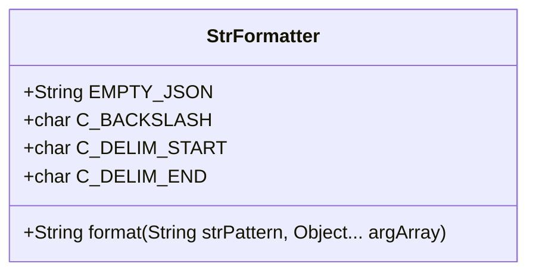
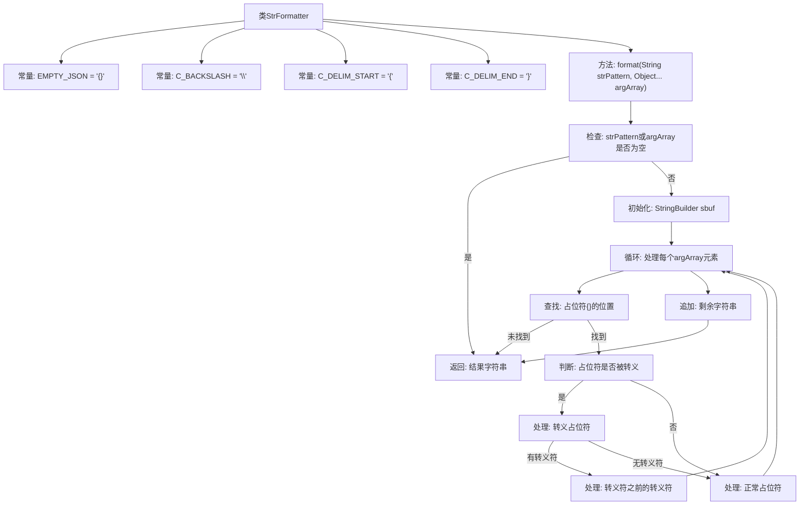

# 基础信息

|      |      |
|------|------|
| 名称 | StrFormatter |
| 编码语言 | .java |
| 代码路径 | RuoYi-main/ruoyi-common/src/main/java/com/ruoyi/common/core/text/StrFormatter.java |
| 包名 | com.ruoyi.common.core.text |
| 依赖项 | ['com.ruoyi.common.utils.StringUtils'] |
| 概述说明 | StrFormatter类提供字符串格式化，支持占位符替换和转义处理。 |

# 说明

StrFormatter类是一个用于字符串格式化的工具，主要功能包括支持使用占位符{}进行字符串替换，并提供转义处理机制。该类能够有效地处理字符串中的占位符，确保在替换过程中不会出现错误或格式混乱。通过转义处理，StrFormatter类还能避免特殊字符对字符串格式化的影响，确保最终输出的字符串符合预期格式。该类的设计旨在简化字符串操作，提高代码的可读性和维护性。

# 类列表 Class Summary

| 名称   | 类型  | 说明 |
|-------|------|-------------|
| StrFormatter | class | StrFormatter类提供字符串格式化功能，支持占位符{}替换和转义处理。 |

## 类 StrFormatter

|      |      |
|------|------|
| 访问范围 | public |
| 类型 | class |
| 名称 | StrFormatter |
| 说明 | StrFormatter类提供字符串格式化功能，支持占位符{}替换和转义处理。 |

### UML类图

这段代码定义了一个名为 `StrFormatter` 的类，主要用于格式化字符串。类中包含三个静态常量 `EMPTY_JSON`、`C_BACKSLASH` 和 `C_DELIM_START`、`C_DELIM_END`，分别表示空 JSON 对象、反斜杠字符以及占位符的起始和结束字符。`format` 方法是该类的核心功能，它接受一个字符串模板和一个可变参数列表，通过替换模板中的占位符 `{}` 来生成最终的字符串。该方法还支持转义字符的处理，使得用户可以在输出中包含 `{}` 或反斜杠字符。代码通过 `StringBuilder` 来高效地构建最终的字符串，并处理了各种边界情况，如空输入、转义字符和占位符的位置等。

### 内部方法调用关系图

这段代码是一个字符串格式化工具类，主要功能是将字符串模板中的占位符 `{}` 按照顺序替换为给定的参数。代码处理了占位符被转义的情况，并且支持转义符 `\` 的使用。通过 `StringBuilder` 进行高效的字符串拼接，最终返回格式化后的字符串。代码逻辑清晰，处理了各种边界情况，如空输入、占位符被转义等，确保输出的准确性。

### 字段列表 Field List

| 名称  | 类型  | 说明 |
|-------|-------|------|
| EMPTY_JSON = "{}" | String | 定义空JSON字符串常量EMPTY_JSON。 |
| C_DELIM_START = '{' | char | 定义静态常量字符C_DELIM_START，值为'{'。 |
| C_DELIM_END = '}' | char | 定义常量字符C_DELIM_END，值为'}'。 |
| C_BACKSLASH = '\\' | char | 定义静态常量字符C_BACKSLASH，值为反斜杠。 |

### 方法列表 Method List

| 名称  | 类型  | 说明 |
|-------|-------|------|
| format | String | 格式化字符串，替换占位符并处理转义符。 |

