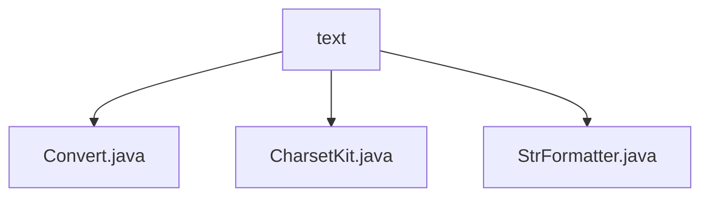

# 基础信息

|      |      |
|------|------|
| 名称 | text |
| 编码语言 | .java |
| 代码路径 | RuoYi-main/ruoyi-common/src/main/java/com/ruoyi/common/core/text |
| 包名 | RuoYi-main.ruoyi-common.src.main.java.com.ruoyi.common.core.text |
| 概述说明 | Convert类支持类型转换与默认值，CharsetKit类简化字符集转换，StrFormatter类处理字符串格式化与转义。 |

# 说明

## 概述

该代码模块是一个功能强大的文本处理工具集，主要用于处理不同类型的数据转换、字符集转换以及字符串格式化操作。模块包含三个核心类：`Convert`、`CharsetKit` 和 `StrFormatter`，每个类都提供了特定领域的功能，旨在简化开发过程中的常见文本处理任务，并增强代码的健壮性和可维护性。

## 主要业务场景

1. **数据类型转换**：
   - 使用 `Convert` 类进行数据类型转换，支持多种类型的转换操作，并提供了默认值设置功能。这在处理不确定或异常数据时非常有用，能够确保程序在转换失败时不会中断，而是返回预先定义的默认值，从而提高代码的容错性和稳定性。

2. **字符集转换**：
   - 通过 `CharsetKit` 类实现不同字符集之间的转换，支持常见的字符集如 ISO-8859-1、UTF-8 和 GBK。该类简化了字符集转换的流程，确保数据在不同编码环境下的兼容性和准确性，适用于需要处理多语言或跨平台数据的场景。

3. **字符串格式化**：
   - 使用 `StrFormatter` 类进行字符串格式化操作，支持占位符 `{}` 的替换，并提供了转义处理机制。该类能够有效地处理字符串中的占位符，确保在替换过程中不会出现错误或格式混乱，同时避免特殊字符对字符串格式化的影响。适用于需要动态生成或格式化字符串的场景，如日志记录、消息模板生成等。

### 包内部结构视图

该流程图展示了`RuoYi-main/ruoyi-common/src/main/java/com/ruoyi/common/core/text`路径下的层级关系。`text`文件夹包含三个文件：`Convert.java`、`CharsetKit.java`和`StrFormatter.java`。每个文件都直接隶属于`text`文件夹，没有进一步的子目录或嵌套结构。

# 文件列表 File List

| 名称   | 类型  | 说明 |
|-------|------|-------------|
| [CharsetKit.java](CharsetKit.md) | file | CharsetKit类支持ISO-8859-1、UTF-8和GBK字符集转换，提供默认方法。 |
| [StrFormatter.java](StrFormatter.md) | file | StrFormatter类提供字符串格式化，支持占位符替换和转义处理。 |
| [Convert.java](Convert.md) | file | Convert类支持多类型转换，默认值处理，失败不报错。 |

