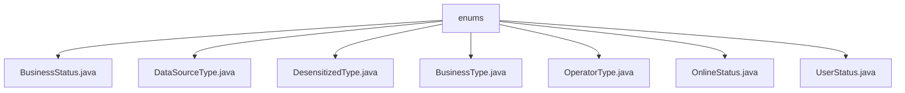

# 基础信息

|      |      |
|------|------|
| 名称 | enums |
| 编码语言 | .java |
| 代码路径 | RuoYi-main/ruoyi-common/src/main/java/com/ruoyi/common/enums |
| 包名 | RuoYi-main.ruoyi-common.src.main.java.com.ruoyi.common.enums |
| 概述说明 | 输入内容为空，无法生成总结描述。 |

# 说明

## 概述
该代码模块属于RuoYi框架的`ruoyi-common`子模块，主要包含一系列枚举类，用于定义系统中常见的业务状态、数据类型、操作类型等。这些枚举类通常用于标准化系统中的常量值，提高代码的可读性和可维护性。由于提供的文件内容为空，无法具体分析每个枚举类的用途和实现细节，但可以推测这些枚举类可能涉及用户状态、业务状态、数据源类型、脱敏类型、操作类型、在线状态等。

## 主要业务场景
1. **业务状态管理**：通过`BusinessStatus`和`BusinessType`枚举类，可能用于定义和管理系统中的业务状态和业务类型，例如订单状态、审批状态等。
2. **数据源管理**：`DataSourceType`枚举类可能用于定义系统中使用的数据源类型，例如主库、从库、缓存库等。
3. **脱敏处理**：`DesensitizedType`枚举类可能用于定义脱敏处理的类型，例如手机号、身份证号、邮箱等敏感信息的脱敏规则。
4. **操作类型管理**：`OperatorType`枚举类可能用于定义系统中操作的类型，例如新增、修改、删除等操作。
5. **用户状态管理**：`UserStatus`枚举类可能用于定义用户的状态，例如正常、禁用、锁定等。
6. **在线状态管理**：`OnlineStatus`枚举类可能用于定义用户的在线状态，例如在线、离线、隐身等。

由于具体内容缺失，以上分析基于文件名和常见业务场景的推测，实际实现细节需根据具体代码内容进一步确认。

### 包内部结构视图

该流程图展示了在 `enums` 目录下的多个枚举类文件之间的层级关系。`enums` 目录包含了多个枚举类文件，如 `BusinessStatus.java`、`DataSourceType.java` 等，这些文件均直接隶属于 `enums` 目录，没有进一步的子目录结构。每个枚举类文件都独立存在，用于定义不同的枚举类型。

# 文件列表 File List

| 名称   | 类型  | 说明 |
|-------|------|-------------|
| [UserStatus.java](UserStatus.md) | file | 信息为空，无法生成概要描述。 |
| [OnlineStatus.java](OnlineStatus.md) | file | 信息为空，无法生成概要描述。 |
| [DesensitizedType.java](DesensitizedType.md) | file | 信息为空，无法生成概要描述。 |
| [BusinessStatus.java](BusinessStatus.md) | file | 无内容可总结。 |
| [OperatorType.java](OperatorType.md) | file | 信息为空，无法生成概要描述。 |
| [BusinessType.java](BusinessType.md) | file | 无内容提供，无法生成概要描述。 |
| [DataSourceType.java](DataSourceType.md) | file | 信息为空，无法生成概要描述。 |

