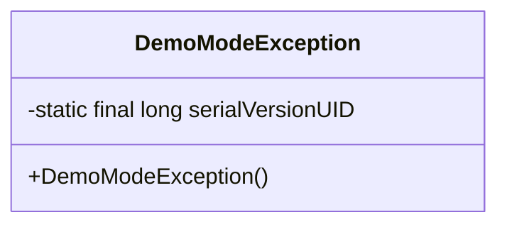
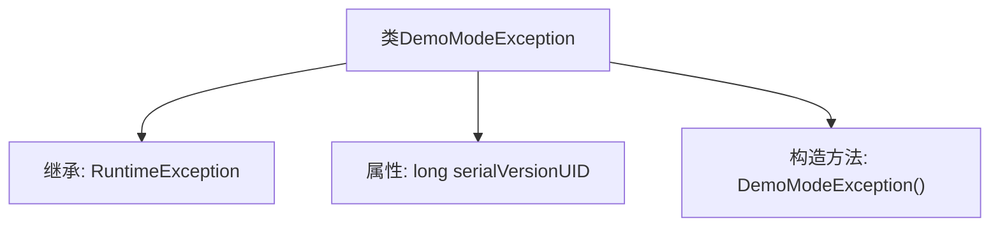

# 基础信息

|      |      |
|------|------|
| 名称 | DemoModeException |
| 编码语言 | .java |
| 代码路径 | RuoYi-main/ruoyi-common/src/main/java/com/ruoyi/common/exception/DemoModeException.java |
| 包名 | com.ruoyi.common.exception |
| 依赖项 | [] |
| 概述说明 | DemoModeException继承RuntimeException，处理演示模式异常。 |

# 说明

DemoModeException是RuntimeException的子类，专门用于处理演示模式下的异常情况。它继承自RuntimeException，表明这是一种运行时异常，通常用于在程序运行过程中捕获和处理与演示模式相关的错误或意外情况。通过定义此类异常，开发者可以在演示模式下更好地管理和控制程序的异常行为，确保在演示过程中不会因为意外的错误而中断或影响用户体验。

# 类列表 Class Summary

| 名称   | 类型  | 说明 |
|-------|------|-------------|
| DemoModeException | class | DemoModeException继承RuntimeException，用于处理演示模式异常。 |

## 类 DemoModeException

|      |      |
|------|------|
| 访问范围 | public |
| 类型 | class |
| 名称 | DemoModeException |
| 说明 | DemoModeException继承RuntimeException，用于处理演示模式异常。 |

### UML类图

这段代码定义了一个名为 `DemoModeException` 的类，它继承自 `RuntimeException`。该类包含一个静态的 `serialVersionUID` 字段，用于序列化控制，并且提供了一个无参构造函数。`DemoModeException` 是一个自定义的运行时异常类，通常用于在演示模式下抛出异常，以指示某些功能在演示环境中不可用或受限。

### 内部方法调用关系图

这段代码定义了一个名为 `DemoModeException` 的类，它继承自 `RuntimeException` 类。`DemoModeException` 类包含一个静态的 `serialVersionUID` 属性，用于序列化版本控制，以及一个无参的构造方法。这个异常类通常用于在演示模式下抛出特定的运行时异常，以便在程序运行中捕获和处理。

### 字段列表 Field List

| 名称  | 类型  | 说明 |
|-------|-------|------|
| serialVersionUID = 1L | long | 定义序列化版本号的静态常量。 |

### 方法列表 Method List

| 名称  | 类型  | 说明 |
|-------|-------|------|

