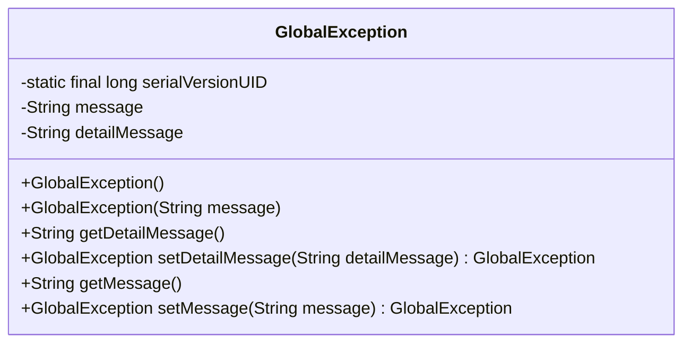
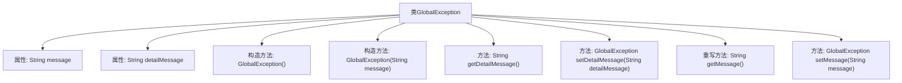

# 基础信息

|      |      |
|------|------|
| 名称 | GlobalException |
| 编码语言 | .java |
| 代码路径 | RuoYi-main/ruoyi-common/src/main/java/com/ruoyi/common/exception/GlobalException.java |
| 包名 | com.ruoyi.common.exception |
| 依赖项 | [] |
| 概述说明 | GlobalException继承RuntimeException，含错误提示和明细，支持序列化。 |

# 说明

GlobalException类继承自RuntimeException，旨在处理全局异常。该类包含错误提示和明细信息，能够清晰地描述异常的具体情况。此外，GlobalException类支持序列化，确保异常信息可以在不同系统或网络环境中传输和存储。通过继承RuntimeException，GlobalException能够保持与Java标准异常处理机制的一致性，便于在应用程序中进行统一的异常管理。

# 类列表 Class Summary

| 名称   | 类型  | 说明 |
|-------|------|-------------|
| GlobalException | class | GlobalException类继承RuntimeException，包含错误提示和明细信息，支持序列化。 |

## 类 GlobalException

|      |      |
|------|------|
| 访问范围 | public |
| 类型 | class |
| 名称 | GlobalException |
| 说明 | GlobalException类继承RuntimeException，包含错误提示和明细信息，支持序列化。 |

### UML类图

**描述：**  
`GlobalException` 类继承自 `RuntimeException`，用于处理全局异常。它包含两个主要属性：`message` 用于存储错误提示信息，`detailMessage` 用于存储内部调试的详细错误信息。类提供了空构造方法和带 `message` 参数的构造方法，以及获取和设置 `message` 和 `detailMessage` 的方法。通过 `setDetailMessage` 和 `setMessage` 方法，可以链式设置属性值，便于代码的简洁性。

### 内部方法调用关系图

这段代码定义了一个名为 `GlobalException` 的异常类，继承自 `RuntimeException`。该类包含两个主要属性：`message` 和 `detailMessage`，分别用于存储错误提示和错误明细。类中提供了两个构造方法，一个空构造方法用于避免反序列化问题，另一个接受 `message` 参数。此外，类中还提供了获取和设置 `detailMessage` 和 `message` 的方法，并重写了 `getMessage` 方法以返回 `message` 属性的值。这些方法使得异常信息的设置和获取更加灵活和方便。

### 字段列表 Field List

| 名称  | 类型  | 说明 |
|-------|-------|------|
| serialVersionUID = 1L | long | 声明一个私有静态不可变的序列化版本号变量。 |
| message | String | 定义私有字符串变量message。 |
| detailMessage | String | 私有字符串变量detailMessage。 |

### 方法列表 Method List

| 名称  | 类型  | 说明 |
|-------|-------|------|
| getDetailMessage | String | 该方法返回`detailMessage`字符串。 |
| setMessage | GlobalException | 全局异常类设置消息并返回自身实例。 |
| getMessage | String | 重写getMessage方法，返回message变量。 |
| setDetailMessage | GlobalException | 全局异常类方法，设置详细消息并返回当前实例。 |

