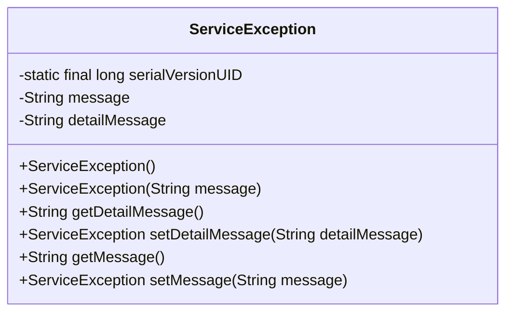
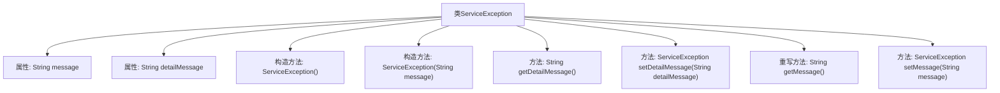

# 基础信息

|      |      |
|------|------|
| 名称 | ServiceException |
| 编码语言 | .java |
| 代码路径 | RuoYi-main/ruoyi-common/src/main/java/com/ruoyi/common/exception/ServiceException.java |
| 包名 | com.ruoyi.common.exception |
| 依赖项 | [] |
| 概述说明 | ServiceException继承RuntimeException，支持设置和获取错误提示及明细。 |

# 说明

ServiceException继承自RuntimeException，是一种运行时异常类。它具备错误提示和明细信息的功能，允许开发者设置和获取异常消息。通过这种方式，ServiceException能够提供更详细的错误描述，帮助开发者在调试和处理异常时更准确地定位问题。该类设计简洁，便于在需要时扩展和自定义错误信息。

# 类列表 Class Summary

| 名称   | 类型  | 说明 |
|-------|------|-------------|
| ServiceException | class | ServiceException继承RuntimeException，包含错误提示和明细，支持设置和获取消息。 |

## 类 ServiceException

|      |      |
|------|------|
| 访问范围 | public final |
| 类型 | class |
| 名称 | ServiceException |
| 说明 | ServiceException继承RuntimeException，包含错误提示和明细，支持设置和获取消息。 |

### UML类图

**描述：**  
`ServiceException` 类是一个自定义的运行时异常，继承自 `RuntimeException`。它包含两个主要属性：`message` 用于存储错误提示信息，`detailMessage` 用于存储内部调试的详细错误信息。类提供了空构造方法和带 `message` 参数的构造方法，以及获取和设置 `message` 和 `detailMessage` 的方法。该类设计灵活，允许链式调用设置方法，并支持反序列化。

### 内部方法调用关系图

这段代码定义了一个名为 `ServiceException` 的异常类，继承自 `RuntimeException`。该类包含两个主要属性：`message` 用于存储错误提示，`detailMessage` 用于存储错误明细。类提供了多个构造方法，包括一个空构造方法以避免反序列化问题，以及一个接受 `message` 参数的构造方法。此外，类还提供了获取和设置 `detailMessage` 和 `message` 的方法，并重写了 `getMessage` 方法以返回 `message` 属性。

### 字段列表 Field List

| 名称  | 类型  | 说明 |
|-------|-------|------|
| detailMessage | String | 私有字符串变量detailMessage用于存储详细信息。 |
| serialVersionUID = 1L | long | 定义了一个私有的静态长整型常量serialVersionUID，值为1L。 |
| message | String | 声明一个私有的字符串类型变量message。 |

### 方法列表 Method List

| 名称  | 类型  | 说明 |
|-------|-------|------|
| getDetailMessage | String | 该方法返回detailMessage字符串的值。 |
| getMessage | String | 重写getMessage方法，返回message变量。 |
| setMessage | ServiceException | ServiceException方法setMessage设置消息并返回当前实例。 |
| setDetailMessage | ServiceException | 设置并返回ServiceException的详细消息。 |

