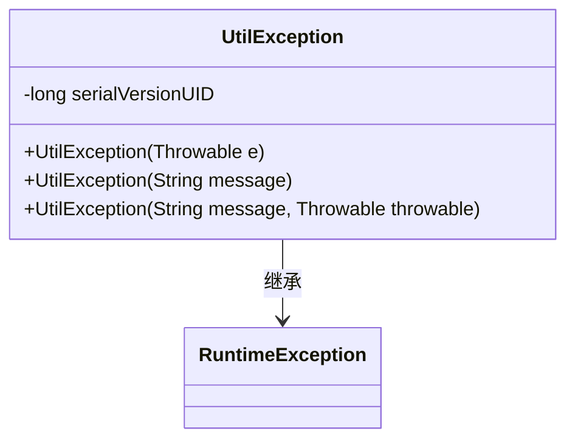
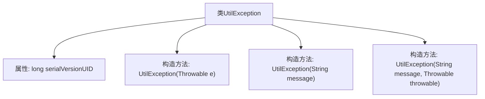

# 基础信息

|      |      |
|------|------|
| 名称 | UtilException |
| 编码语言 | .java |
| 代码路径 | RuoYi-main/ruoyi-common/src/main/java/com/ruoyi/common/exception/UtilException.java |
| 包名 | com.ruoyi.common.exception |
| 依赖项 | [] |
| 概述说明 | UtilException继承RuntimeException，提供多种构造方法。 |

# 说明

自定义异常类UtilException继承自RuntimeException，提供了多种构造方法。该类用于处理特定场景下的异常情况，允许开发者通过不同的构造方法灵活地创建异常实例。UtilException的设计旨在简化异常处理流程，提升代码的可读性和可维护性。通过继承RuntimeException，UtilException属于非检查型异常，无需在方法签名中显式声明或捕获。

# 类列表 Class Summary

| 名称   | 类型  | 说明 |
|-------|------|-------------|
| UtilException | class | 自定义异常类UtilException继承RuntimeException，支持多种构造方法。 |

## 类 UtilException

|      |      |
|------|------|
| 访问范围 | public |
| 类型 | class |
| 名称 | UtilException |
| 说明 | 自定义异常类UtilException继承RuntimeException，支持多种构造方法。 |

### UML类图

**描述**：`UtilException` 类继承自 `RuntimeException`，用于处理工具类中的异常情况。它提供了三种构造函数，分别用于接受异常对象、异常消息，以及同时接受异常消息和异常对象。这种设计使得异常处理更加灵活，能够根据不同的情况传递详细的错误信息。

### 内部方法调用关系图

这段代码定义了一个名为 `UtilException` 的类，它继承自 `RuntimeException`。该类包含三个构造方法，分别用于处理不同的异常情况：第一个构造方法接受一个 `Throwable` 对象作为参数，第二个构造方法接受一个字符串消息，第三个构造方法同时接受字符串消息和 `Throwable` 对象。这些构造方法通过调用父类的构造方法来初始化异常对象。

### 字段列表 Field List

| 名称  | 类型  | 说明 |
|-------|-------|------|
| serialVersionUID = 8247610319171014183L | long | 定义了一个静态长整型常量serialVersionUID，用于序列化版本控制。 |

### 方法列表 Method List

| 名称  | 类型  | 说明 |
|-------|-------|------|

