# 基础信息

|      |      |
|------|------|
| 名称 | exception |
| 编码语言 | .java |
| 代码路径 | RuoYi-main/ruoyi-common/src/main/java/com/ruoyi/common/exception |
| 包名 | RuoYi-main.ruoyi-common.src.main.java.com.ruoyi.common.exception |
| 概述说明 | 自定义异常类继承RuntimeException，处理用户、文件、全局等场景，提升系统健壮性和可维护性。 |

# 说明

## 概述
该代码模块主要包含一系列自定义异常类，这些异常类均继承自`RuntimeException`或`Exception`，专门用于处理不同业务场景中的异常情况。模块中的异常类设计灵活，支持错误码、嵌套异常、错误提示和明细信息等功能，能够更精确地识别和定位问题，同时保留原始异常的上下文信息，提供更全面的错误诊断和调试支持。通过继承基础异常类，这些自定义异常类能够复用父类的异常处理机制，同时针对特定的业务场景提供更精确的异常处理逻辑，提高了代码的可维护性和系统的健壮性。

## 主要业务场景
1. **用户相关异常处理**  
   - 包括验证码错误（`CaptchaException`）、用户不存在（`UserNotExistsException`）、用户被封锁（`UserBlockedException`）、用户删除（`UserDeleteException`）、密码重试次数超限（`UserPasswordRetryLimitCountException`、`UserPasswordRetryLimitExceedException`）、角色封锁（`RoleBlockedException`）、密码不匹配（`UserPasswordNotMatchException`）和黑名单处理（`BlackListException`）等场景。这些异常类使得系统能够更精确地捕获和处理与用户相关的各种异常场景，提高了系统的安全性和用户体验。

2. **文件操作异常处理**  
   - 包括文件上传异常（`FileUploadException`）、文件大小限制检查（`FileSizeLimitExceededException`）、文件后缀验证（`InvalidExtensionException`）、文件名长度限制检查（`FileNameLengthLimitExceededException`）和通用文件异常处理（`FileException`）。这些异常类针对不同的文件操作场景提供了更精确的异常管理机制，确保文件操作过程中的错误能够被及时捕获和处理。

3. **全局异常处理**  
   - 使用`GlobalException`类处理全局异常，支持错误提示和明细信息，确保异常信息可以在不同系统或网络环境中传输和存储。该类保持了与Java标准异常处理机制的一致性，便于在应用程序中进行统一的异常管理。

4. **演示模式异常处理**  
   - 使用`DemoModeException`类处理演示模式下的异常情况，确保在演示过程中不会因为意外的错误而中断或影响用户体验。

5. **工具类异常处理**  
   - 使用`UtilException`类处理特定场景下的异常情况，简化异常处理流程，提升代码的可读性和可维护性。

6. **任务异常处理**  
   - 使用`TaskException`类处理任务执行过程中的异常情况，支持错误码和嵌套异常机制，提供更全面的错误诊断和调试支持。

7. **服务异常处理**  
   - 使用`ServiceException`类处理服务层中的异常情况，支持错误提示和明细信息，帮助开发者更准确地定位问题。

8. **基础异常处理**  
   - 使用`BaseException`类作为其他异常类的基类，提供模块、错误码、参数和默认消息等属性，增强异常的可读性和可调试性。

### 包内部结构视图

```mermaid
graph TD
    exception --> job
    exception --> ServiceException.java
    exception --> user
    exception --> GlobalException.java
    exception --> UtilException.java
    exception --> DemoModeException.java
    exception --> base
    exception --> file
    job --> TaskException.java
    user --> CaptchaException.java
    user --> UserNotExistsException.java
    user --> UserException.java
    user --> UserBlockedException.java
    user --> UserDeleteException.java
    user --> UserPasswordRetryLimitCountException.java
    user --> RoleBlockedException.java
    user --> UserPasswordNotMatchException.java
    user --> BlackListException.java
    user --> UserPasswordRetryLimitExceedException.java
    base --> BaseException.java
    file --> FileUploadException.java
    file --> FileSizeLimitExceededException.java
    file --> InvalidExtensionException.java
    file --> FileException.java
    file --> FileNameLengthLimitExceededException.java
```

该流程图展示了RuoYi项目中`ruoyi-common`模块下`exception`包及其子包的层级关系。`exception`包下包含多个子包和异常类，如`job`、`user`、`base`和`file`，每个子包下又包含具体的异常类。通过此图可以清晰地看到异常类的组织结构和依赖关系，便于开发者快速定位和理解代码结构。

# 文件列表 File List

| 名称   | 类型  | 说明 |
|-------|------|-------------|
| [DemoModeException.java](DemoModeException.md) | file | DemoModeException继承RuntimeException，处理演示模式异常。 |
| [UtilException.java](UtilException.md) | file | UtilException继承RuntimeException，提供多种构造方法。 |
| [GlobalException.java](GlobalException.md) | file | GlobalException继承RuntimeException，含错误提示和明细，支持序列化。 |
| [ServiceException.java](ServiceException.md) | file | ServiceException继承RuntimeException，支持设置和获取错误提示及明细。 |
| [file](file/_module.md) | package | 自定义文件上传异常类处理上传异常，记录原因并打印堆栈信息。文件大小、后缀、长度超限异常类分别处理相应问题。FileException类继承BaseException，处理文件操作异常。 |
| [base](base/_module.md) | package | BaseException继承RuntimeException，含模块、错误码、参数及默认消息。 |
| [user](user/_module.md) | package | 多个自定义异常类继承UserException，处理验证码、用户不存在、密码错误等场景，提升代码维护性和用户体验。 |
| [job](job/_module.md) | package | TaskException继承Exception，含错误码和嵌套异常，支持多错误类型。 |

