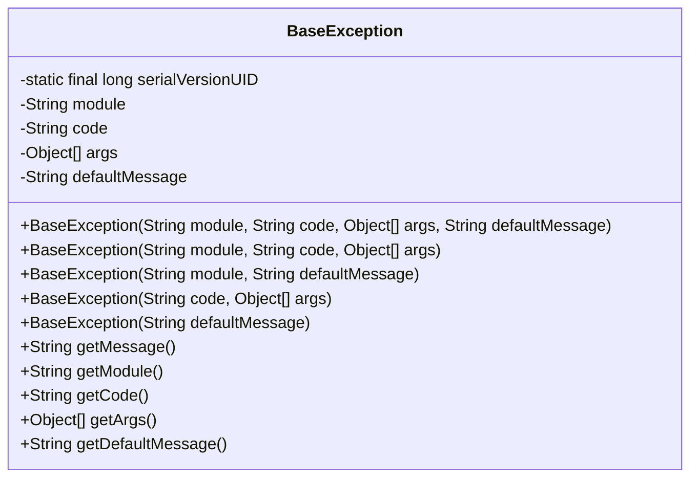

# 基础信息

|      |      |
|------|------|
| 名称 | BaseException |
| 编码语言 | .java |
| 代码路径 | RuoYi-main/ruoyi-common/src/main/java/com/ruoyi/common/exception/base/BaseException.java |
| 包名 | com.ruoyi.common.exception.base |
| 依赖项 | ['com.ruoyi.common.utils.MessageUtils', 'com.ruoyi.common.utils.StringUtils'] |
| 概述说明 | BaseException继承RuntimeException，含模块、错误码、参数及默认消息。 |

# 说明

BaseException类继承自RuntimeException，旨在提供更丰富的异常处理功能。该类包含四个主要属性：模块、错误码、参数和默认消息。模块属性用于标识异常所属的具体模块，错误码用于唯一标识异常类型，参数属性允许传递额外的上下文信息，而默认消息则提供了异常的简要描述。这些属性共同增强了异常的可读性和可调试性，使得开发者能够更精确地定位和处理问题。

# 类列表 Class Summary

| 名称   | 类型  | 说明 |
|-------|------|-------------|
| BaseException | class | BaseException类扩展RuntimeException，包含模块、错误码、参数和默认消息。 |

## 类 BaseException

|      |      |
|------|------|
| 访问范围 | public |
| 类型 | class |
| 名称 | BaseException |
| 说明 | BaseException类扩展RuntimeException，包含模块、错误码、参数和默认消息。 |

### UML类图

BaseException类是一个自定义的运行时异常类，继承自RuntimeException。它包含了模块、错误码、错误参数和默认错误消息等属性，并提供了多个构造函数以适应不同的异常场景。getMessage方法用于获取异常消息，优先从错误码和参数生成消息，如果生成失败则返回默认消息。该类设计灵活，适用于多种异常处理需求。

### 内部方法调用关系图

```mermaid
graph TD
    A["类BaseException"]
    B["属性: String module"]
    C["属性: String code"]
    D["属性: Object[] args"]
    E["属性: String defaultMessage"]
    F["构造方法: BaseException(String module, String code, Object[] args, String defaultMessage)"]
    G["构造方法: BaseException(String module, String code, Object[] args)"]
    H["构造方法: BaseException(String module, String defaultMessage)"]
    I["构造方法: BaseException(String code, Object[] args)"]
    J["构造方法: BaseException(String defaultMessage)"]
    K["重写方法: String getMessage()"]
    L["方法: String getModule()"]
    M["方法: String getCode()"]
    N["方法: Object[] getArgs()"]
    O["方法: String getDefaultMessage()"]

    A --> B
    A --> C
    A --> D
    A --> E
    A --> F
    A --> G
    A --> H
    A --> I
    A --> J
    A --> K
    A --> L
    A --> M
    A --> N
    A --> O
```

这段代码定义了一个`BaseException`类，它继承自`RuntimeException`。该类包含了多个属性，如模块名、错误码、错误参数和默认错误消息，并提供了多个构造方法以支持不同的异常初始化方式。重写的`getMessage`方法根据错误码和参数生成错误消息，若未提供错误码则返回默认错误消息。其他方法用于获取模块名、错误码、错误参数和默认错误消息。

### 字段列表 Field List

| 名称  | 类型  | 说明 |
|-------|-------|------|
| defaultMessage | String | 定义了一个私有字符串变量defaultMessage。 |
| args | Object[] | 定义私有对象数组变量args。 |
| module | String | 定义了一个名为module的私有字符串变量。 |
| code | String | 定义了一个私有的字符串类型变量code。 |
| serialVersionUID = 1L | long | 定义序列化版本号，确保类版本一致性。 |

### 方法列表 Method List

| 名称  | 类型  | 说明 |
|-------|-------|------|
| getModule | String | 该方法返回模块字符串。 |
| getCode | String | 该方法返回字符串类型的code值。 |
| getArgs | Object[] | 该方法返回对象数组args。 |
| getDefaultMessage | String | 该方法返回默认消息字符串。 |
| getMessage | String | 重写getMessage方法，优先返回code对应消息，否则返回默认消息。 |

