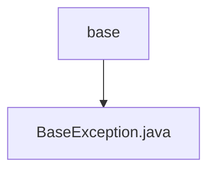

# 基础信息

|      |      |
|------|------|
| 名称 | base |
| 编码语言 | .java |
| 代码路径 | RuoYi-main/ruoyi-common/src/main/java/com/ruoyi/common/exception/base |
| 包名 | RuoYi-main.ruoyi-common.src.main.java.com.ruoyi.common.exception.base |
| 概述说明 | BaseException继承RuntimeException，含模块、错误码、参数及默认消息。 |

# 说明

BaseException类继承自RuntimeException，旨在提供更丰富的异常处理功能。该类包含四个主要属性：模块、错误码、参数和默认消息。模块属性用于标识异常所属的具体模块，错误码用于唯一标识异常类型，参数属性允许传递额外的上下文信息，而默认消息则提供了异常的简要描述。这些属性共同增强了异常的可读性和可调试性，使得开发者能够更精确地定位和处理问题。

### 包内部结构视图

该流程图展示了`RuoYi-main`项目中`ruoyi-common`模块的`exception`目录下的层级关系。`base`文件夹作为根节点，包含了`BaseException.java`文件。整个结构简洁明了，清晰地反映了文件与目录之间的从属关系。

# 文件列表 File List

| 名称   | 类型  | 说明 |
|-------|------|-------------|
| [BaseException.java](BaseException.md) | file | BaseException继承RuntimeException，含模块、错误码、参数及默认消息。 |

