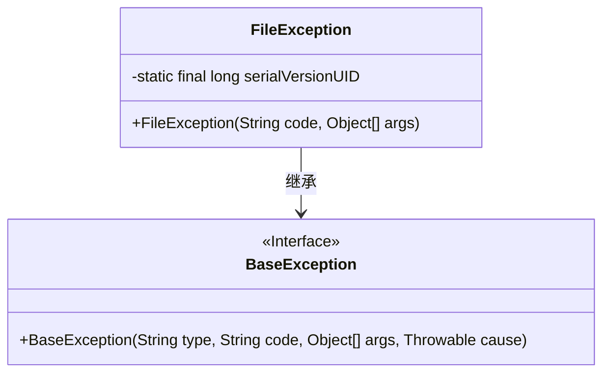
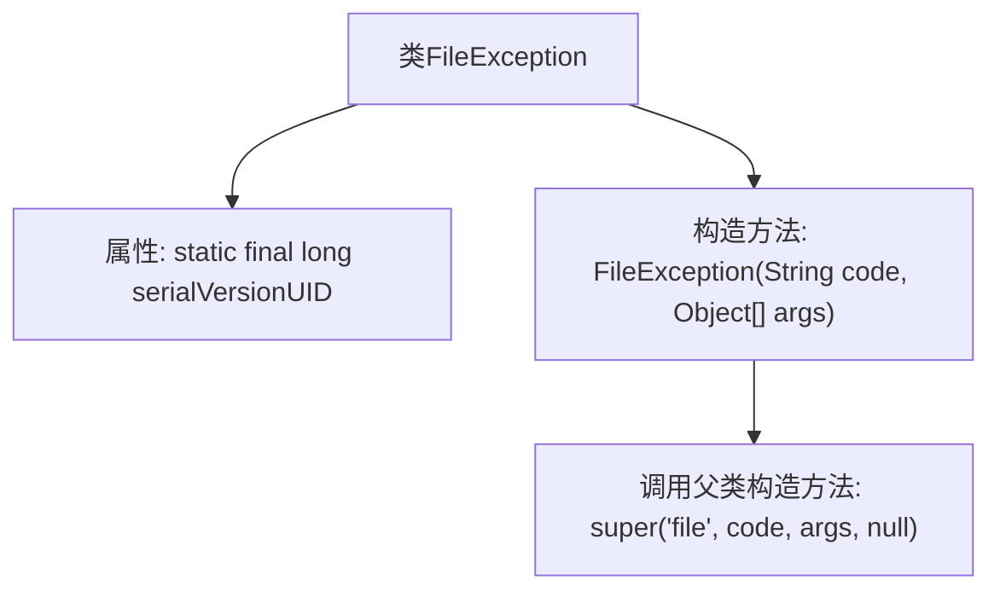

# 基础信息

|      |      |
|------|------|
| 名称 | FileException |
| 编码语言 | .java |
| 代码路径 | RuoYi-main/ruoyi-common/src/main/java/com/ruoyi/common/exception/file/FileException.java |
| 包名 | com.ruoyi.common.exception.file |
| 依赖项 | ['com.ruoyi.common.exception.base.BaseException'] |
| 概述说明 | FileException继承BaseException，处理文件异常，构造方法传递错误码和参数。 |

# 说明

FileException类继承自BaseException，专门用于处理与文件操作相关的异常情况。该类包含一个构造方法，允许在实例化时传递错误码和参数，以便更精确地描述和捕获文件操作过程中可能出现的错误。

# 类列表 Class Summary

| 名称   | 类型  | 说明 |
|-------|------|-------------|
| FileException | class | FileException类继承BaseException，用于处理文件相关异常，包含构造方法传递错误码和参数。 |

## 类 FileException

|      |      |
|------|------|
| 访问范围 | public |
| 类型 | class |
| 名称 | FileException |
| 说明 | FileException类继承BaseException，用于处理文件相关异常，包含构造方法传递错误码和参数。 |

### UML类图

这段代码定义了一个 `FileException` 类，它继承自 `BaseException` 类。`FileException` 类包含一个私有的静态常量 `serialVersionUID`，用于序列化版本控制。`FileException` 的构造函数接受一个 `code` 和 `args` 参数，并调用父类 `BaseException` 的构造函数，传递固定的 `"file"` 类型和 `null` 原因。`BaseException` 是一个接口，定义了构造函数的签名。这段代码主要用于处理文件相关的异常，通过继承 `BaseException` 来实现特定的异常类型。

### 内部方法调用关系图

这段代码定义了一个名为 `FileException` 的类，该类继承自 `BaseException`。`FileException` 类包含一个静态常量 `serialVersionUID` 和一个构造方法。构造方法接收两个参数：`code` 和 `args`，并在内部调用父类 `BaseException` 的构造方法，传递固定的字符串 `'file'` 以及其他参数。这个类的主要作用是处理与文件相关的异常情况。

### 字段列表 Field List

| 名称  | 类型  | 说明 |
|-------|-------|------|
| serialVersionUID = 1L | long | 声明一个私有静态长整型常量，用于序列化版本控制。 |

### 方法列表 Method List

| 名称  | 类型  | 说明 |
|-------|-------|------|

