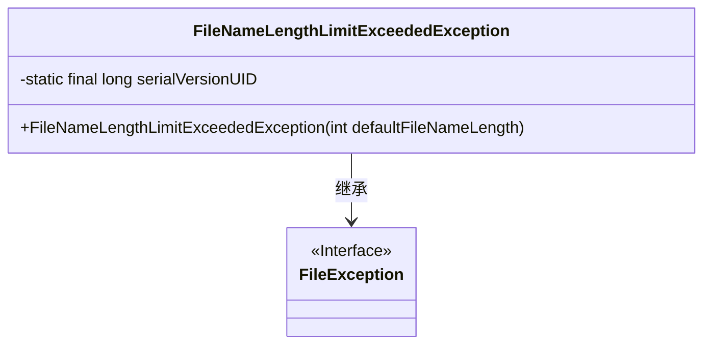
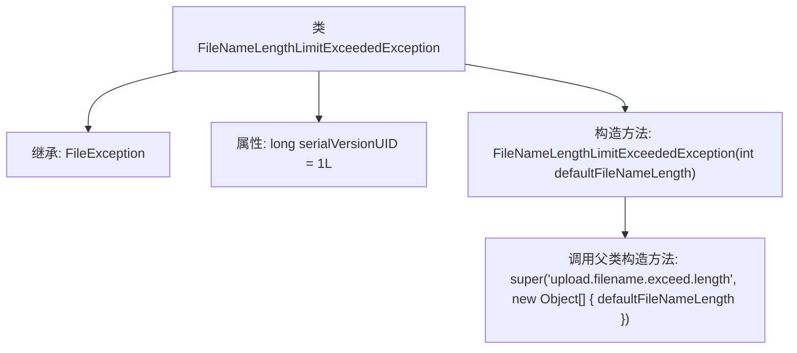

# 基础信息

|      |      |
|------|------|
| 名称 | FileNameLengthLimitExceededException |
| 编码语言 | .java |
| 代码路径 | RuoYi-main/ruoyi-common/src/main/java/com/ruoyi/common/exception/file/FileNameLengthLimitExceededException.java |
| 包名 | com.ruoyi.common.exception.file |
| 依赖项 | [] |
| 概述说明 | 文件名长度超限异常类继承文件异常类，含默认长度参数。 |

# 说明

文件名长度超限异常类是一个继承自文件异常类的自定义异常类，专门用于处理文件名长度超过规定限制的情况。该类包含一个默认的文件名长度参数，用于定义文件名的最大允许长度。当检测到文件名长度超过此参数设定的值时，将抛出该异常，以便程序能够捕获并处理此类错误。

# 类列表 Class Summary

| 名称   | 类型  | 说明 |
|-------|------|-------------|
| FileNameLengthLimitExceededException | class | 文件名长度超限异常类，继承自文件异常类，包含默认文件名长度参数。 |

## 类 FileNameLengthLimitExceededException

|      |      |
|------|------|
| 访问范围 | public |
| 类型 | class |
| 名称 | FileNameLengthLimitExceededException |
| 说明 | 文件名长度超限异常类，继承自文件异常类，包含默认文件名长度参数。 |

### UML类图

类图描述：
`FileNameLengthLimitExceededException` 类继承自 `FileException` 接口，表示文件名长度超过限制的异常。该类包含一个私有静态常量 `serialVersionUID` 用于序列化，以及一个公有构造函数 `FileNameLengthLimitExceededException`，该构造函数接受一个整数参数 `defaultFileNameLength`，并调用父类的构造函数传递错误信息和参数。

### 内部方法调用关系图

这段代码定义了一个名为 `FileNameLengthLimitExceededException` 的异常类，它继承自 `FileException`。类中包含一个静态的 `serialVersionUID` 属性，用于序列化控制。构造方法 `FileNameLengthLimitExceededException` 接受一个 `int` 类型的参数 `defaultFileNameLength`，并调用父类的构造方法，传递一个错误消息和包含 `defaultFileNameLength` 的对象数组。这个异常类通常用于处理文件名长度超过默认限制的情况。

### 字段列表 Field List

| 名称  | 类型  | 说明 |
|-------|-------|------|
| serialVersionUID = 1L | long | 定义序列化版本UID为1L。 |

### 方法列表 Method List

| 名称  | 类型  | 说明 |
|-------|-------|------|

